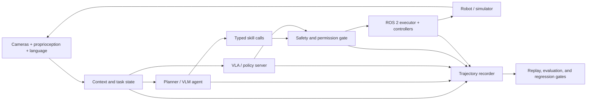

# Awesome Harness Robot

> A curated map of **agent harnesses**, **vision-language-action (VLA) systems**, and **robot foundation models**—with an emphasis on systems that can actually be trained, evaluated, integrated, and deployed.

Robot intelligence is a **model–harness–environment system**. The model predicts or plans; the harness owns tools, state, timing, safety, execution, recording, and verification; the environment includes the robot, simulator, sensors, and people around it.

This list is intentionally smaller than a paper dump. It prioritizes official code, released weights, reproducible evaluation, clear interfaces, and evidence from real or simulated closed-loop execution.

## Contents

- [What Counts as a Robot Harness?](#what-counts-as-a-robot-harness)
- [Current Landscape](#current-landscape)
- [Reference Architecture](#reference-architecture)
- [Harnesses and Development Platforms](#harnesses-and-development-platforms)
- [Robot Agent Systems](#robot-agent-systems)
- [Vision-Language-Action Models](#vision-language-action-models)
- [Robot Foundation and World Models](#robot-foundation-and-world-models)
- [Datasets and Data Infrastructure](#datasets-and-data-infrastructure)
- [Benchmarks and Evaluation](#benchmarks-and-evaluation)
- [Simulation and Digital Twins](#simulation-and-digital-twins)
- [Runtime, Safety, and Observability](#runtime-safety-and-observability)
- [Practical Starter Stacks](#practical-starter-stacks)
- [Surveys and Reading Lists](#surveys-and-reading-lists)
- [Contributing](#contributing)

## What Counts as a Robot Harness?

An **agent harness** is the runtime around a reasoning model. A **VLA harness** specializes that runtime for high-rate observations and action chunks. A **robot foundation-model harness** extends it across data collection, pre/post-training, embodiment adaptation, evaluation, and deployment.

| Layer | Owns | Typical failure if omitted |
| --- | --- | --- |
| Task and context | Goals, prompts, scene state, memory, skill registry | The model solves the wrong task or loses state. |
| Model adapter | Pre/post-processing, normalization, embodiment metadata, inference server | Actions use the wrong coordinate frame or scale. |
| Scheduler | Agent loop, policy/control rates, action chunking, retries, timeouts | Stale actions, jitter, or uncontrolled blocking. |
| Safety and permissions | Joint/workspace limits, collision checks, approvals, emergency stop | A plausible model output becomes a physical hazard. |
| Execution | ROS 2 actions/services/topics, controllers, skill calls | Plans never become deterministic robot behavior. |
| Observability | Traces, video, state/action logs, latency, interventions | Failures cannot be reproduced or attributed. |
| Verification | Task success, constraint checks, regression suites, replay | Demos look good while reliability silently regresses. |

The practical boundary is simple: **the model proposes; the harness decides whether, when, and how an action reaches hardware.**

## Current Landscape

Last verified: **2026-08-31**.

- **Robot harnesses are becoming a research category of their own.** [Guava](https://guava-harness.github.io/) studies model-agnostic embodied tool use; [ASPIRE](https://research.nvidia.com/labs/gear/aspire/) turns execution traces into an expanding skill library; and [GaP](https://graph-robots.github.io/gap/) uses multi-agent coding plus simulation to construct and refine graph-structured robot policies.
- **Robot middleware is being reframed as the Physical AI harness layer.** [Harness Engineering for Physical AI](https://arxiv.org/abs/2606.09416) argues that ROS 2-class middleware should compose output projection, resource isolation, and fallback transfer across control, compute, and communication. It is a position/design paper proposing a ROS 2 Harness Profile, not an implemented or experimentally validated system.
- **Harness optimization now reaches complete robot policy repositories.** [RHO](https://arxiv.org/abs/2606.16458) uses a tool-enabled coding agent and execution feedback to evolve interpretable multi-file repositories-as-policies during training, then deploys them without test-time code generation. Its Robosuite, LIBERO-PRO, and O3DE results are author-reported and simulation-only; no official code repository was linked as of 2026-08-16.
- **Recovery is becoming a first-class harness primitive.** [AgentRewind](https://arxiv.org/abs/2608.14380) checkpoints aligned agent context and controlled environment state, then resumes from an earlier point while retaining information from the failed attempt. Its evidence is on long-horizon engineering tasks rather than robots.
- **Transactional durability is being formalized for agents.** [Agentic Transaction](https://arxiv.org/abs/2608.13900) reinterprets ACID as Semantic Atomicity, Consistency, Isolation, and Durability for long-horizon agent execution and instantiates them in a data agent with exploration–execution–validation cycles, reporting a 10.6% gain over prior agents including Claude Code; no official implementation was linked as of 2026-08-17.
- **Test-time digital twins are becoming verification-gated harnesses.** [Twin](https://arxiv.org/abs/2608.14490) has a coding agent write an executable world model of an unknown environment, withholds scored actions until the model reproduces every observed transition, and repairs the model from prediction mismatches; MIT-licensed code and action-by-action replays are public. Current evidence is ARC-AGI-3 games rather than robotics.
- **Model and harness evolution are being coupled.** [HELIX](https://arxiv.org/abs/2608.13951) represents harness changes as source-traceable typed artifacts and turns verified sibling trajectories into model-training records. The paper evaluates one code-repair round, not robotics; the claimed `HKUDS/HELIX` repository returned 404 on 2026-08-17 but is now live (MIT-licensed TypeScript workspace) as of 2026-08-18.
- **Harness state is becoming a continual-learning object.** [Harness Continual Learning](https://arxiv.org/abs/2608.19013) (HCL) treats the harness — prompts, memories, tools, skills, and routing rules — as the state that evolves around a frozen foundation model, defines *harness-level forgetting* as the loss of earlier behavior after a harness update, and instantiates guarded harness evolution in which a Continual Optimizer proposes candidate harnesses from post-execution feedback and a Continual Evaluator commits only after checking current improvement, historical retention, and validity. Digital-agent results; no official code was located as of 2026-08-20.
- **Rollback must restore what the model attends, not only the transcript.** [Aborted but Not Forgotten](https://arxiv.org/abs/2608.15939) shows retained KV-cache state can keep an agent attending to content the application believes it discarded after a logical abort (25 of 63 audited cells across seven open-weight families), formalizing rollback consistency as a cross-layer harness guarantee; no public artifact link was located on the arXiv record as of 2026-08-18.
- **The harness itself is now an RL optimization target.** [ClawGym II](https://arxiv.org/abs/2608.16798) runs black-box PPO/GRPO through opaque harnesses by sandboxing rollouts, proxying model calls, and reconstructing multi-turn trajectories as prefix trees, including mix-harness training across heterogeneous harnesses; reported Pass@1 gains are on digital long-horizon agents.
- **Harness-native RL is becoming a documented framework line.** [LEGO-RL](https://lego-rl.pages.dev) ([paper](https://arxiv.org/abs/2608.17393), [code](https://github.com/LegoX/Lego-RL)) bridges native coding-agent harnesses with policy-gradient training through in-process LLM proxying, sandboxed execution with reward-hacking defenses, and integrated monitoring, reporting SWE-bench Verified gains across OpenHands SDK, Claude Code, and OpenCode harnesses; [Agent Lightning v1.0](https://arxiv.org/abs/2608.17528) formalizes "harnessed agentic RL," where the deploy-time harness owns the environment loop and the trainer sees only request–response pairs, packaged as a ~3,500-line framework that improves Qwen3.5-9B on SWE-bench Verified with 6K examples. Both are digital-agent results; no robot experiment. The Apache-2.0 LEGO-RL repository went live on 2026-08-20.
- **Harness scaling is becoming a reproducible research result.** [StateM](https://arxiv.org/abs/2608.15089) ([code](https://github.com/henryqin1997/statem)) organizes execution around durable states, checked transitions, and recoverable runbooks, and reports raising GPT-5.6 Sol xhigh to 95.3% raw accuracy on Terminal-Bench 2.1 at ~$15 of final-score API usage; [Evo-Harness](https://arxiv.org/abs/2608.15071) ([code](https://github.com/A-EVO-Lab/a-evolve)) formalizes online harness learning, compiling noisy single-shot executions into reusable skill harnesses for a frozen solver. Both are digital-agent results with released implementations.
- **Closed-loop embodied harnesses are learning online.** [Zetta](https://air-embodied-brain.github.io/zetta/) ([paper](https://arxiv.org/abs/2608.16590)) evolves code-based runtime critics and recovery skills at three timescale-separated loops while the base policy stays frozen, reporting 90.8% LIBERO-Pro / 93.6% RoboCasa with an 11.1× speedup; the repository is public but asserts no license as of 2026-08-18.
- **Humanoid service agents are getting a System-2 architecture.** [HODAgent](https://arxiv.org/abs/2608.17584) uses a semi-duplex Env-Interactor / Planner / Executor / hierarchical-Memory stack so a humanoid can take new requests mid-motion, revise actions, and verify outcomes; a shared interface isolates platform-specific control across simulation and a physical Unitree G1. The authors report 84.8%/91.5% joint success over 164 interactive simulation cases and 92%/72%/63.3% pass rates for atomic/composite/complete physical tasks. The paper was withdrawn by the authors on 2026-08-20 (v2) for a mandatory company review, so the results are unverified pending re-release.
- **Robot foundation models are adding test-time compute.** [τ0-VLA](https://tau0-vla.github.io/) ([paper](https://arxiv.org/abs/2608.16885), [code](https://github.com/sii-research/tau-0-vla), [weights](https://huggingface.co/sii-research/tau-0-vla)) makes high-level subtask generation a compute-scalable inference problem with world-model-guided search over alternatives, trained on 40,115 hours of heterogeneous real-world data; code (Apache-2.0) and weights are public.
- **Evaluation is being threaded from benchmark to robot.** [DeepInsight II](https://arxiv.org/abs/2608.16556) reproduces released checkpoints across navigation and manipulation benchmarks, places whole-body controllers under one metric contract, and carries matched cohorts from parallel simulation to real robots with shared trace identity so the sim-to-real gap becomes a native reduction.
- **World-model evaluation is gaining calibration and reasoning.** [CaliBench](https://arxiv.org/abs/2608.16829) tests the aleatoric calibration of stochastic video world models against closed-form reference distributions; [HarnessEval-W](https://mirros-lab.github.io/HarnessEval-W/) ([code](https://github.com/MirroS-Lab/HarnessEval-W)) agentifies world-model evaluation into verifiable evidence trees; and [RigidBench](https://arxiv.org/abs/2608.15555) ([code](https://github.com/swarnim-j/RigidBench), [data](https://doi.org/10.5281/zenodo.21649156)) separates motion, geometry, and visual-similarity errors in generated rollouts with released simulator-grounded data.
- **Coding-agent reliability is becoming a documented systems discipline.** [Engineering Reliable Coding Agents](https://arxiv.org/abs/2608.13867) ([companion](https://github.com/sjarmak/engineering-reliable-coding-agents)) packages runnable evaluation and operation protocols, a machine-readable catalog of 206 reliability records, and reusable agent skills for separating model capability from harness, state, retrieval, permissions, and observability effects.
- **Orchestration is moving from a paper abstraction to a modular system boundary.** [RoboBRIDGE](https://arxiv.org/abs/2607.27881) separates monitoring, perception, planning, control, and robot interfaces around pretrained VLAs, while [Embodied Agents Take Control](https://arxiv.org/abs/2607.26148) directly evaluates general software-agent harnesses holding the perceive–act–verify–correct loop in zero-shot navigation.
- **Code-as-policy is closing its loop inside the episode.** [VLCP](https://arxiv.org/abs/2608.16978) keeps a frontier VLM frozen and has it write the policy as a short Python control function, re-observing the scene every K steps and rewriting the failed code rather than retrying a fixed policy or picking a different subtask. On a 57-task MuJoCo/RoboVerse sweep the authors report 35.1% pooled success versus 3.5% for one query per episode (tenfold gap, 27.3% within-episode recovery on failed grasps); evidence is simulation-only and no official code link was located as of 2026-08-19.
- **Open physical-agent runtimes are appearing.** [OpenETA](https://github.com/OpenMOSS/OpenETA) exposes planners, typed tools and skills, host-owned execution gates, fresh-observation turns, replayable trajectories, and auditable memory behind common simulation and real-robot adapters.
- **The orchestration gap is now being measured directly.** [Physical Agency](https://arxiv.org/abs/2607.21725) wraps frozen VLAs and parameterized skills in a closed-loop planner that decomposes goals, verifies outcomes, and recovers without additional policy training.
- **Improvement and verification are entering the execution loop.** [HERO](https://arxiv.org/abs/2607.26809) bootstraps experience and consolidates repeated interactions into visuomotor policies, while [CheckVLA](https://arxiv.org/abs/2607.26789) uses a frozen action-conditioned world model to detect deviations and rewrite still-deployable action suffixes.
- **Physical autoresearch now has an explicit harness.** [ENPIRE](https://research.nvidia.com/labs/gear/enpire/) turns reset, safety, verification, policy improvement, audited rollout, and multi-agent experiment evolution into a closed loop over real robot fleets.
- **Autoresearch is acquiring recoverable executable state.** [ScienceFlow](https://arxiv.org/abs/2608.14354) segments long-horizon research into executable workspaces, re-anchors between live and archived research states, and gates compute allocation on validated progress; the authors report a 70.22% Any-Medal score on MLE-bench. No official code was linked as of 2026-08-17.
- **The harness itself is becoming an optimization target.** [Self-Harness](https://arxiv.org/abs/2606.09498) mines recurring failures from execution traces, proposes bounded model-specific changes to the surrounding agent system, and promotes them only through regression tests. It is a general coding-agent result rather than a robotics evaluation, but its trace–edit–validate loop is directly relevant to safer offline robot-harness improvement.
- **Harness use is now learned, not scripted.** [EvoHarness-RL](https://arxiv.org/abs/2608.05446) learns when to read, update, and consolidate external harness state, while [EnvACE](https://arxiv.org/abs/2608.06197) trains agents to rehearse environment responses instead of touching an external simulator; both are general-agent results with no robot evaluation yet.
- **Skill selection is becoming a trained policy decision.** [SkillGate](https://arxiv.org/abs/2608.18852) ([code](https://github.com/DeepExperience/SkillGate), [weights](https://huggingface.co/simonlqy/SkillGate-9B)) diagnoses why outcome-rewarded RL cannot teach an agent which skill to read mid-episode — *selector credit starvation*: under broadcast sequence-level advantage, the few skill-naming tokens carry a vanishing, increasingly wrong-signed share of the loss — and partitions token support into disjoint credit channels so outcome credit reaches only execution tokens while an action-local advantage trains exactly the skill-naming tokens. Apache-2.0 code and a released 9B model; digital-agent results, no robot experiment.
- **Self-improvement is moving into environment design.** [SPADE](https://arxiv.org/abs/2608.19197) ([code](https://github.com/spade-rl/spade), [models](https://huggingface.co/spade-rl)) has one LLM play both roles in self-play RL: an Environment Designer writes complete long-horizon training environments as executable code with Gym-style reset/step interfaces, and a Reasoning Agent learns in them, with the designer optimizing the agent's regret signal to target environments at the edge of its capabilities while keeping them feasible. MIT-licensed code and Apache-2.0 weights are public; digital agents and explicitly a work-in-progress report.
- **The harness idea is now applied to the environment side.** [EnvHarness](https://envharness.com/) ([paper](https://arxiv.org/abs/2608.19880), [code](https://github.com/google-research/envharness)) wraps a frozen environment — not a frozen model — with Setup/Rule/Link plug-ins at the `reset`/`step` interface, so static benchmarks gain an adaptation surface while keeping their trusted goal predicates; the Apache-2.0 Google Research repository is public.
- **Physical AI execution is gaining an evidence-and-authorization contract.** [The Verification Gap in Networked Physical AI](https://arxiv.org/abs/2608.19593) ([companion](https://github.com/sarulab-ou/post-semcom)) formalizes the post-semantic interface between proposal formation and physical execution: declared evidence requirements, evidence records, validation of supporting and conflicting records, and authorized finalization — with a frozen executable evaluator.
- **Self-improvement claims now have a measured-null audit protocol.** [Phantom Gains](https://arxiv.org/abs/2608.20290) ([code](https://github.com/chengxuphd/phantom-gains)) shows that seven standard measurement practices each invert a self-training finding when audited against a frozen control through the identical pipeline, and replaces them with per-problem exact tests under FDR control; the Apache-2.0 repository recomputes every number in the paper.
- **Harness training and audit are becoming infrastructure.** [OpenForgeRL](https://arxiv.org/abs/2607.21557) records harness model calls as training data for harness-native agents, while [A²E](https://arxiv.org/abs/2608.07346) audits agent harnesses end-to-end with instrumented execution traces and multidimensional metrics.
- **Harness evolution is acquiring safety and evaluation boundaries.** [SHE](https://arxiv.org/abs/2608.09885) attributes failures to four separately evolvable safety artifacts, while [Evo-Bench](https://arxiv.org/abs/2608.09096) tests whether improvements transfer beyond the tasks used to evolve them. Both are digital-agent results, not robot validation.
- **Harnesses can transfer capability without changing model weights.** [AI4AI at Test-Time](https://arxiv.org/abs/2608.12307) uses a stronger builder model to move reasoning into deterministic code, routing, and output enforcement around a weaker target; [Harness-IF](https://arxiv.org/abs/2608.11727) tests whether agents actually follow rules across five harness instruction surfaces. Both are coding/digital-agent results rather than robot validation.
- **Safety evaluation is becoming execution-grounded.** [REDAgentBench](https://arxiv.org/abs/2608.10669) verifies harmful effects from sandbox service receipts and final state rather than collapsing exposure, execution, visibility, and adjudication into one model-judged score; its current evidence is for digital agents, not robots.
- **Agent-harness safety is becoming lifecycle-evaluated.** [HarnessRisk](https://baiyajing.github.io/harness-risk/) ([paper](https://arxiv.org/abs/2608.17597), [code](https://github.com/Baiyajing/HarnessRisk), [data](https://huggingface.co/datasets/YajingB/HarnessRisk)) organizes harness safety into six operational phases (configuration, capability extension, runtime, state persistence, action control, incident recovery) with 128 sandboxed cases pairing benign goals with adversarial workflow artifacts; across three harnesses, six models, and 14 configurations, attack success ranges 12.6–80.9% while utility stays 75.0–97.6%, with Harness Configuration the most vulnerable phase. MIT-licensed code and a public dataset are verified; digital agents, no robot experiment.
- **Pre-action control is becoming a composed, stateful contract.** [One Gate Is Not Enough](https://arxiv.org/abs/2608.18360) ([code](https://github.com/besanson/sarc-suite-one-pass)) formalizes *remediation-induced control coupling*: a remediation applied by one pre-action gate (authority, resource, evidence) can change what another gate evaluates, invalidating its earlier judgment. It gives a remediate-and-regate protocol that restores per-action soundness, and a finite-model checker finds the two implemented remediation operators do not commute, making remediation order part of control-plane semantics rather than an implementation detail. The Apache-2.0 reference implementation and Zenodo data are public; digital agents, no robot experiment.
- **Manipulation safety is becoming specification-grounded.** [MANIGUARD](https://nu-ideas-lab.github.io/ManiGuard) ([paper](https://arxiv.org/abs/2608.17386), [code](https://github.com/NU-IDEAS-Lab/ManiGuard), [data](https://huggingface.co/collections/IDEAS-Lab-Northwestern/maniguard-benchmark-and-datasets-6a83d488178bcba81688cd4e)) evaluates foundation-model manipulation under an LTL_f-grounded automaton-monitored contract: 200 locked base tasks × 5 perturbation axes = 1,000 scenarios, with 8,000 safety-annotated demonstrations released. Across 23,000+ rollouts, 6–21% of successful rollouts violate the safety specification, so safety must be scored independently of task success; fine-tuning on the suite raises safe completion from near zero to 7.5–29.8%. The benchmark datasets are public (CC-BY-4.0) and the Apache-2.0 code repository (evaluation, monitoring, and teleop tooling) went live on 2026-08-20.
- **VLA evaluation is adding unauthorized visual-cue safety.** [LIBERO-VIFO](https://arxiv.org/abs/2608.17600) benchmarks both capability and safety of visual cue following: eight cue families, four protocols across authorized following and unauthorized following under language-cue conflict and empty-language conditions. Seven evaluated VLAs often fail to translate cue understanding into execution yet will execute cue-indicated tasks without any language instruction, exposing an emerging unauthorized-cue-following risk corroborated by real-robot deployment; no official benchmark release was located as of 2026-08-19.
- **Persistent skill learning creates a new safety lifecycle.** [SkillMisevo](https://github.com/henrymao2004/misevolve) tracks whether unsafe experience becomes an authored skill, is retrieved on benign work, and causes fresh-session harm; its mitigation governs both skill writes and later reuse across four coding-agent harnesses.
- **[Harness VLA](https://arxiv.org/abs/2607.08448) makes the harness itself the method.** It wraps a frozen VLA as a retryable contact-rich primitive, combines it with a small analytic primitive library, and uses task-specific traces plus global success/failure memory to recover and re-ground without fine-tuning the VLA.
- **Evaluation is becoming infrastructure.** [vla-evaluation-harness](https://github.com/allenai/vla-evaluation-harness) decouples model servers from benchmark containers; [HarnessOpt-Bench](https://arxiv.org/abs/2608.06301) places harness optimization behind a metered, held-out evaluation boundary; and [GAUGE](https://arxiv.org/abs/2608.05948) diagnoses which physical laws simulators and video world models violate.
- **Robot policies are gaining a shared systems contract.** [XPolicyLab](https://github.com/XPolicyLab/XPolicyLab) standardizes observation, action, trajectory, reset, serving, and evaluation interfaces across 42 policies, RoboTwin, RoboDojo, and real-robot clients.
- **VLA reasoning is moving from generation to consumption.** [In-Context VLA](https://arxiv.org/abs/2608.05738) reports that free-form textual chain-of-thought degrades low-level control and instead feeds structured perceptual evidence plus agentic tool queries into the policy; the results are author-reported on simulation and eight real-robot tasks.
- **In-context robot adaptation is becoming structured.** [StellaVLA](https://arxiv.org/abs/2608.11671) converts one retrieved robot, human-hand, or XR trajectory into a task plan, subgoals, and verbalized 3D motion, then removes the language path from high-rate deployment inference.
- **VLA evaluation is being stress-tested at scale.** [VLA-Arena](https://arxiv.org/abs/2512.22539) benchmarks 170 tasks across Safety, Distractor, Extrapolation, and Long Horizon dimensions with fine-tuning restricted to the easiest difficulty level.
- **Common interfaces are winning.** [LeRobot](https://github.com/huggingface/lerobot) now spans data capture, policies, VLA/world-model integrations, evaluation, and hardware plugins; [StarVLA](https://github.com/starVLA/starVLA) focuses on composable backbones, action heads, datasets, and benchmarks.
- **Action generation is moving beyond one-token-at-a-time control.** Flow matching, diffusion heads, continuous regression, learned action tokenizers such as FAST, and action chunking are the dominant implementation families.
- **Cross-embodiment adaptation is a first-class concern.** Current stacks carry robot-specific state/action schemas, normalization statistics, embodiment tags, and camera layouts alongside checkpoints. [LingBot-VLA 2.0](https://github.com/Robbyant/lingbot-vla-v2) uses a 55-dimensional canonical schema, while Qwen-RobotManip reports an 80-dimensional masked schema and camera-frame motion alignment.
- **Open models cover a useful range.** Small local policies such as [SmolVLA](https://huggingface.co/blog/smolvla), open research stacks such as [OpenVLA-OFT](https://github.com/moojink/openvla-oft) and [openpi](https://github.com/Physical-Intelligence/openpi), and larger humanoid-oriented systems such as [GR00T N1.7](https://github.com/NVIDIA/Isaac-GR00T) can all be studied and adapted.
- **World-model interfaces are becoming embodiment-aware and multimodal.** [Robot-Factored World Models](https://bjkim95.github.io/rofacto/) exposes controller-realized robot motion as rendered geometry, [ViTacWorld](https://vitacworld.github.io/) predicts synchronized visual and tactile outcomes, and [GeniWorld](https://chenghaogu.github.io/GeniWorld/) turns URDF-rendered actions into an interactive policy-evaluation interface.
- **World models are also becoming planner-facing artifacts.** [World Action Planner](https://arxiv.org/abs/2607.27599) searches over imagined visual outcomes, while [VisualPatchWorld](https://github.com/HKBU-KnowComp/VisualPatchWorld) induces inspectable dynamics programs that can be rolled forward inside model-predictive control.
- **World models are becoming evaluated objects.** [XEWorld](https://arxiv.org/abs/2608.05799) tests whether action-conditioned world models render unseen embodiments and finds they mostly match visual patterns rather than physical kinematics, while [DynamicWAM](https://arxiv.org/abs/2608.00793) releases a motion-conditioned compact WAM with asynchronous chunking for dynamic manipulation.
- **World models are becoming diagnosis interfaces.** [Onto-EV-WM](https://arxiv.org/abs/2608.13901) grounds world-model failure signals in typed task predicates and correction routes with verification-gated acceptance, reporting 85.00% success over the 10,030-task LIBERO-Plus registry; evidence is simulation-only.
- **World models are gaining a shared action interface: pixel motion.** [Hydra-0](https://nvidia-isaac.github.io/video_to_data/hydra-0/) ([paper](https://arxiv.org/abs/2608.18077)) represents robot actions as pixel motion so one world model learns action consequences across embodiments, tasks, and video backbones, reporting 90.4% lower robot-motion and 60.2% lower object-motion error than an action-conditioned baseline and r=0.96 replay/reference correlation on RoboLab, with an emergent inverse "world action model" mode that maps desired object flow to executable actions. Everything reported is open-loop, and the project page marks code "coming soon" as of 2026-08-19.
- **Cross-embodiment reuse is being measured as an explicit gap.** [The Embodiment Gap in Robot Foundation Models](https://arxiv.org/abs/2608.18433) (TMLR 2026) surveys what can be reused across robot embodiments versus what must still be implemented on a new robot, places existing RFM/VLA methods on a two-axis map (type of shared structure × stage where adaptation is needed), and proposes a reporting framework for adaptation work — an evaluation contract for judging portability claims that success rate alone hides.
- **One WAM checkpoint can now expose multiple compute modes.** [Flex-π](https://flex-pi.github.io/) jointly denoises actions with RGB, pointmap geometry, and semantic latents, then enables different observed/predicted stream subsets at deployment. The official repository is only a release placeholder as of 2026-08-12.
- **Future conditioning no longer requires iterative video rollout.** [RIFT](https://arxiv.org/abs/2608.11521) first probes whether WAM actions consume future-cache content, then replaces iterative cache production with learned anticipation tokens and a single backbone pass; current evidence is simulation-only.
- **Serving and intervention now have explicit contracts.** [World Action Models in Real Time](https://arxiv.org/abs/2608.01880) studies temporal alignment and asynchronous chunk serving, [CoWAM](https://arxiv.org/abs/2608.02578) gates bimanual policy interventions through typed coordination obligations, and [SAFECAST](https://arxiv.org/abs/2608.04246) calibrates VLA failure detectors under deployment shift.
- **VLA monitoring is moving earlier and deeper.** [ContactGuard](https://arxiv.org/abs/2608.13438) predicts failure before a planned chunk reaches contact, while [Decoding Task Progress](https://arxiv.org/abs/2608.13474) reads stalled progress directly from VLA activations as a lightweight deployment signal.
- **VLA memory is moving from context to persistent state.** [AtlasVLA](https://arxiv.org/abs/2608.06729) keeps a 4D voxel-hashed world state plus an ego-working memory so policies survive partial observability and long horizons, while [PSG-JEPA](https://arxiv.org/abs/2608.06799) grounds JEPA latents in proprioceptive state to make world-model representations control-relevant.
- **WAM harnesses are closing the prediction–execution loop.** [HarnessWAM](https://arxiv.org/abs/2608.09516) adds task state, capability-constrained skills, verification, and recovery; [TempoWAM](https://arxiv.org/abs/2608.09492) decides how much of each chunk to execute from observed progress; and [WorldSimProbe](https://arxiv.org/abs/2608.09298) tests whether imagined actions actually cause grounded motion and interaction.
- **Perception is part of the safety boundary.** [Hijacking Robots with a Piece of Paper](https://arxiv.org/abs/2608.05715) shows physical signage can prompt-inject VLM-controlled robots (up to 29.4% attack success across three frontier VLMs), and [Failing Gracefully](https://arxiv.org/abs/2608.05313) scores the impact of inevitable robot failures rather than only their probability.
- **Robot-team coordination is a security boundary.** [When Coordination Becomes a Threat](https://arxiv.org/abs/2608.06830) attacks communication in LLM-planned multi-robot systems across DMAS and HMAS architectures, and [AutoIntervene](https://arxiv.org/abs/2608.07065) adds calibrated operator handoff for action-chunking policies.
- **Tactile sensing has a new physical-layer attack surface.** [GhostTac](https://arxiv.org/abs/2608.20817) (ACM CCS 2026, [code](https://github.com/GhostTac/GhostTac_CCS)) is the first contactless attack on tactile sensors: crafted EMI signals are nonlinearly rectified and amplified by the sensor front-end into persistent DC offsets that bypass onboard filtering, yielding spatially targeted manipulation of measured contact. Evaluated on 10 sensor modules and two dexterous hands (15 sensors), with closed-loop grasping, slip detection, and material-classification case studies; the official repository ships code and demo videos.
- **Agent-runtime security is becoming a progressive multi-tier gateway.** [ClawSentry](https://arxiv.org/abs/2608.21101) ([code](https://github.com/Elroyper/ClawSentry)) supervises the whole agent control loop — skill admission, invocation-time intent, execution-time effect, post-action consequence — with a deterministic L1 layer, a rule-anchored L2 semantic reviewer, and a read-only L3 evidence-seeking agent, plus session-level anti-bypass for tool-switching and rephrased retries. The MIT-licensed reference implementation applies one Agent Harness Protocol policy across Codex, Claude Code, Kimi CLI, and Gemini CLI; on SkillInject contextual attack success falls from 39.55% to 2.61% (author-reported, digital agents).
- **Skills are becoming the evaluated unit, not just agents.** [ACES](https://arxiv.org/abs/2608.20614) (Agentic Continuous Evaluation of Skills, [code](https://github.com/NVIDIA/SkillEvaluator)) runs paired live trials with and without a target skill under the same model, sandbox, and grading policy, normalizes trajectories into the Agent Trajectory Interchange Format, and reports Skill Lift — the skill's added value for a fixed task/harness/workspace/scorer. The Apache-2.0 NVIDIA implementation is public; across 947 scored paired cases from 58 production skills the authors report mean composite Skill Lift 0.2134 (95% CI [0.1967, 0.2301]).
- **Robot policies are learning from their own failures without touching the policy weights.** [Q-Planning](https://arxiv.org/abs/2608.21204) ([project](https://varungiridhar.github.io/qplanning/)) equips a frozen visuomotor BC policy with a small off-policy Q-function trained on both successes and failed deployment rollouts, then self-improves via value-guided action selection and Q-only fine-tuning: the authors report LIBERO-10 rising 93%→99%, RoboTwin 83.8%→91.4%, and real-robot stack-cups 40%→90% and insert-wallet 25%→80% in five iterations. Code is marked "coming soon" as of 2026-08-24.
- **Agent memory hygiene is now a measurable benchmark.** [DreamBench-SWE](https://arxiv.org/abs/2608.20664) ([release](https://github.com/iroiro147/dreambench-swe/releases/tag/v2.1.0)) is a multi-session benchmark in which later software tasks depend on non-inferable evidence from earlier sessions, scored by executable hidden oracles; a preregistered v2.1 audit (360 work units) found no external memory system beats the no-memory control (21/180 passes) except one pinned hosted-memory configuration (97/180) — a discriminating executable profile rather than evidence for any particular memory mechanism.
- **Prompt authority is becoming an explicit VLA harness contract.** [TOWN-VLA](https://arxiv.org/abs/2608.23224) shows that retrieved text becomes a control intervention once it enters a frozen VLA's executed prompt — raw appends drop mean success from 92.47% to 3.00% and "prompt-form collapse" can dominate semantics — and enforces a fixed compatibility rule that authorizes a canonical compact instruction or restores the original prompt exactly. The authors report LIBERO-Plus rising 69.5%→73.1% across six perturbation axes and a physical PiPER arm with frozen π0.5 rising 52.7%→78.7%; no official artifacts as of 2026-08-25.
- **Harness optimization is becoming an offline learning problem with durable updates.** [AutoSaddler](https://arxiv.org/abs/2608.23041) diagnoses failure traces, generates structured patches that treat the harness itself as code, and selects updates by validation; the authors report +9.0/+9.6/+10.0 points on GAIA2, SWE-Bench Pro, and Terminal-Bench 2.0 (code "coming soon"). [Prime Agent](https://arxiv.org/abs/2608.23552) ([code](https://github.com/PrimeIntellect-ai/prime-agent)) ships the other side of the loop as open source: a persistent IPython REPL (Recursive Language Model abstraction), continual harness state, recursive subagents, and an agents view, with ARC-AGI-3 RHAE Best@1 reported at 30%→95.5%.
- **Imitation evaluation is moving beyond action prediction.** [The Imitator Game](https://arxiv.org/abs/2608.22301) ([code](https://github.com/imitator-game/The-Imitator-Game), [data](https://huggingface.co/datasets/imitator-game/IG-10K-Dataset)) widens the demonstration–scene gap across four levels to isolate where trajectory replay fails and task understanding is required, with 20,000+ paired human–robot episodes and a blind A/B arena.
- **Agent-harness memory is becoming a recursively evolving substrate.** [Recuris](https://arxiv.org/abs/2608.24876) ([code](https://github.com/Gen-Verse/Recuris)) couples Working Memory (task progress) with Experiential Memory (skills) so skill invocation is grounded in current need rather than the full history, then has a fixed Meta-Agent turn execution evidence into validation-gated Skill Memory updates — a bounded recursive memory-evolution loop. The authors report success gains in 35 of 37 model–benchmark pairs across four long-horizon benchmarks (tau-bench +17.8 for GPT-5.6 Sol, Claude Opus 5 → 87.9%). Apache-2.0 code is public; digital agents, no robot experiment.
- **Robot policies are gaining native episode memory through MLLM context.** [PonderPounce](https://arxiv.org/abs/2608.24115) ([project](https://worv-ai.github.io/ponderpounce/)) reuses a pretrained MLLM's native causal context as robot memory instead of a purpose-built history module: a System-2 *Ponder* accumulates episode observations, demonstrations, and prior cognition, while a System-1 *Pounce* VLA asynchronously receives only the newest continuous cognition token and its age (p50 78 ms refresh, 20 Hz action playback), jointly trained end to end. The authors report RoboMME 60.83% with a 9B Pounce (vs 44.51% FrameSamp+Modul and 17.93% current-observation π0.5) and 75.54% at 9× data; the official repository is a placeholder as of 2026-08-26 and results are author-reported on simulation benchmarks.
- **WAM test-time imagination is moving off the critical path.** [GlanceWAM](https://arxiv.org/abs/2608.23927) ([code](https://github.com/linhanwang/GlanceWAM)) decouples asynchronous lookahead from control within one video DiT: an asynchronous proposer imagines a single future frame on a slow clock in latent space while an action head decodes action chunks at control rate (48 ms/chunk on an A100), enabled by a non-interfering attention mask and staleness-robust horizon training. The authors report 72.2% on the 24-task RoboCasa suite (vs 67.1% synchronous Cosmos Policy and 64.4% imagination-free co-training) and 99.0% on LIBERO, 24× faster than synchronous baselines; MIT-licensed code is public and the evidence is simulation-based.
- **Interactive generative simulation is reaching surgical robotics.** [NVIDIA Cosmos-H-Dreams](https://arxiv.org/abs/2608.24199) ([runtime](https://github.com/isaac-for-healthcare/Cosmos-H-Dreams), [model](https://huggingface.co/nvidia/Cosmos-H-Dreams)) is a causal, few-step self-forcing distilled student of the bidirectional Cosmos-H-Surgical-Simulator that streams action-conditioned surgical video at ~160 FPS on a single workstation GPU and is controller-agnostic: it can be driven live by a human (browser over WebRTC, Meta Quest over WebXR), a commercial surgical console (CMR Versius), or learned policies in closed loop. The released checkpoint specializes to dVRK tabletop suturing under the NVIDIA Open Model License; surgical-robotics domain, results author-reported.
- **Pre-execution agent guardrails are becoming trained step-level monitors.** [StepGuard](https://arxiv.org/abs/2608.24777) ([project](https://zheng977.github.io/StepGuard/), [code](https://github.com/zheng977/StepGuard), [weights](https://huggingface.co/ninty-seven/StepGuard)) audits completed trajectories and checks tool actions before they execute, trained with StepGen (an automatic engine generating safe/unsafe trajectories with identical context) and Balance-GRPO. Guarding agents on AgentDojo and AgentDyn reduces mean attack success by 77.3% while mean utility drops only 2.8 percentage points; the authors report the highest average accuracy among open-weight guard models, comparable to GPT-5.4. Code and weights are public (EMNLP 2026); digital agents, no robot experiment.
- **Harness intelligence is becoming a trainable capability.** [JIT-Agent](https://arxiv.org/abs/2608.25593) ([project](https://bingreeky.github.io/JIT-site)) formalizes the harness as a composable, machine-generatable artifact under a fixed four-module protocol and trains a harness-intelligence model that synthesizes, repairs, and self-evolves task-adaptive harnesses on the fly for off-the-shelf agentic LLMs; with it, DeepSeek-V4-Flash surpasses GPT-5.6 on DeepSearchQA (+9.1) and OdysseyBench (+4.3), and GLM-5.2 gains up to +20.2. Digital agents; project page live, no code as of 2026-08-27.
- **VLA action spaces are being unified across embodiments.** [UCAG-P](https://arxiv.org/abs/2608.26058) ([project](https://public-bots.github.io/UCAG-P)) treats manipulation as camera-observable anchor motion in image and camera-frame coordinates, so robot arms, humanoids, and human hands become embodiments of one action schema; a single checkpoint reaches 98.3% on LIBERO via a geometry-conditioned action translator. Results are author-reported and the repository is figures-only ("code coming soon") as of 2026-08-27.
- **One world-action model is now both policy and simulator.** [Riemann-1.0](https://arxiv.org/abs/2608.27033) models multi-view observations, robot state, and embodiment-specific actions as one fully causal autoregressive sequence, so the same checkpoint executes as an online robot policy and as a multi-embodiment visual world simulator, trained by a progressive embodied pretraining scheme over 200K+ hours of human-video, handheld-gripper, and heterogeneous robot data. The authors report 94.3% on RoboTwin2.0, 99.0% on LIBERO, and 62.6% on RoboCasa-365 (+8.4 over the previous best) plus long-horizon real-world results. Closed model — no official code or weights located as of 2026-08-28.
- **Video world models are learning cross-embodiment physics.** [CLAP](https://omni-clap.github.io) ([paper](https://arxiv.org/abs/2608.27406), [code](https://github.com/omni-CLAP/clap), [weights](https://huggingface.co/omni-CLAP/CLAP)) trains action-conditioned video generation on internet-scale human and robot video by reconciling end-effector poses, language, and latent actions, with a curriculum that first learns physical priors from unlabeled video via latent actions and then grounds them into end-effector action spaces for zero-shot deployment; it approaches or surpasses single-embodiment SOTA on DROID. MIT-licensed code and released checkpoints (including bimanual YAM and G1 humanoid adaptations) are public; results are author-reported.
- **Harness variation is now measured as a confound in agent evaluation.** [Same Model, Different Harness](https://arxiv.org/abs/2608.26218) ([code](https://github.com/sydches/yuj)) holds model and task fixed and changes only the harness's context-maintenance policy: mechanically shortening older tool results under tight context raises mean per-task fail-to-pass fraction in all three pressure comparisons and complete solutions from 43 to 72 on SWE-bench Verified (169-task cohort), and the effect transfers across models without retuning — direct evidence that evaluations must treat model and harness together. The MIT-licensed Yuj harness and study artifacts are public.
- **Safety state must live at the loop level, not the trajectory level.** [LoopHarness](https://arxiv.org/abs/2608.27141) proves that against attacks whose evidence is fragmented across iterations, every trajectory-scoped monitor has true-positive rate equal to its false-positive rate, and that a geometrically decaying risk score cannot fix it because the adversary's cooling-off period does not grow with the horizon; LoopHarness restores a persistent non-decaying safety state and bounds unauthorized irreversible actions by a constant independent of the horizon.
- **Harness evolution is getting behavior-aware verification.** [HarnessLens](https://arxiv.org/abs/2608.27311) ([code](https://github.com/jhxu5214/HarnessLens)) explores the task space jointly with user-configurable harness components and verifies each candidate only on behavior-relevant tasks through an attributable-evidence gate, reporting +7.6–13.6% held-out performance across three harnesses and four benchmarks at a fraction of the evaluation budget; the repository is live (no license asserted as of 2026-08-28).
- **Agent-harness effects are being measured against a single-pass baseline.** [Zero-Shot Self-Orchestration with Ledger-Based Control](https://arxiv.org/abs/2608.26480) ([bundle](https://github.com/slee-persis/GVS5H)) isolates a manager–worker scaffold over a shared filesystem workspace (ledger-style notes, context management, sample-test verification) from model, prompts, and token budget: across nine models on the 100 latest hard LiveCodeBench problems, the same model with the scaffold gains up to +23.4 (Qwen3.8-27B) or +30.4 (Kimi-K3, reasoning off) while other arms are null or negative, and a managed GPT-5.6-Terra nearly matches Fable 5's single-call accuracy at a fifth of the price. A full reproducibility bundle — both scaffold versions, the benchmark harness, and every reported run's transcripts — is public (no license asserted; not linked from the arXiv record).
- **Self-improvement is moving into the live run.** [PILOT in the Loop](https://arxiv.org/abs/2608.26530) is a supervisor–worker harness whose supervisor can redirect or abort the active worker during execution (live steering) while lessons from the run are distilled into reusable skills and memory (live self-evolution). On Terminal-Bench 2.0 it outperforms counterpart harnesses by up to 9.8 points, gains 14.6/12.4 points in the self-improvement setting (GLM-5.1/Kimi-K2.6), and cuts mean output tokens 42.9–47.4% at 110–134% higher evaluations per million output tokens. Digital agents; the in-paper repository link returned 404 as of 2026-08-30.
- **Software agents are gaining structured-state interfaces.** [ASIL](https://arxiv.org/abs/2608.26991) (EMNLP 2026 Findings, [code](https://github.com/sharryXR/ASIL)) replaces screenshot-and-click GUI operation with structured JSON observations and code-executable semantic actions through the deepest feasible access path per application. Across 15 applications and 380 tasks it exceeds 80 strict success with closed models in fewer than five actions per task and beats LibreOffice's UNO API by 28–38 strict points on matched tasks; the Apache-2.0 official implementation is public. Digital software agents, no robot experiment.
- **Judge reliability is being benchmarked for agentic tool-calling.** [AgentJudgeBench](https://arxiv.org/abs/2608.26623) ([data](https://huggingface.co/datasets/ServiceNow-AI/AgentJudgeBench)) measures LLM-as-a-judge alignment over 3,808 instances across six workflow-DAG topologies and three difficulty tiers: alignment degrades monotonically with difficulty (1.5× faster without ground truth), all six judges converge to a 77–82% band on hard no-ground-truth queries, ground-truth exposure can reduce alignment (over-anchoring), and structured rubrics help up to 6.5 pp while chain-of-thought and temperature do not. The Apache-2.0 dataset and evaluation code are public; digital agents.
- **Open harness platforms are shipping as production infrastructure.** [openJiuwen](https://arxiv.org/abs/2608.27969) ([code](https://github.com/openJiuwen-ai/jiuwenswarm)) is an open-source harness (Huawei) built around structural composability (a shared execution substrate and Rail-based capability composition across single agents, delegated sub-agents, and Swarm Flow) and runtime adaptivity (execution evidence dynamically steers runtime decisions around a fixed model policy); the authors report 82.6% on SWE-bench Verified and 87.19% on Terminal-Bench 2.1, exceeding selected official-leaderboard results by 3.4/3.39 points. The Apache-2.0 repository and the 19-repo openJiuwen-ai org are live; digital coding agents, no robot experiment.
- **Recoverability is becoming a constraint on harness self-evolution.** [EvoUndo](https://arxiv.org/abs/2608.28363) verifies that model-generated harness mutations can be reversed across counterfactual states: across 600 one-shot self-evolution tasks, 197 capability-improving mutations fail recoverability verification, conventional repair recovers 0/197, and only a co-designed recovery calculus plus exact state grounding reaches 191/197 — evidence that reliable self-evolution is a verification problem, not an iterative-prompting problem.
- **Runtime oversight is becoming certified.** [CURA](https://arxiv.org/abs/2608.27808) turns an agent trajectory into a sequential test with certified false-alarm control (α = 0.10: 42.3% of failures detected a median of 31 steps before termination at 0.066 realized false-alarm rate, after showing 90% of the authors' own OSWorld failures end in success claims), and [OBPE](https://arxiv.org/abs/2608.27646) moves policy enforcement outside agent reasoning to a Cedar-typed tool boundary where trace failure falls from 57.6% to 0.2% across 3,621 trials with a proven order-independence property.
- **Constraints are becoming executable, verifiable objects for embodied agents.** [CEDAR](https://arxiv.org/abs/2608.27797) grounds natural-language instructions as regular languages over event traces, so skills and constraints are deterministic finite automata whose intersection enforces *sleep at night*-style specifications by construction and supports repair from failing traces — a verification layer between instructions and embodied policies that program-generating baselines lack.
- **The hard problems are still systems problems.** Real-time latency, train–test drift, recovery, long-horizon compounding error, safety, and comparable real-robot evaluation remain less solved than short-horizon benchmark success.

See [the landscape notes](docs/landscape.md) for a timeline and design trends.

## Reference Architecture

The slow semantic loop and fast motor loop should not share one unconstrained clock:

- **Planner loop (roughly 0.1–2 Hz):** interpret goals, select skills, recover, ask for approval.
- **Policy loop (roughly 2–30 Hz):** refresh observations and generate/fuse action chunks.
- **Servo loop (roughly 100–1000 Hz):** enforce limits, interpolate targets, stabilize contacts, and stop safely.

See [Reference Architecture](docs/reference-architecture.md) for interfaces, state machines, safety gates, and an implementation checklist.

## Harnesses and Development Platforms

### General Harness Design and Self-Improvement

- [Self-Harness: Harnesses That Improve Themselves](https://arxiv.org/abs/2606.09498) — Keeps the base model fixed while the same model mines verifier-grounded failure patterns, proposes minimal changes to prompts, tools, memory, runtime controls, skills, or subagents, and promotes candidates through held-in/held-out regression gates. Evaluated on Terminal-Bench-2.0 rather than robots; no official code link was present as of 2026-07-26.
- [Harness-R1](https://github.com/DeepExperience/Harness-R1) ([paper](https://arxiv.org/abs/2608.02276), [models](https://huggingface.co/ShaoShuai0605/Harness-R1)) — Trains a separate 9B harness engineer with supervised cold start and online reinforcement learning to turn batches of agent failures into validated executable lifecycle-hook patches while the target model stays frozen. The Apache-2.0 repository and model weights are public. Results are author-reported on WebShop, ALFWorld, and DBBench rather than robots, so transfer to a physical-agent harness remains unvalidated.
- [HarnessOpt-Bench](https://arxiv.org/abs/2608.06301) — Evaluates end-to-end harness optimization under fixed, expensive, stochastic target-evaluation budgets. A trusted execution environment hides the held-out test partition, meters target-agent resources, and preserves candidate versions for audit; the authors report 111 runs over five frontier optimizer models and four downstream digital-agent tasks. It contains no robot experiment, and no official code or benchmark release was linked as of 2026-08-07.
- [EvoHarness-RL](https://arxiv.org/abs/2608.05446) — Learns a self-evolving runtime harness for long-horizon LLM agents instead of hand-crafting prompts and workspace conventions. Belief, Progress, and Experience become policy-facing harness state: supervised fine-tuning teaches the harness action space, and cost-aware GRPO learns when to read, update, and consolidate state. On ALFWorld with Qwen3-8B the authors report 96.9% success and describe harness annealing and harness evolution. Digital-agent results only; no official code link was located as of 2026-08-10.
- [EnvACE](https://arxiv.org/abs/2608.06197) ([code](https://github.com/Within-yao/EnvACE)) — Agentic reinforcement learning that replaces external environment interaction during training with world rehearsal: the policy alternates between generating tool calls and playing the environment response, jointly optimized end-to-end, yielding an internalized agent world model with private rehearsal at test time. The released repository includes the agent system and simulator core; reported gains are on digital tool-use benchmarks (BFCL-v4, tau²-Bench, VitaBench, FinMCP-Bench), not robots.
- [OpenForgeRL](https://arxiv.org/abs/2607.21557) — Open-source framework for training harness-native agents end-to-end in arbitrary environments: a lightweight proxy records the harness's model calls as training data for a standard RL codebase (for example veRL), while a Kubernetes orchestrator runs each rollout in an isolated container. This makes stateful, multi-process harnesses such as Claude Code, Codex, and OpenClaw trainable; the paper describes it as open-source, but no official repository link was located on the arXiv record as of 2026-08-10.
- [A²E: Agent Auditing Engine](https://arxiv.org/abs/2608.07346) ([code](https://github.com/datamllab/A2E)) — End-to-end evaluation engine for agent harnesses. An Agent Task Protocol integrates evaluation tasks across harnesses, an automatically instrumented Monitor captures standardized execution traces, and multidimensional metrics assess harness capabilities beyond correctness alone. The official repository is public; evaluated harnesses and tasks are digital-agent focused.
- [SHE: Safety Harness Evolution](https://arxiv.org/abs/2608.09885) — Decomposes a safety harness into System Prompt, Rule Bank, Safety Memory, and Tool Policy, attributes rollout failures to the responsible artifact, and promotes localized refinements through safety–utility validation. The authors report a 3.1× attack-success-rate reduction on Agent-SafetyBench and transfer to AgentHarm; there is no robot experiment or official code link as of 2026-08-11.
- [Evo-Bench](https://arxiv.org/abs/2608.09096) — Benchmark for intrinsic harness evolution across Search, Office, and General agents, using harness-sensitive task construction and sensitivity-aware splits to separate transferable framework improvements from base-model strength and task overfitting. Digital-agent results only; no official benchmark release was linked as of 2026-08-11.
- [REDAgentBench](https://arxiv.org/abs/2608.10669) — Executable red-teaming framework that derives attacks from explicit safety constraints, runs them in isolated service sandboxes, and verifies effects from receipts and final-state changes. Its 1,661 cases span five service surfaces, six models, and three harnesses. Results are author-reported and digital-agent only; no official code or benchmark repository was linked as of 2026-08-12.
- [AI4AI at Test-Time](https://arxiv.org/abs/2608.12307) — Strong-to-weak scaffolding in which a builder model iteratively constructs an inference-time harness for a weaker frozen target. Reported gains mainly come from deterministic code, routing, and strict answer enforcement. Evaluated on Theory-of-Mind benchmarks rather than robots; no official code link was located as of 2026-08-13.
- [Harness-IF](https://arxiv.org/abs/2608.11727) — Execution-grounded benchmark for operational instruction following across system prompts, project files, user instructions, tools, and skill descriptions. Against-Prior Accuracy withholds rules to separate compliance from coincidence, and a conflict pilot probes surface precedence. Coding-agent results only; no official benchmark repository was linked as of 2026-08-13.
- [SkillMisevo / Practice Makes Unsafe](https://github.com/henrymao2004/misevolve) ([paper](https://arxiv.org/abs/2608.12851)) — Lifecycle-aware benchmark for persistent skill poisoning across Claude Code, Codex, OpenClaw, and Hermes. It separates unsafe authoring, retrieval, benign-task contamination, and fresh-session carryover; SafeEvolve repairs skill content and governs reuse. Results are digital-agent only, and the public implementation declares no repository license as of 2026-08-14.
- [AgentRewind](https://arxiv.org/abs/2608.14380) — Runtime recovery framework that records aligned checkpoints of agent context and controlled environment state, rewinds both after a propagated error, and resumes with information from previous attempts. MettleBench evaluates long-horizon engineering work across models, strategies, and harnesses. Results are digital-agent only, and no official code or benchmark release was linked as of 2026-08-17; robotics transfer additionally requires safe physical rollback or compensating actions because hardware state is rarely reversible.
- [HELIX](https://arxiv.org/abs/2608.13951) ([code](https://github.com/HKUDS/HELIX)) — Source-traceable substrate for model–harness co-evolution built from typed ports, reusable atoms, recipes, product shells, and runtime policies. It preserves intervention identity, trajectories, tests, and provenance while converting complementary sibling outcomes into SFT, critic, filter, and preference data. The reported evidence is one SWE-bench code-repair evolution round with no robot experiment. The MIT-licensed repository is now live (TypeScript workspace decomposing OpenCode, Pi Mono, Nanobot, and Hermes into 1,332 harness atoms with 96 standard swap ports) as of 2026-08-18.
- [Agentic Transaction](https://arxiv.org/abs/2608.13900) — Reinterprets classical ACID for LLM-agent execution as Semantic Atomicity, Consistency, Isolation, and Durability, and instantiates them in a data agent through transactional exploration–execution–validation cycles, confidence-divergence-based validation, semantic dependency-aware isolation, and transaction-aware state management. The authors report a 10.6% improvement over prior agents including Claude Code on widely used benchmarks; no official implementation was linked as of 2026-08-17.
- [ScienceFlow](https://arxiv.org/abs/2608.14354) — Long-horizon autoresearch harness that organizes ML and scientific research into executable workspaces, represents research progress as recoverable executable state, and uses Executable-State Transition through Re-Anchoring (ESTRA) plus an evidence-aware execution controller to continue, redirect, or stop lines of work under budget. The authors report a 70.22% Any-Medal score on MLE-bench within a 24-hour budget; no official code or repository link was located as of 2026-08-17.
- [Engineering Reliable Coding Agents](https://arxiv.org/abs/2608.13867) ([companion](https://github.com/sjarmak/engineering-reliable-coding-agents)) — A 314-page engineering monograph with an Apache-2.0 companion artifact treating coding-agent reliability as a property of the system around the model: harness, execution state, retrieval, memory and state management, permissions, review interfaces, and resource allocation. It contributes runnable evaluation and operation protocols, a machine-readable catalog of 206 reliability records, an evidence ledger, and reusable agent skills for distinguishing model capability from infrastructure effects. Scope is digital agents, not robot validation.
- [Twin](https://arxiv.org/abs/2608.14490) ([code](https://github.com/Alexyskoutnev/TWIN-ARC-AGI-3), [replays](https://arc-agi-3-twin.vercel.app/)) — Test-time world-model inference harness for unknown environments: a coding agent writes an executable world model of the task, the harness withholds scored actions until the model reproduces every observed transition, and each prediction mismatch becomes a counterexample that repairs the model. The MIT-licensed implementation and action-by-action replays are public; the authors report clearing 97.8% of ARC-AGI-3 levels versus 7.8% for the base model played directly. Evidence is game-domain; robot transfer would require observation and physics grounding.
- [StateM](https://arxiv.org/abs/2608.15089) ([code](https://github.com/henryqin1997/statem)) — Harness-scaling runtime for long-horizon agents that organizes execution around durable states, phase-local context, checked transitions, recoverable runbooks, and versioned procedural practices, turning postmortem findings into executable preconditions. The Apache-2.0 repository contains a runnable runtime package with tests and docs. The authors report raising GPT-5.6 Sol xhigh to 95.3% raw accuracy on Terminal-Bench 2.1 across 445 trials at ~$15 of final-score API usage (versus $574.68 for the reference), with runbooks transferring across models. Digital terminal agents; no robot experiment.
- [Evo-Harness](https://arxiv.org/abs/2608.15071) ([code](https://github.com/A-EVO-Lab/a-evolve)) — Online harness learning: a frozen solver processes a task stream while an external skill harness is compiled from execution context and grounded feedback (`Select → Inject → Execute → Reflect → Compile → Update`), storing all learning as inspectable Markdown skill files. The MIT-licensed implementation on the `release/evo-harness` branch includes the five benchmark pipelines (TerminalBench2, SWE-bench, CL-Bench, WebArena-Infinity). Digital agents; no robot experiment.
- [ClawGym II](https://arxiv.org/abs/2608.16798) — Black-box reinforcement learning through opaque agent harnesses: sandboxed concurrent rollouts, a serving proxy that captures model calls at the model boundary, prefix-tree reconstruction of multi-turn trajectories, PPO/GRPO optimization over the tree, and mix-harness training that lets one model be jointly optimized by heterogeneous harnesses. The authors report Pass@1 gains of 9.98 and 14.81 points on ClawGym-Bench through OpenClaw and Claude Code with Qwen3-30A3B, stable over 200–400 optimization steps. Digital long-horizon agents; no official code link was located as of 2026-08-18.
- [Bounded Agents](https://arxiv.org/abs/2608.15888) ([code](https://github.com/xmuruaga/bounded-agents)) — Delegation security for multi-agent systems: the Agentic Principal Chain evaluates every proposed action against six conjunctive checks (identity, scope and composition, context, approval, evidence, intent) over accumulated session state, narrows delegated scope monotonically across hops, and enforces composition restrictions outside the model. The Apache-2.0 reference implementation ships 215 tests with zero runtime dependencies. The authors report AgentDojo exfiltration falling from 75–100% to 0% and all 544 InjecAgent data-stealing cases blocked, at a utility cost of 8.6–13.9 percentage points. Digital agents; no robot experiment.
- [SCOPE](https://arxiv.org/abs/2608.15043) ([code](https://github.com/YuhuaJiang2002/SCOPE)) — Score-isolated, auditable inference-time adaptation for frozen video world models: external controls live in a typed state updated only through bounded, evidence-supported changes, with selection-aware conformal risk control, score-blind candidate filtering, exact base fallback, and the policy frozen before held-out evaluation. The authors report +14.24 (95% CI [+8.10, +21.23]) over the frozen base on Physics-IQ, with gains that do not transfer uniformly across backbones. Video-world-model domain, not robotics; the repository asserts no license as of 2026-08-18.
- [Aborted but Not Forgotten](https://arxiv.org/abs/2608.15939) — Cross-layer rollback consistency for stateful language agents: clearing a rejected branch from the application transcript is not a complete abort when the serving session retains KV state, because the model can keep attending to content the application believes it discarded. A same-token/different-cache audit across seven open-weight families (3.8B–36B) shows retained KV alone flips a typed protected effect in 25 of 63 audited cells, including under LangGraph time-travel; transaction-local cache restoration closes the channel without a global flush. Digital agents; the paper reports released artifacts but no public link was located on the arXiv record as of 2026-08-18.
- [LEGO-RL](https://lego-rl.pages.dev) ([paper](https://arxiv.org/abs/2608.17393), [code](https://github.com/LegoX/Lego-RL)) — Framework for harness-native reinforcement learning of coding agents that bridges native harness execution with scalable policy-gradient optimization without modifying harness control flow: in-process LLM proxying captures raw generation streams for token-level alignment and robust log-probability recomputation under harness-side compaction, sandbox orchestration with image caching and stage-wise defenses mitigates reward hacking, and an integrated monitoring plugin plus live UI exposes trajectories. With GSPO on Qwen3.5-35B-A3B the authors report SWE-bench Verified gains across OpenHands SDK (64.0→70.4%), Claude Code (62.4→68.2%), and OpenCode (57.2→66.6%) while keeping rollout–training probability correlation above 0.99. Digital coding agents, no robot experiment; the Apache-2.0 repository (core library, patches, web UI, docs) went live on 2026-08-20.
- [Agent Lightning v1.0](https://arxiv.org/abs/2608.17528) — Formalizes *harnessed agentic RL*, where the deploy-time harness owns the environment interaction loop and the trainer observes only LLM request–response pairs through an endpoint proxy — a disaggregated architecture the paper traces to its original Agent Lightning and later frameworks (verl Uni-Agent, AReaL 2.0, slime, Polar). v1.0 is a lightweight (~3,500-line) framework supporting arbitrary agent harnesses, with documented retokenization, sample-merging, advantage, loss-normalization, and backend-scheduling challenges, plus a complete reproducible pipeline for coding-agent RL: with 6K examples and modest compute, RL improves Qwen3.5-9B on SWE-bench Verified. Digital agents, no robot experiment; no official code link on the arXiv record as of 2026-08-19 (an MIT-licensed reference implementation of the original design exists at [fkatada/ms-agent-lightning](https://github.com/fkatada/ms-agent-lightning)).
- [HarnessRisk](https://baiyajing.github.io/harness-risk/) ([paper](https://arxiv.org/abs/2608.17597), [code](https://github.com/Baiyajing/HarnessRisk), [data](https://huggingface.co/datasets/YajingB/HarnessRisk)) — Lifecycle-oriented benchmark for agent harness safety: 128 sandboxed cases pair a benign user objective with an adversarial instruction embedded in an untrusted workflow artifact across six operational phases (Harness Configuration, Capability Extension, Runtime Operation, State Persistence, Action Control, Incident Recovery), scored by Utility, Attack Success Rate, Persistence, and Detection. Across three harnesses, six language models, and 14 configurations, attack success ranges 12.6–80.9% with utility at 75.0–97.6%; Harness Configuration is the most vulnerable phase, and explicit risk recognition does not reliably lead to safe action. The MIT-licensed implementation and public dataset are verified; digital agents, no robot experiment.
- [Harness Continual Learning (HCL)](https://arxiv.org/abs/2608.19013) — Formulates *harness-level forgetting*: modern agents adapt through a harness of prompts, memories, tools, skills, and routing rules, and because these contents jointly shape later execution, a harness update can disrupt previously reliable behavior even when the model is frozen. HCL evolves the harness around a frozen foundation model through four execution-facing components (Task Interface, Experience Memory, Capability Map, Adaptive Router) and *guarded harness evolution*, where a Continual Optimizer proposes candidate harnesses from post-execution feedback and a Continual Evaluator commits only after checking current improvement, historical retention, and validity. Digital-agent results; no official code was located as of 2026-08-20.
- [One Gate Is Not Enough](https://arxiv.org/abs/2608.18360) ([code](https://github.com/besanson/sarc-suite-one-pass)) — Compositional semantics for stateful pre-action controls in agentic systems: authority, resource, and evidence gates admit, degrade, or remediate actions before execution, and *remediation-induced control coupling* means a remediation applied by one control can invalidate the judgment another control already made. The paper formalizes the coupling, gives a remediate-and-regate protocol that restores per-action soundness, and shows with a finite-model checker that the two implemented remediation operators (evidence substitution, resource-budget downroute) do not commute, so remediation order is part of the control plane. The Apache-2.0 reference implementation and Zenodo data (10.5281/zenodo.22003399) are public; digital agents, no robot experiment.
- [SkillGate](https://arxiv.org/abs/2608.18852) ([code](https://github.com/DeepExperience/SkillGate), [weights](https://huggingface.co/simonlqy/SkillGate-9B)) — Makes mid-episode skill selection a trained policy decision. It identifies *selector credit starvation* — under broadcast sequence-level advantage, the few tokens naming the chosen skill carry a vanishing and increasingly wrong-signed share of the loss, so outcome-rewarded RL cannot teach skill selection — and fixes it by construction: outcome credit reaches only execution tokens while a separate action-local advantage trains exactly the skill-naming tokens. The Apache-2.0 repository and released 9B model are public; results are digital-agent (no robot experiment).
- [SPADE](https://arxiv.org/abs/2608.19197) ([code](https://github.com/spade-rl/spade), [models](https://huggingface.co/spade-rl)) — Self-play in adaptive synthetic executable environments: a single LLM plays both Environment Designer and Reasoning Agent. The designer writes complete long-horizon training environments as executable code with Gym-style reset/step interfaces (spanning reasoning problems and multi-step agentic tool use), and the agent learns in them; the designer optimizes the agent's regret signal (reward with versus without privileged hints) to target environments at the edge of capability while keeping them feasible. MIT-licensed code and Apache-2.0 weights (SPADE-Qwen3-30B-A3B ToolUse/Games) are public; digital agents, explicitly a work-in-progress report.
- [EnvHarness](https://envharness.com/) ([paper](https://arxiv.org/abs/2608.19880), [code](https://github.com/google-research/envharness)) — Applies the agent-harness idea to the other side of the interaction: instead of wrapping a frozen model, EnvHarness wraps a **frozen environment** with a programmable plug-in layer (Setup reshapes the initial state, Rule reshapes which actions are allowed, what they do, and what the agent observes, Link composes in other environments' tasks) operating strictly at the standard `reset`/`step` interface, leaving the environment's code and its trusted goal predicate untouched. Static benchmarks thus gain an adaptation surface for targeting an agent's weaknesses without rebuilding environments, while preserving the original verifiers. The Apache-2.0 Google Research repository (package, experiments, RL utilities, tests) and website are public; digital-agent environments, no robot experiment.
- [Task-CoEvolve](https://arxiv.org/abs/2608.20169) ([repo](https://github.com/Agent4Science-UTokyo/Task-CoEvolve)) — Efficient harness optimization by co-evolving the validation task set with the harness: instead of evaluating the fixed validation set in full at every harness-rewrite iteration, it samples tasks where candidate harnesses disagree (variance-weighted sampling at the capability frontier) and estimates full-set scores from partial evaluations with sampling-probability correction. On online text classification and Terminal-Bench 2.1 the authors report matching the final performance of full-set search while cutting the optimization evaluation budget by 80%. Digital agents; no robot experiment; the repository is live but contains only README and figures as of 2026-08-21 — code is marked "available soon," so it is not described as open.
- [Loreley](https://arxiv.org/abs/2608.19703) ([code](https://github.com/NeapolitanIcecream/loreley)) — Repository-scale program evolution with Quality-Diversity search: complete repository states are retained in a QD archive and sampled as parents or context for later edits, candidates are produced as Git commits in isolated worktrees and judged by a project-supplied evaluator, and a separate measurement identity (e.g., release-binary hash) prevents equivalent artifacts from consuming benchmark runs. Notably, the matched Zstandard experiment (seven paired blocks, 1,008 total candidate jobs) **did not establish a QD advantage** over sequential champion editing at 48 jobs per policy, and the full evidence is published with the Apache-2.0 code, docs, and CI. Digital software repositories, not robotics.
- [Phantom Gains](https://arxiv.org/abs/2608.20290) ([code](https://github.com/chengxuphd/phantom-gains)) — Audit methodology for self-improvement claims: tracking which individual problems a model gains and loses means differencing two noisy estimates, and the events of interest sit exactly where that error bites hardest. Auditing three rounds of rank-32 LoRA self-training on Qwen3-8B against a frozen control pushed through the identical pipeline, the authors identify **seven measurement failures**, each of which inverts a reported finding when the control is absent — including a single-greedy-decode ledger that manufactures capability change and an expansion statistic that assigns an untrained model a rate of 0.280. They replace these with a per-problem exact test against a pooled baseline under FDR control. The Apache-2.0 repository recomputes every number in the paper from released records; digital LLM self-training, no robot experiment.
- [MaliciousSkillBench](https://arxiv.org/abs/2608.19901) ([project](https://protectskills.github.io/MaliciousSkillBench/), [code](https://github.com/protectskills/MaliciousSkillBench), [data](https://huggingface.co/datasets/ProtectSkills/MaliciousSkillBench)) — Consolidated benchmark for malicious Agent Skill detection: 13 public sources canonicalized and deduplicated into 9,740 benchmark identities (7,505 malicious, 2,235 benign; 4,588 structural families; 11 harmonized attack categories), with random, structural-disjoint, and source-disjoint evaluation protocols. Because Agent Skills are a direct distribution channel for malicious behavior shipped inside reusable instruction packages, skill-layer detection is a harness-safety contract. Code and the full public dataset are released (exact frozen text of five sanitized records withheld); digital agents, no robot experiment.
- [ACES: Evaluating Skills, Not Just Agents](https://arxiv.org/abs/2608.20614) ([code](https://github.com/NVIDIA/SkillEvaluator)) — Repository-native framework for continuously evaluating skills and capability packages as executable agent artifacts: paired live trials with and without a target skill under the same model, sandbox, and grading policy; trajectories normalized into the Agent Trajectory Interchange Format (ATIF); six default runtime metrics; and Skill Lift — the target skill's added value for a fixed task, harness, workspace, and scorer. The authors report that scan-only gates measure facets complementary to LLM-judge scoring (structural versus LLM-judge Spearman ρ = 0.14 on 145 real skills), and across 947 scored paired cases from 58 production skills and four harnesses a mean composite Skill Lift of 0.2134 (95% paired-case CI [0.1967, 0.2301]). The Apache-2.0 NVIDIA SkillEvaluator implementation is public; enterprise-agent scope, no robot experiment.
- [Prime Agent: A Self-Improving RLM Harness](https://arxiv.org/abs/2608.23552) ([code](https://github.com/PrimeIntellect-ai/prime-agent)) — Open-source long-horizon harness that standardizes execution, recovery, verification, and resource accounting while leaving strategy construction to the model. A persistent IPython REPL implements the Recursive Language Model abstraction for programmatic context processing and test-time compute; Continual Harness preserves histories, memories, skills, prompts, and subagent specifications across trajectories; recursive subagents coordinate through direct agent-to-agent communication; and an Agents View lets humans inspect daemon-backed sessions. The authors report ARC-AGI-3 RHAE Best@1 rising from 30% to 95.5% and matching or exceeding native and popular harnesses on long-context tasks. MIT-licensed and actively maintained; digital agents, no robot experiment.
- [AutoSaddler](https://arxiv.org/abs/2608.23041) ([project](https://autosaddler-projectpage.github.io/)) — Automatic harness optimization that formulates harness improvement as an offline learning problem: failure-trace diagnosis, structured patch generation that treats the harness as code (with a Capability-versus-Steering patch taxonomy), and validation-based update selection with durable per-patch updates from mini-batches of execution traces. The authors report +9.0, +9.6, and +10.0 percentage points over the base harnesses on GAIA2, SWE-Bench Pro, and Terminal-Bench 2.0, with ablations isolating deep debugging, structured interfaces, and validation-based selection. Digital agents, no robot experiment; the project page is live but code is marked "coming soon" as of 2026-08-25.
- [Recuris: Recursive Experiential–Working Memory Evolution for Long-Horizon Agent Harnesses](https://arxiv.org/abs/2608.24876) ([code](https://github.com/Gen-Verse/Recuris)) — Recursive memory architecture for long-horizon agent harnesses: a Working Memory tracks task progress and guides skill selection from an Experiential Memory, grounding skill use in current needs instead of the full growing history, and the coupling turns execution itself into structured evidence that localizes failures to specific memory components. A fixed Meta-Agent converts that evidence into validation-gated, localized updates to Skill Memory — a bounded recursive memory-evolution loop. Across four long-horizon benchmarks and ten models the authors report success gains in 35 of 37 completed model–benchmark pairs (tau-bench +17.8 for GPT-5.6 Sol and +15.6 for Claude Opus 5, taking Opus 5 to 87.9%; +16.6/+13.5 on Qwen3.6-27B/35B on SkillFlow), with the advantage widening to +32.2 points on the longest tasks and common long-horizon failures falling by up to 80%. The Apache-2.0 repository is live; digital agents, no robot experiment.
- [JIT-Agent: Scaling Harness Intelligence via Just-in-Time Harness Evolution](https://arxiv.org/abs/2608.25593) ([project](https://bingreeky.github.io/JIT-site)) — Makes harness intelligence itself a trainable capability: the harness (memory management, planning strategy, action protocol, tool/skill orchestration) is formalized as a composable, machine-generatable artifact under a fixed four-module protocol, and a purpose-built harness-intelligence model synthesizes task-adaptive harnesses on the fly for arbitrary off-the-shelf agentic LLMs, repairs them for stable execution, and self-evolves by distilling performance signals from an expanding archive of prior harness configurations. With JIT-Agent as a harness helper, the authors report DeepSeek-V4-Flash surpassing GPT-5.6 on DeepSearchQA (+9.1) and OdysseyBench (+4.3), GLM-5.2 gaining up to +20.2 points, and generated harnesses competitive with mature runtimes such as OpenCode and Claude Code. Digital agents, no robot experiment; the project page is live but no code repository was located as of 2026-08-27.
- [OpsHarness: A Self-Evolving Harness for Root Cause Analysis](https://arxiv.org/abs/2608.25661) — Argues from a comparative study that LLM-based RCA should be harness-led: general-purpose agents now often surpass purpose-built RCA agents, and the residual accuracy gap stems mainly from the external adaptation layer — the harness. OpsHarness then makes that harness self-evolve: a data plane combines layered operational knowledge with an idea-card tool library, a control plane coordinates setup, diagnosis, evolution, and verification, and evolution contrasts successful and failed trajectories, converts evidence into atomic proposals, and admits updates only through a dual-gate verification process designed to prevent overfitting and regression. Digital SRE agents, no robot experiment; no official artifacts were located as of 2026-08-27.
- [HarnessLens / Verify Smarter, Evolve Further](https://arxiv.org/abs/2608.27311) ([code](https://github.com/jhxu5214/HarnessLens)) — Budget-aware harness evolution with behavior-aware verification. Existing propose-and-verify harness optimizers score every candidate on a fixed task set, wasting rollouts on unrelated behaviors and letting aggregate scores obscure regressions; HarnessLens jointly explores the task space and user-configurable harness components, derives candidate modifications from execution trajectories, and selectively verifies each candidate on behavior-relevant tasks through an attributable-evidence gate. Across three agent harnesses and four benchmarks the authors report +7.6–13.6% average held-out performance while consuming substantially less evaluation budget than competing baselines. Digital agents, no robot experiment; the repository is live but asserts no license as of 2026-08-28.
- [Same Model, Different Harness: Different Coding-Agent Results](https://arxiv.org/abs/2608.26218) ([code](https://github.com/sydches/yuj)) — Controlled measurement of harness effects on coding-agent results: model and task are held fixed and only the harness's context-maintenance policy changes. The treatment keeps the same record but mechanically shortens older tool results as the context fills and responds to repeated or stalled work; under tight context it raises mean per-task fail-to-pass fraction in all three pressure comparisons and increases complete solutions from 43 to 72 on SWE-bench Verified (169-task cohort, 20,480-token window), with the same frozen treatment transferring to three additional models without retuning. The paper concludes coding-agent evaluations should treat model and harness together. The MIT-licensed Yuj harness (a context-watching coding-agent harness) and study artifacts are public; digital agents, no robot experiment.
- [Zero-Shot Self-Orchestration with Ledger-Based Control](https://arxiv.org/abs/2608.26480) ([bundle](https://github.com/slee-persis/GVS5H)) — Controlled measurement of a manager–worker scaffold added on top of the same model, with no training and no per-benchmark tuning: the manager orchestrates short worker calls over a shared filesystem workspace with ledger-style notes, a sample-test verifier, and size bounds, measured against the same model answering in a single pass. Across nine models (five open-weight, 9B to ~2.8T parameters; four frontier closed) on the 100 latest hard LiveCodeBench problems, the scaffold's benefit is real but conditional — large and statistically significant for some arms (Qwen3.8-27B +23.4, GPT-5.6-Luna +10.6, GPT-5.6-Terra +8.0; Kimi-K3 +30.4 and Minimax-M3 +11.0 with reasoning off; +42/+12 in a single pass at a 128k cap) and null or negative for others (Qwen3.6-35B −1 to −9 with reasoning off) — with transcript analysis attributing the gains mainly to context management (short calls plus shared notes reduce truncation) and problem decomposition. Cost analysis: a managed GPT-5.6-Terra nearly matches Fable 5's single-call accuracy (85.0 vs 87.4) at about a fifth of the price ($11.71 vs $61.11 per 100-problem pass), and the Qwen-27B arm does so on self-hostable weights. The GVS5H bundle ships the paper, both scaffold versions, the benchmark harness, and complete transcripts and workspaces of every reported run (all figures recompute exactly); no license asserted, and the bundle is not linked from the arXiv record. Digital coding agents, no robot experiment; results author-reported.
- [PILOT in the Loop: Live Self-Improvement for Long-Horizon Agents](https://arxiv.org/abs/2608.26530) — Supervisor–worker harness that makes self-improvement live rather than post-hoc: a separate supervisor can redirect or abort the active worker during execution (*live steering*), while a *live self-evolution* mechanism distils procedures and failure modes revealed during execution into reusable skills and memory that apply to both the current run and future work — capabilities single-agent self-correction and non-redirectable subagent delegation lack. Across two frozen backbones and three benchmarks PILOT ranks first in five of six configurations; on Terminal-Bench 2.0 it outperforms counterpart harnesses by up to 9.8 percentage points, and in the self-improvement setting it gains 14.6 points with GLM-5.1 and 12.4 points with Kimi-K2.6 while mean output tokens fall 42.9%/47.4% and successful evaluations per million output tokens rise 110.3%/134.0%. Digital agents, no robot experiment; the in-paper repository link (github.com/XiaoYang66/Pilot) returned 404 as of 2026-08-30. Distinct from the earlier PILOT world-action-model paper (2608.06994).
- [ASIL: Replacing Screenshot-and-Click with Structured State and Semantic Actions](https://arxiv.org/abs/2608.26991) ([code](https://github.com/sharryXR/ASIL), EMNLP 2026 Findings) — Agent-native software interface that argues screenshot-and-click is state-incomplete and semantically weak for long-horizon GUI agents, and instead exposes applications through structured JSON observations and code-executable semantic actions, realized through the deepest feasible access path per application. Instantiated across 15 applications and a benchmark of 300 single-application and 80 multi-application tasks: ASIL exceeds 80 strict success with closed models while executing fewer than five actions per task, versus 6.6/26.6 strict success for screenshot-and-click under a repaired runtime and a 50-step budget (15.0/53.3 on an easier OSWorld-comparable band); against application-native interfaces it beats LibreOffice's UNO API by 28–38 strict points and matches draw.io's MCP content contract. The structured modality also trains: small-scale SFT raises Qwen3.5-2B 58.0→72.1 and Qwen3.5-9B 66.6→80.4, and resource-limited on-policy RL further raises them to 74.4/82.2. The Apache-2.0 official implementation is public (pushed 2026-08-27); digital software agents, no robot experiment; results author-reported.
- [openJiuwen: Beyond Static Harnesses for Long-Horizon Coding Agents](https://arxiv.org/abs/2608.27969) ([code](https://github.com/openJiuwen-ai/jiuwenswarm)) — Open-source harness (openJiuwen team, Huawei Technologies) organized around *Structural Composability* and *Runtime Adaptivity*: a shared execution substrate and Rail-based capability composition across single agents, delegated sub-agents, and Swarm Flow under common execution semantics let developers assemble and reconfigure harnesses without rebuilding orchestration, while semantic diagnostics, execution outcomes, task progress, and changing context relevance dynamically steer framework-controlled runtime decisions (task continuation, stopping, cross-task experience reuse) around a fixed model policy. On SWE-bench Verified and Terminal-Bench 2.1 the authors report 82.6% and 87.19%, exceeding the strongest selected official-leaderboard results by 3.4 and 3.39 percentage points. The Apache-2.0 repository is live (the paper's "Source Code" link; the openJiuwen-ai org ships 19 public repos — agent-core/-runtime/-tools/-memory/-protocol/-studio, skillhub — pushed 2026-08-31; the linked repo's top-level README currently fronts the JiuwenClaw assistant while the harness components live across the org). Digital coding agents, no robot experiment; results author-reported.
- [EvoUndo: Recoverability-Constrained Self-Evolution for LLM Agent Harnesses](https://arxiv.org/abs/2608.28363) — Makes recoverability a first-class verification target for runtime self-modification: a successful mutation can leave persistent effects that cannot be safely reversed in states different from the one in which it was created, so EvoUndo represents, synthesizes, diagnoses, and independently verifies recoverability of model-generated self-modifications across counterfactual states. Across 600 unseen one-shot self-evolution tasks it identifies 197 capability-improving mutations that fail recoverability verification — conventional repair strategies recover 0/197, deterministic oracle analysis 48/197 under the original recovery language L0, and the extended recovery calculus 191/197. A protocol-locked 2×2 grounding-by-expressivity intervention separates the bottlenecks: exact state-address grounding lifts recovery 0/48 → 38/48 when the original language suffices, while extending the recovery language recovers 142/143 in the oracle-defined stratum; on gpt-oss-120b the richer language plus exact-address diagnostics *reduces* recovery to 133/143, an interaction a Qwen3.8-27B replication does not reproduce (model-dependent). The conclusion — reliable self-evolution requires co-designing verification, state grounding, witness semantics, and recovery-language expressivity — is a design contract for the whole self-evolving-harness line (Self-Harness, Evo-Harness, HarnessLens, JIT-Agent). Digital agents, no robot experiment; no official artifacts located as of 2026-08-31.
- [Logos: An Agent Harness on a Cross-Process Bus](https://arxiv.org/abs/2608.28553) — Fault-isolation result for the capability-composition line: the plugin carrier of the spatiotemporal-composability calculus is normally a single process sharing one context, so one fault suspends every component and process death interrupts every co-resident session. Logos shows the calculus does not bind an agent to one process (stateless LLM inference keeps cross-step state outside the model; the soundness invariant lives on the state space) and constructs a ROS-like cross-process harness in which a plugin is a process and the only shared state is an append-only transcript. Eighty sessions resume with no repeated effect after kills placed at the four boundaries of the tool-call cycle, and a same-fault comparison shows one fault interrupting every co-resident session in the single-process reference versus ending at one node under the peer-process construction. Digital agents, no robot experiment; no official artifacts located as of 2026-08-31.

### End-to-End Robot Learning

- [LeRobot](https://github.com/huggingface/lerobot) — End-to-end PyTorch stack for robot hardware, datasets, imitation/RL policies, VLAs, world models, training, and evaluation.
- [StarVLA](https://github.com/starVLA/starVLA) — Modular VLA development stack with pluggable VLM/world-model backbones, action heads, datasets, and benchmark integrations.
- [XPolicyLab](https://github.com/XPolicyLab/XPolicyLab) ([paper](https://arxiv.org/abs/2608.09892), [project](https://xpolicylab.github.io/)) — Shared observation/action/trajectory schemas and a dependency-isolated policy-server/environment-client contract for installation, debugging, serving, evaluation, and deployment. The public repository integrates 42 VLA, WAM, and baseline policies with RoboTwin, RoboDojo, and real-robot paths; integration-effort results are author-reported.
- [Isaac GR00T](https://github.com/NVIDIA/Isaac-GR00T) — Training, fine-tuning, inference, embodiment schemas, and deployment tools around NVIDIA's open generalist robot model.
- [openpi](https://github.com/Physical-Intelligence/openpi) — Official training and inference stack for π0, π0-FAST, and π0.5 checkpoints.
- [OpenVLA](https://github.com/openvla/openvla) — Reference stack for the 7B OpenVLA model, RLDS data, fine-tuning, and robot evaluation.
- [OpenVLA-OFT](https://github.com/moojink/openvla-oft) — Optimized OpenVLA fine-tuning and deployment with continuous actions, action chunking, parallel decoding, and proprioception.
- [RoboVLMs](https://github.com/Robot-VLAs/RoboVLMs) — Flexible research codebase for swapping VLM backbones and training/evaluating VLA variants.
- [robomimic](https://github.com/ARISE-Initiative/robomimic) — Mature imitation-learning framework and a strong non-foundation-model baseline.

### Unified Evaluation

- [vla-evaluation-harness](https://github.com/allenai/vla-evaluation-harness) — Model-server/benchmark-container abstraction, parallel rollout execution, recording, and a public leaderboard.
- [LeRobot evaluation](https://huggingface.co/docs/lerobot/index) — Unified policy evaluation and environment integration inside the LeRobot ecosystem.
- [EmbodiedBench](https://github.com/EmbodiedBench/EmbodiedBench) — Standardized evaluation for multimodal models acting as embodied agents across high- and low-level tasks.

### Robot Middleware and Execution

- [ROS 2](https://github.com/ros2/ros2) — Distributed robot middleware and the default integration boundary for sensors, tools, actions, and controllers.
- [ros2_control](https://github.com/ros-controls/ros2_control) — Real-time-capable controller and hardware-interface framework.
- [MoveIt 2](https://github.com/moveit/moveit2) — Motion planning, manipulation, collision checking, and servoing.
- [Navigation2](https://github.com/ros-navigation/navigation2) — ROS 2 navigation stack built around lifecycle nodes and behavior trees.
- [BehaviorTree.CPP](https://github.com/BehaviorTree/BehaviorTree.CPP) — Deterministic skill orchestration that pairs well with probabilistic planners and VLAs.
- [Open-RMF](https://github.com/open-rmf/rmf) — Fleet-level task, traffic, and infrastructure coordination.

## Robot Agent Systems

### Agentic Robot and VLA Harnesses

- [Harness Engineering for Physical AI](https://arxiv.org/abs/2606.09416) — Position and systems-design paper identifying robot middleware as the Physical AI harness boundary. It proposes Projection to gate learned-model outputs, Isolation to bound inference and transmission resources, and Transfer to fall back to a verified baseline, packaged as a prospective ROS 2 Harness Profile spanning ROS 2, DDS, and Zenoh. The paper provides architecture and requirements rather than an implementation or robot experiment; no official code was linked as of 2026-08-16.
- [RHO: Your Coding Agent is Secretly a Roboticist](https://arxiv.org/abs/2606.16458) — Robotics Harness Optimization moves Code-as-Policies search to training time: a bounded coding agent edits and evaluates multi-file repositories-as-policies using reflective environment feedback and Pareto-frontier selection. The selected repository executes without deployment-time code generation. The authors report gains on Robosuite, LIBERO-PRO, and an O3DE agent stack; all reported experiments are simulated, and no official implementation repository was linked as of 2026-08-16.
- [ART: Agentic Robot with Tool-use](https://arxiv.org/abs/2608.14047) — Tool-injection framework that fine-tunes a VLA to call off-the-shelf low-level vision, high-level affordance, and embodiment tools inside long trajectories. The authors report simulation and real-world gains using 30K tool-use/action trajectories, including dark and novel-viewpoint manipulation. The paper is in CVPR 2026 Findings, but no official project, dataset, model, or code release was linked as of 2026-08-17.
- [OpenETA](https://github.com/OpenMOSS/OpenETA) ([paper](https://arxiv.org/abs/2608.03924), [project](https://openmoss.ai/OpenETA/)) — Open implementation of the Embodied Task Agent paradigm: a planner issues one typed world-changing tool call, a host-owned interface validates and executes it, and the world returns the result plus a fresh observation before the next decision. The Apache-2.0 repository includes simulation and real-robot adapters, reusable skills and memory, replayable logs, tests, and a UR5e integration path; benchmark and hardware results are author-reported.
- [ENPIRE](https://research.nvidia.com/labs/gear/enpire/) ([paper](https://arxiv.org/abs/2606.19980), [analysis](sources/enpire-2606.19980.md)) — Physical-autoresearch harness with Environment, Policy Improvement, Rollout, and Evolution modules. Coding agents build reset and verification routines, revise policy or training code, run budgeted trials on one or more real robots, and exchange successful recipes through Git branches. The authors report a 99% **pass@8** rate on showcased dexterous tasks; this allows up to eight in-context retries per subtask and should not be read as 99% single-attempt success. No public implementation repository was linked as of 2026-08-03.
- [RoboBRIDGE](https://arxiv.org/abs/2607.27881) — Five-module orchestration layer—Monitor, Perceptor, Planner, Controller, and Robot Interface—that turns pretrained VLAs or other policies into closed-loop agents. It combines rapid failure detection, hierarchical recovery, asynchronous perception, replanning, and embodiment abstraction; the authors report LIBERO, RoboCasa, and multi-platform real-robot studies. No official public code repository was located as of 2026-07-31.
- [Embodied Agents Take Control](https://arxiv.org/abs/2607.26148) — Controlled study of general software-engineering agent harnesses directly operating a monocular navigation interface through perceive–act–verify–correct loops. It highlights model choice, tool-interface design, latency, context growth, and long-horizon degradation rather than presenting a new robot policy; no official code link was present on the arXiv page as of 2026-07-31.
- [HERO / Practice Makes Policies](https://arxiv.org/abs/2607.26809) — Self-improving hierarchical embodied agent that bootstraps manipulation from heuristic reasoning, reuses successful exemplars, and consolidates repeated experience into closed-loop visuomotor policies without human demonstrations. The paper reports reduced human intervention and diverse manipulation experiments; no official code link was present as of 2026-07-31.
- [CheckVLA](https://arxiv.org/abs/2607.26789) — Execution-time verifier for open-loop VLA action chunks. A frozen action-conditioned world model, conformal intervention threshold, latency-aware suffix replacement, and event-driven keyframe memory restore feedback during long-horizon execution. Results reported to date are on RoboCasa365 simulation, and no official code link was present as of 2026-07-31.
- [CoWAM](https://arxiv.org/abs/2608.02578) — Selective intervention layer for bimanual policies that turns synchronization, role compatibility, and collision convergence into typed admissibility checks, calibrated gates, and an abstention fallback. The authors report gains across eight simulated tasks while keeping harmful interventions below 1%; no official code link was present as of 2026-08-06, and the evidence is simulation-only.
- [Harness VLA](https://harnessvla.github.io/) ([paper](https://arxiv.org/abs/2607.08448)) — Memory-guided agentic framework that treats a frozen VLA as a retryable primitive for contact-rich phases while analytic primitives handle grounding, staging, transport, navigation, and release. It learns how to compose a fixed skill library from task-specific execution traces, global success rules, and failure models; no public code repository was linked as of 2026-07-25.
- [In-Context VLA](https://arxiv.org/abs/2608.05738) — Argues empirically and analytically that free-form textual chain-of-thought degrades low-level VLA control (ungrounded reasoning, latency, conflicting reasoning-versus-action objectives) and instead gives a VLA language competence through in-context post-training on structured perceptual evidence plus an agentic tool-use interface (open-vocabulary detectors, monocular depth, and VLM queries). The authors report SOTA performance and efficiency against CoT-based methods on RoboCasa-GR1, SimplerEnv, LIBERO, and eight real-robot manipulation tasks; no official code link was located as of 2026-08-10.
- [AtlasVLA](https://arxiv.org/abs/2608.06729) — Adds a persistent world-ego state to VLA policies for long-horizon, partially observable tasks. A 4D Persistent World State Memory lifts transient 2D observations into a voxel-hashed spatial state to resolve visual blind spots, an Ego-Working State Memory tracks historical ego state and task progress, and a diffusion Transformer conditions on the joint state. Results are author-reported; no official code or project link was located as of 2026-08-10.
- [Agentic Harnesses](https://arxiv.org/abs/2608.09857) — LLM-driven verification middleware between a planning server and robot-facing MCP server, with approve, reject-for-reformulation, and human-escalation outcomes. The reported precision and adversarial-containment results are author-reported; no public code or independent hardware validation was located as of 2026-08-11.
- [HarnessWAM](https://arxiv.org/abs/2608.09516) — Wraps a WAM with an evidence-grounded scene belief, structured task graph, capability-constrained skill projection, and event-driven dual-timescale verification/recovery loop. RoboMemArena and RoboCerebra results are author-reported; no official code link was located as of 2026-08-11.
- [HyMeS / Skills in Weights, Memory in Code](https://arxiv.org/abs/2608.09410) — Keeps reusable motor skills in a Markovian VLA while a coding agent evolves executable memory-management heuristics from rollout feedback; multimodal stage-completion checks update memory and close the steering/execution loop. Results are author-reported and no official code link was located as of 2026-08-11.
- [Physical Agency / Pigey](https://arxiv.org/abs/2607.21725) — Closed-loop physical agent orchestrator that plans, decomposes goals, invokes existing VLA policies or parameterized skills, verifies low-level observations, and recovers from failures without additional data collection or post-training. The paper reports simulation and real-robot manipulation results; no official project or code link was located as of 2026-07-27.
- [Guava](https://guava-harness.github.io/) ([paper](https://arxiv.org/abs/2606.18363)) — Model-agnostic embodied tool-use harness built around iterative perception–reasoning–action loops, semantic action abstractions, and multimodal observations. The authors also distill the interaction pattern into Guava-Agent-4B with fewer than 2,000 simulation trajectories; code was marked “coming soon” as of 2026-07-25.
- [ASPIRE](https://research.nvidia.com/labs/gear/aspire/) ([paper](https://arxiv.org/abs/2607.00272)) — Continual code-as-policy system that records multimodal execution traces, diagnoses and validates repairs, stores reusable fixes in a growing skill library, and explores programs with evolutionary search. The project page marked code as forthcoming as of 2026-07-25.
- [GaP: Graph-as-Policy](https://graph-robots.github.io/gap/) ([paper](https://arxiv.org/abs/2607.05369)) — Multi-agent coding harness for variational automation. It assembles directed perception, planning, and control graphs from a modular robot skill library, generates internal simulations, and rehearses alternative graph structures and parameters before deployment.
- [Zetta ζ](https://air-embodied-brain.github.io/zetta/) ([paper](https://arxiv.org/abs/2608.16590), [code](https://github.com/air-embodied-brain/Zetta-Embodiment)) — Closed-loop embodied harness for self-evolving physical intelligence. Three timescale-separated loops provide action-frequency governance, rollout-level critic–recovery proposals, and validation-gated skill updates, so code-based runtime critics and recovery skills evolve online while the base policy stays frozen; Z-Infra decouples agent logic from heterogeneous execution resources. The authors report 90.8% on LIBERO-Pro and 93.6% on RoboCasa with an 11.1× inference speedup and zero-shot skill transfer. Results are author-reported; the repository is public but asserts no license as of 2026-08-18.
- [BATON](https://arxiv.org/abs/2608.16889) — Long-horizon robot manipulation harness that freezes a VLA and puts an LLM agent in charge: subtask-level exploration in the cheap short-horizon regime makes failure cost additive (T·K) instead of multiplicative (T^K), and a transition-aware memory governs VLA invocation (verifier agent), cross-subtask handoff (entry-state restoration), and lookahead strategy selection. No parameters are updated. The authors report +11.6% task success and +14.9% cumulative success over the SoTA on RoboMemArena; no official code link was located as of 2026-08-18.
- [HODAgent](https://arxiv.org/abs/2608.17584) — System-2 embodied agent for humanoid service settings with a semi-duplex architecture: an Env-Interactor, Planner, Executor, and hierarchical Memory keep situated intent, responsive execution, task revision, and outcome verification coherent during service episodes, so the robot can take new requests mid-motion, retain progress, and ground closure in execution outcomes. A shared interface connects simulation and physical robots (Unitree G1) while isolating platform-specific control. The authors report 84.8%/91.5% joint success over 164 interactive simulation cases (outperforming baselines by 9.8/18.9 points) and physical pass rates of 92% (atomic), 72% (composite), and 63.3% (complete), plus 0.7–9.0-point gains on embodied benchmarks. **Withdrawn by the authors on 2026-08-20 (v2)** for a mandatory company internal review; the arXiv record carries the "(withdrawn)" marker, so the reported results should be treated as unverified pending re-release.
- [The Verification Gap in Networked Physical AI](https://arxiv.org/abs/2608.19593) ([companion](https://github.com/sarulab-ou/post-semcom)) — Systems-interface framework for the gap between a task-effective proposal and the valid, timely, proposal-bound evidence and authorization required before physical action. Post-semantic communication formalizes application-declared evidence requirements, evidence records, validation of supporting and conflicting records, and authorized finalization at a permitted finalizer — evidence, authorization, and timing live outside the model, the same ownership boundary as the One Gate Is Not Enough and Harness Engineering for Physical AI lines. The companion repository freezes the paper and ships an exact evaluator over 4,096 weighted states (authorized-finalizer × interaction axes) with a Dockerfile and examples; the evaluator parameters are declared design probes, not measurements.
- [Beyond Imitation: Self-Improving Robot Policies via Off-Policy Q-Planning](https://arxiv.org/abs/2608.21204) ([project](https://varungiridhar.github.io/qplanning/)) — Self-improvement for large visuomotor policies without RL fine-tuning of the policy: a small off-policy Q-function is trained on the same demonstrations as the behavior-cloning policy and then absorbs both successful and failed deployment rollouts, enabling single-step value-guided action selection at inference (a Q-weighted average over BC draws) and online self-improvement that fine-tunes only the Q-function while the BC weights stay frozen. Ten iterations lift LIBERO-10 from 93% to 99% and bimanual RoboTwin from 83.8% to 91.4%; on two contact-rich bimanual real-robot tasks the same loop (BC frozen, no human intervention) improves stack-cups 40%→90% and insert-wallet 25%→80% in five iterations, where SFT on successful rollouts alone stalls. Results are author-reported; the project page is live but code is marked "coming soon" as of 2026-08-24.
- [TOWN-VLA: Think Only When Needed](https://arxiv.org/abs/2608.23224) — Prompt-authority control for frozen VLA policies: retrieved text becomes a control intervention once it enters the executed prompt, and a matched audit shows raw appends dropping mean success from 92.47% to 3.00% while meaningful and length-matched meaningless appends both fail on all 500 states — *prompt-form collapse*, where changing the instruction form rather than adding semantics dominates execution. TOWN-VLA separates candidate generation from permission to alter the policy input: a fixed compatibility rule authorizes a canonical compact instruction or restores the original Base prompt exactly (900/900 audited routes follow the contract). The authors report LIBERO-Plus rising 69.5%→73.1% (+362 episodes; 95% CI 1.89–5.45 points) across six perturbation axes and all four suites, and a physical PiPER arm with a frozen π0.5 checkpoint rising 52.7%→78.7% over 150 trials per method (p = 3.16×10⁻⁶). Author-reported; no official artifacts on the arXiv record as of 2026-08-25.
- [Pointing-VLA](https://arxiv.org/abs/2608.23138) — Typed hidden-state spatial grounding for VLA manipulation, replacing the two brittle channels of current VLAs (autoregressive text coordinates and opaque action tokens): geometry-specific heads predict normalized points, object-functional-grounding (OFG) heatmaps, and visual trajectories without serializing geometry as text, and an explicit execution contract assigns PICK to source-conditioned OFG and PLACE to Pointing. The authors report 72.9% average success on the evaluated Bridge/WidowX four-task set without Bridge-specific fine-tuning under collision-enabled CuRobo execution, and OFG/contact readout transfer to NORA-1.5 preserving or improving success while cutting recorded controller time by more than 20×. Author-reported; no official artifacts located as of 2026-08-25.
- [PonderPounce: A Pretrained MLLM as an Episode Context Engine for Robot Control](https://arxiv.org/abs/2608.24115) ([project](https://worv-ai.github.io/ponderpounce/)) — Episode-memory harness for VLAs that reuses a pretrained MLLM's native causal context as robot memory instead of a purpose-built history mechanism. *Ponder* (System 2) accumulates episode observations, demonstrations, and prior cognition in its causal context and generates subgoal text and demonstration reasoning for internal use; *Pounce* (System 1) VLA receives the current observation, instruction, and proprioception directly, and asynchronously receives only the newest continuous cognition token plus its age through the Ponder–Pounce interface. Both are jointly trained end to end with no separate bridge pretraining; optimized serving reaches p50 78 ms cognition refresh and 25 ms action invocation at 20 Hz playback. The authors report RoboMME 60.83% with a 9B Pounce and 50.04% with 0.8B (vs 44.51% FrameSamp+Modul and 17.93% current-observation π0.5), 75.54% with 9× data, and RoboCasa-DC learning from action supervision alone. Author-reported simulation results; the linked repository is a placeholder (no code or weights) as of 2026-08-26.
- [FLARE: A Failure-Aware Framework for Autonomous Correction and Recovery in VLA Manipulation](https://arxiv.org/abs/2608.26645) (CVPR 2026) — Recovery harness for VLAs built on a Retry/Reset paradigm instead of trajectory-monotonic "perfect" demonstrations. A *Retry* mechanism injects perturbation and bridging segments that decouple robot pose from environment state into demonstrations so the policy autonomously handles execution deviations (missed grasp, dropped object, unexpected collision); for state-breaking out-of-distribution failures a *Reset* pipeline uses an MLLM for offline failure analysis over execution videos to identify OOD states and collect a small library of object-centric Reset skills that restore a task-valid state. At inference an online MLLM monitor arbitrates between task execution and Reset skills. The authors report significant task-success and robustness gains on contact-rich manipulation tasks. Author-reported; no official code or project link on the arXiv record as of 2026-08-28.
- [CEDAR: Automata as Verifiable Interfaces for Language-Guided Embodied Action](https://arxiv.org/abs/2608.27797) — Counterexample-guided framework that grounds natural-language instructions as regular languages over environment event traces, so both skills and specifications become deterministic finite automata: a learned skill intersected with a learned *sleep at night* or *stay in this biome* specification yields a controller that enforces the constraint **by construction** rather than by repeated prompting, and the automaton gives a stable object to verify, compose with new constraints, and repair from a failing trace — properties free-form generated programs lack. In Minecraft, with the same simulator/API observations available to a program-generating baseline, CEDAR maintains temporal and spatial constraints the baseline fails to preserve and amortizes reuse of learned skills, reducing cumulative LLM queries. A practical verification layer between natural-language instructions and embodied-agent policies. Simulation-only (Minecraft); no official code located as of 2026-08-31; results author-reported.

### Runnable Agent-to-Robot Bridges

- [ROSA](https://github.com/nasa-jpl/rosa) — JPL's ROS Agent for inspecting, diagnosing, and operating ROS 1/2 systems through tool-using language agents.
- [ROS-LLM](https://github.com/Auromix/ROS-LLM) — ROS-oriented framework connecting language models, embodied perception, and robot functions.
- [ROSGPT](https://github.com/aniskoubaa/rosgpt) — Natural-language-to-ROS command bridge useful as a compact reference implementation.
- [ROS2SmolVLA](https://arxiv.org/abs/2608.23320) ([code](https://github.com/una-auxme/ros2smolvla_docker)) — Open-source ROS 2 ↔ SmolVLA integration for Universal Robots industrial arms: Docker definitions wiring the LeRobot framework to UR10e simulation and hardware, a camera interface package, and separate sim/real stacks (all Apache-2.0, verified live 2026-08-25). The authors validate SmolVLA on a real UR10e pick-and-place path; the release is integration scaffolding for industrial VLA deployment (same niche as the Panda ROS 2 stack) rather than new model weights.

### Planning, Tool Use, and Skill Composition

- [SayCan](https://say-can.github.io/) — Combines language-model affordances with learned value functions for grounded skill selection.
- [Code as Policies](https://code-as-policies.github.io/) — Generates robot policy code that composes perception and control APIs.
- [Inner Monologue](https://innermonologue.github.io/) — Adds environment feedback to language-model planning.
- [VoxPoser](https://voxposer.github.io/) — Uses language models and vision-language models to synthesize 3D value maps for manipulation.
- [AutoRT](https://auto-rt.github.io/) — Scales robot data collection with VLM scene understanding, LLM task proposals, and safety filtering.
- [PaLM-E](https://palm-e.github.io/) — Early embodied multimodal language model connecting continuous sensor inputs to language reasoning.
- [VLCP](https://arxiv.org/abs/2608.16978) — Closed-loop code replanning for code-as-policy manipulation: a frozen VLM writes the policy as a short Python control function, then every K steps re-observes the scene (multi-view RGB, proprioception, state delta) and rewrites the control code from what it just saw, so failures are caught before they compound rather than retried at the subtask level. On a 57-task MuJoCo/RoboVerse sweep the authors report 35.1% pooled success versus 3.5% for one query per episode (a tenfold gap), driven by a 27.3% within-episode recovery rate on failed grasps, with ~84% of input tokens cache-hit and ~10 compact queries per episode. Evidence is simulation-only and author-reported; no official code link was located as of 2026-08-19.

**Implementation pattern:** expose only typed, bounded skills (for example `pick(object_id)`, `navigate(pose)`, or `open_gripper()`), validate arguments outside the model, and keep raw actuator access behind deterministic controllers.

## Vision-Language-Action Models

Legend: **Open** = code and usable weights; **Partial** = some artifacts, SDK, or restricted access; **Closed** = public technical material/demo but no general model release. Always check the upstream license.

### Open and Reproducible

| Model / stack | Release | Action approach | Availability | Best fit |
| --- | --- | --- | --- | --- |
| [Octo](https://github.com/octo-models/octo) | 2024 | Transformer policy with action chunking | Open | Compact generalist policy and OXE research baseline. |
| [OpenVLA](https://github.com/openvla/openvla) | 2024 | Autoregressive discretized actions | Open | Canonical open 7B VLA and Bridge/OXE experimentation. |
| [RDT-1B](https://github.com/thu-ml/RoboticsDiffusionTransformer) | 2024 | Diffusion Transformer, 64-step chunks | Open | Bimanual manipulation and heterogeneous embodiments. |
| [CogACT](https://github.com/microsoft/CogACT) | 2024 | VLM plus specialized diffusion action module | Open | Studying decoupled cognition/action architectures. |
| [π0 / π0-FAST / π0.5](https://github.com/Physical-Intelligence/openpi) | 2024–2025 | Flow matching or FAST autoregressive tokenizer | Open | Large-scale pretraining, fine-tuning, and open-world studies. |
| [OpenVLA-OFT](https://github.com/moojink/openvla-oft) | 2025 | Parallel continuous action chunks with L1 regression | Open | Fast OpenVLA adaptation on LIBERO and ALOHA. |
| [SmolVLA](https://huggingface.co/blog/smolvla) | 2025 | Compact VLM plus flow-matching action expert | Open | Consumer hardware, LeRobot, SO-100/SO-101. |
| [X-VLA](https://github.com/2toinf/X-VLA) | 2025 | Soft prompts for cross-embodiment conditioning | Open | One policy across different robot embodiments. |
| [MolmoAct 2](https://github.com/allenai/molmoact2) | 2026 | Embodied-reasoning VLM plus flow-matching action expert | Open | Interpretable 3D reasoning, Franka, SO-100/101, and bimanual YAM. |
| [GR00T N1.7](https://github.com/NVIDIA/Isaac-GR00T) | 2026 | VLM plus diffusion Transformer action head | Open / early access | Humanoid and cross-embodiment post-training. |
| [InternVLA-A1](https://github.com/InternRobotics/InternVLA-A-series/tree/InternVLA-A1) | 2026 | Mixture-of-Transformers with understanding, visual-foresight, and flow-matching action experts | Open | Studying unified semantic reasoning, world-model-style prediction, and dynamic manipulation. |
| [LingBot-VLA 2.0](https://github.com/Robbyant/lingbot-vla-v2) | 2026 | 55-dimensional canonical state/action schema with a sparse MoE action expert and predictive-dynamics distillation | Open | Cross-embodiment bimanual, whole-body, and long-horizon mobile-manipulation research. |
| [TurboVLA](https://github.com/H-EmbodVis/TurboVLA) | 2026 | Lightweight bidirectional vision–language interaction with continuous action chunks | Open | Real-time VLA inference research on consumer GPUs; official training and evaluation code is available. |
| [LLaVA-VLA](https://github.com/OpenHelix-Team/LLaVA-VLA) | 2025 | LLaVA-derived VLA | Open | Smaller-scale architecture and training experiments. |
| [UniVLA](https://github.com/baaivision/UniVLA) | 2025 | Unified vision-language-action representation | Open | Robotics and autonomous-driving research. |
| [τ0-VLA](https://tau0-vla.github.io/) ([paper](https://arxiv.org/abs/2608.16885)) | 2026 | Hierarchical: world-model-guided test-time compute over subtask generation, low-level executor across embodiments | Open | Long-horizon manipulation where consequential choices deserve extra inference. |
| [StreamPI](https://github.com/hku-sail/StreamPI) ([paper](https://arxiv.org/abs/2608.26067), [project](https://happinesslz.github.io/projects/StreamPI)) | 2026 | Streaming causal temporal modeling: instruction-anchored bidirectional attention within (observation, instruction) pairs, causal across pairs; no added parameters | Open | Adding temporal reasoning to single-frame VLAs (pi0.5-class) for asynchronous real-robot deployment. |
| [MA-VLA](https://github.com/zhangzaibin/future-robots) ([paper](https://arxiv.org/abs/2608.25864)) | 2026 | Mid-level atomic per-arm action assignment with Arm Shuffle permutation for role-agnostic composition | Open | Multi-arm collaboration and compositional generalization to unseen coordination patterns. |

### In-Context Adaptation

- [StellaVLA](https://arxiv.org/abs/2608.11671) — Conditions a VLA on one retrieved, automatically structured demonstration containing a task plan, subgoals, and verbalized 3D motion. Robot, human-hand, and XR demonstrations share the interface; a dual-training design removes language generation during deployment. VLA-Arena, LIBERO, and real-robot results are author-reported, and no official code or weights link was located as of 2026-08-13.
- [Zero-WAM](https://arxiv.org/abs/2608.26103) ([project](https://robbyant-research.github.io/Zero-WAM/), [code](https://github.com/robbyant-research/Zero-WAM)) — In-context world-action modeling from human videos: the natural task specification for manipulation is a human video, so a causal video-action model executes unseen tasks by following in-context human-video guidance. An automatic pipeline converts task-sampled robot trajectories into semantically matched human videos (HumanGen: 74.2K human–robot pairs across 8.6K tasks), and an in-context future-chunk prediction objective suppresses shortcuts learned from seen tasks. The authors report 47.0% average success on seven unseen RoboTwin 2.0 tasks (+29.5 points over the strongest video-action baseline) and real-world generalization from human-video guidance. The Apache-2.0 repository is live; results are author-reported.

### Foundational Milestones

- [RT-1](https://robotics-transformer1.github.io/) — Scaled language-conditioned real-robot control with tokenized actions.
- [RT-2](https://robotics-transformer2.github.io/) — Co-fine-tuned web-scale vision-language knowledge into robot actions.
- [RT-X / Open X-Embodiment](https://robotics-transformer-x.github.io/) — Cross-institution dataset and cross-embodiment generalist policy effort.
- [VIMA](https://vimalabs.github.io/) — Multimodal prompt-conditioned manipulation benchmark and model.
- [RoboFlamingo](https://roboflamingo.github.io/) — Adapted a pretrained vision-language model into a robot imitation policy.

### Partial or Closed Frontier Systems

- [Qwen robotics foundation-model family](https://github.com/QwenLM/Qwen-VLA) — [Qwen-VLA](https://arxiv.org/abs/2605.30280) unifies manipulation, navigation, and trajectory prediction; [Qwen-RobotManip](https://arxiv.org/abs/2606.17846) studies representation, motion, and behavior alignment at scale; and [Qwen-RobotNav](https://arxiv.org/abs/2606.18112) exposes task mode and observation-budget controls to an upper-level navigation agent. The authors report simulation and real-robot evaluations. The official repositories contain technical material and demos rather than implementations or checkpoints; the RobotManip and RobotNav repositories explicitly state that model weights are not planned for release as of 2026-08-03.
- [Gemini Robotics](https://deepmind.google/models/gemini-robotics/) — Google DeepMind's VLA family, including Robotics 1.5 and an on-device variant; access is not equivalent to open weights.
- [Gemini Robotics-ER](https://deepmind.google/models/gemini-robotics/) — Embodied-reasoning model intended to sit above robot controllers and policies.
- [Helix 02](https://www.figure.ai/news/helix-02) — Figure's proprietary hierarchical whole-body humanoid VLA.
- [ReflexVLA](https://reflexvla.github.io/) ([paper](https://arxiv.org/abs/2608.14379)) — Compact reaction-critical VLA combining latent future prediction, multi-frame temporal fusion, batched visual encoding, and CUDA Graph replay. ReflexBench decouples simulator time from policy inference and injects configurable latency; the authors also report three real-world dynamic tasks. The project page says code will be released only after acceptance, so neither model nor benchmark is currently runnable from official artifacts.
- [Rho-alpha](https://www.microsoft.com/en-us/research/story/advancing-ai-for-the-physical-world/) — Microsoft Research early-access VLA derived from the Phi vision-language family.
- [π*0.6](https://www.physicalintelligence.company/download/pistar06.pdf) — Physical Intelligence's experience-improved VLA; research is public, but it is not part of the openpi release.
- [UCAG-P](https://arxiv.org/abs/2608.26058) ([project](https://public-bots.github.io/UCAG-P)) — Unified Camera-Centric Action Geometry Pre-training: instead of robot-specific commands as the shared policy target, manipulation is represented as camera-observable anchor motion in image and camera-frame coordinates, treating robot arms, humanoids, and human hands as embodiments of a common action schema, with a geometry-conditioned action translator producing executable controls per target embodiment. Trained on 4.03K hours of robot/simulation data and 2.34K hours of human demonstrations, one checkpoint reaches 98.3% on LIBERO, 88.7%/89.2% on RoboTwin Easy/Hard, and 82.0% zero-shot transfer (author-reported). The official repository is figures-only — "code release coming soon" as of 2026-08-27 — so it is treated literally as not open.

## Robot Foundation and World Models

### World and Physical-Reasoning Models

- [V-JEPA 2](https://github.com/facebookresearch/vjepa2) — Self-supervised video world model with an action-conditioned variant for model-predictive robot control.
- [NVIDIA Cosmos](https://github.com/NVIDIA/Cosmos) — World foundation-model platform for physical-AI video generation, reasoning, and synthetic data workflows.
- [Qwen-RobotWorld](https://arxiv.org/abs/2606.17030) ([official blog](https://qwen.ai/blog?id=qwen-robotworld)) — Language-conditioned video world model spanning manipulation, navigation, autonomous driving, and human-to-robot transfer, with proposed uses in synthetic data, policy evaluation, and planning. Results are author-reported; no official code or weights release was located as of 2026-08-03.
- [Robot-Factored World Models](https://bjkim95.github.io/rofacto/) ([paper](https://arxiv.org/abs/2607.22535)) — Converts actions into controller-realized nominal trajectories and camera-aligned URDF renderings, giving a video world model a shared geometric action interface across viewpoints and robot embodiments. An [official repository](https://github.com/bjkim95/rofacto) now exists, but it still says “Code coming soon” and contains no implementation as of 2026-08-02.
- [ViTacWorld](https://vitacworld.github.io/) ([paper](https://arxiv.org/abs/2607.22530)) — Action-conditioned visual–tactile world model used to synthesize contact-rich policy rollouts and estimate policy outcomes before deployment. The authors report real-robot augmentation experiments; code was marked “coming soon” as of 2026-07-27.
- [World Action Planner](https://arxiv.org/abs/2607.27599) — Uses a VLM to propose action plans and a multi-task pose/image-conditioned world model to iteratively optimize them against imagined outcomes. The authors report compositional and zero-shot generalization beyond evaluated VLA and WAM baselines; the project page was announced, but no public code repository was verified as of 2026-07-31.
- [World Action Models in Real Time](https://arxiv.org/abs/2608.01880) — Empirical deployment study comparing six synchronous and asynchronous action-chunk strategies on a 10 Hz bimanual robot. The authors identify observation–prediction–execution alignment as the key boundary and report prefix-conditioned generation as the best overall trade-off; no official code link was present as of 2026-08-06.
- [ω-0](https://arxiv.org/abs/2608.06375) — Latent predictive world-action model for concurrent real-world humanoid locomotion and manipulation. It couples future-observation embeddings with diffusion-based whole-body action generation and introduces the author-reported 40+ hour ω-HOME dataset and 11-task evaluation; no official project, code, dataset, or weights link was present as of 2026-08-07.
- [GeniWorld](https://chenghaogu.github.io/GeniWorld/) ([paper](https://arxiv.org/abs/2608.06332)) — Interactive manipulation world model that converts numeric actions into URDF-rendered visual actions, decouples embodiment kinematics from environment dynamics, and supports closed-loop policy evaluation and synthetic rollouts. Results are author-reported; the official project page did not expose code, data, or weights as of 2026-08-07.
- [XEWorld](https://arxiv.org/abs/2608.05799) — Controlled cross-embodiment testbed asking whether action-conditioned world models render robots they have never seen. Evaluating held-out robots in physically identical scenes, the authors find current models act as 2D visual pattern matchers whose generalization tracks visual rather than kinematic similarity, need heavily grounded pixel-space actions and spatial-temporal alignment for zero-shot transfer, and suffer catastrophic forgetting under few-shot adaptation; no official code or benchmark link was located as of 2026-08-10.
- [Onto-EV-WM](https://arxiv.org/abs/2608.13901) — Ontology-grounded diagnosis and verification-gated correction interface layered over an action-conditioned world model: a task-local TBox records unmet task predicates and their arguments, source-specific grounding maps predicted or simulator-observed states to task ABoxes, and deterministic rules attach a correction-route label so failures become typed, reviewable records with predicate-gated acceptance. The authors report PointMaze and LIBERO results including 85.00% success across the 10,030-task LIBERO-Plus registry; evidence is simulation-only, real-robot recovery is not evaluated, and no official code was linked as of 2026-08-17.
- [DynamicWAM](https://arxiv.org/abs/2608.00793) ([project](https://dynamicwam.github.io/), [code](https://github.com/Autumn1337/DynamicWAM)) — Compact world-action model for dynamic manipulation with dual-path motion conditioning: history-flow optical-flow frames through a frozen video VAE plus kinematic descriptors (displacement, duration, velocity, acceleration) fused via joint world-action attention, with a distilled backbone and real-time chunking for asynchronous execution. The authors report a 38.2% success rate on DOMINO and 46.7% average success across 12 real-world tasks, exceeding the strongest baseline by 22.9 points; code and project page are public.
- [Flex-π](https://flex-pi.github.io/) ([paper](https://arxiv.org/abs/2608.10860), [repository](https://github.com/geyan21/flex-pi)) — Multi-stream 6B WAM that jointly denoises actions with RGB, pointmap geometry, and DINO semantic latents. Per-stream dropout lets one checkpoint operate from action-only inference to full joint future generation, making compute and foresight a deployment choice. Real-world bimanual results are author-reported; the official repository says code and checkpoints are forthcoming and contains no implementation as of 2026-08-12.
- [RIFT / Keep the Future, Drop the Rollout](https://arxiv.org/abs/2608.11521) — Uses cache interventions to show that tested WAMs consume future representations, then learns anticipation tokens that construct a complete future K/V cache in one backbone pass while preserving the action model's future-read interface. The authors report 68.2–89.1% lower chunk latency with competitive LIBERO and RoboTwin results; no real-robot experiment or official code link was located as of 2026-08-13.
- [PSG-JEPA / Is Forward Prediction Enough?](https://arxiv.org/abs/2608.06799) — Asks whether JEPA forward prediction alone yields control-relevant representations and adds physical grounding: individual latents are grounded in robot proprioceptive state and latent pairs in multi-horizon joint-angle changes, applied only during training so inference cost is unchanged. The authors report improved latent identifiability, planning, and policy performance at three evaluation levels; an official repository exists but marks code as coming soon as of 2026-08-10.
- [VisualPatchWorld](https://github.com/HKBU-KnowComp/VisualPatchWorld) ([paper](https://arxiv.org/abs/2607.25236)) — Induces qualitative dynamics programs from short probes and state–action traces, then rolls the inspectable code forward inside model-predictive control. The MIT-licensed repository includes implementation, induced models, result artifacts, and reproduction scripts; reported evidence is in four simulated control environments.
- [DreamerV3](https://github.com/danijar/dreamerv3) — General world-model reinforcement-learning baseline across diverse domains.
- [Genie 2](https://deepmind.google/discover/blog/genie-2-a-large-scale-foundation-world-model/) — Large-scale interactive world-model research; not an open robot-control stack.
- [Hydra-0](https://nvidia-isaac.github.io/video_to_data/hydra-0/) ([paper](https://arxiv.org/abs/2608.18077)) — Generalist world model conditioned on *action flow*, representing robot actions as pixel motion so action consequences are learned across embodiments, tasks, environments, and video-generation backbones. The best configuration reports 90.4% lower robot-motion error and 60.2% lower object-motion error than an action-conditioned baseline, zero-shot composition and data-efficient adaptation, and r=0.96 between replayed and reference success rates on RoboLab; an emergent inverse mode (a world action model) predicts compatible robot motion from desired object flow transferred from human demonstration and maps it to executable actions via a trained action head. Everything reported is open-loop, results are author-reported, and the project page marks code "coming soon" as of 2026-08-19.
- [What Matters for Latent Actions in Robot Learning](https://arxiv.org/abs/2608.19613) ([project](https://carldegio.github.io/latent_action.github.io), [code](https://github.com/XizoB/LAM), [weights](https://huggingface.co/XizoB/LAM), [data](https://huggingface.co/datasets/XizoB/franka_20260617_lerobotv2.1)) — First comprehensive empirical study of latent action learning for robot manipulation. Prior LAM work evaluates design choices in isolation under inconsistent settings; this study fixes one protocol and isolates which factors — latent-action prediction targets, VLM backbone fine-tuning, and policy learning on top — actually determine downstream manipulation performance, with real-world experiments. An evaluation contract for a representation family the field is adopting at scale; code, weights, and a released Franka dataset are public. Results are author-reported.
- [GlanceWAM: Sparse Test-Time Imagination for World-Action Models](https://arxiv.org/abs/2608.23927) ([code](https://github.com/linhanwang/GlanceWAM)) — Breaks the speed–success dilemma of WAM test-time imagination by generating it asynchronously off the critical path and consuming it in latent space: an asynchronous proposer glances ahead on a slow clock to imagine a single lookahead frame seconds into the future, while an action head decodes action chunks at control rate (48 ms) without blocking, within one video DiT. A non-interfering attention mask isolates video representations and staleness-robust horizon training accommodates asynchronous lookahead aging. Trained purely on demonstrations, the authors report 72.2% on the 24-task RoboCasa benchmark (surpassing synchronous Cosmos Policy at 67.1% and imagination-free co-training at 64.4%) and 99.0% on LIBERO, 24× faster than synchronous baselines on an A100. MIT-licensed code is public; evidence is simulation-based and results are author-reported.
- [TrAct: Bridging Robot Control and Visual Prediction with Visual Tracks](https://arxiv.org/abs/2608.24101) — World-model-based robot decision framework that uses *visual tracks* — embodiment-agnostic image-space point motion — as the interface between control and prediction, since raw actions are embodiment-specific and only weakly aligned with visual change. A Vision-Language-Action-and-Track model (VLAT) proposes candidate action–track pairs, a track-conditioned world model (TWM) rolls out their visual consequences, and a vision-language reward model (VLAC) selects the outcome that best satisfies the instruction. The authors report success rising 27%→55% on the proposed LIBERO-INTEGRAL benchmark and 49%→76% on real Franka tasks versus the strong π0.5 VLA baseline. Author-reported; no official artifacts located as of 2026-08-26.
- [GaussianDream++: Efficient 3D Gaussian World Modeling for Robotic Manipulation](https://arxiv.org/abs/2608.25659) ([code](https://github.com/TuojingAI/GaussianDream), [project](https://tuojingai.github.io/GaussianDream-Series-project-page/)) — Makes 3D-Gaussian world supervision policy-native and inference-free: World State and World Prediction Tokens are inserted directly into the VLA backbone, a training-only World Representation Head decodes them into a Current World plus coupled Future Prediction over shared Gaussian primitives with static–dynamic factorization, and at inference the head, renderer, auxiliary objectives, and VGGT/TGE pathway are removed, leaving only 20 world tokens with no online Gaussian decoding or rollout. The authors report 98.6% on LIBERO and 87.8% on LIBERO-Plus, with clear gains under camera and layout perturbation. The Apache-2.0 repository of the GaussianDream series is public; evidence is simulation-based and results are author-reported.
- [Riemann-1.0: An Embodied World Action Model for Physical AI](https://arxiv.org/abs/2608.27033) — Fully causal autoregressive World Action Model that unifies online robot policy execution and action-conditioned world simulation in a single checkpoint: multi-view observations, robot state, and embodiment-specific actions form one causal sequence, so robot actions and world evolution are the same modeled state transitions. A progressive embodied pretraining framework unifies egocentric human videos, handheld-gripper demonstrations, and heterogeneous robot trajectories under one World Action Modeling objective; built on 200K+ hours of interaction data, the authors report 94.3% on RoboTwin2.0, 99.0% on LIBERO, and 62.6% on the long-horizon RoboCasa-365 (outperforming the previous best by 8.4%), plus long-horizon real-world manipulation results. The strongest statement of the unified policy-plus-simulator WAM thesis in the line that includes the arXiv paper's own comparison against joint-generation, video-first, and decoupled WAM paradigms. Closed model: no official code, weights, or project page were located as of 2026-08-28; results are author-reported (the model was publicly announced in July 2026 by Riemann Dynamics).
- [CLAP: Cross-Embodiment Video World Models are Zero-Shot Physical Simulators](https://arxiv.org/abs/2608.27406) ([project](https://omni-clap.github.io), [code](https://github.com/omni-CLAP/clap), [weights](https://huggingface.co/omni-CLAP/CLAP)) — Action-conditioned video world model trained across human and robotic agents on internet-scale video, built on the observation that universal physical laws govern spatiotemporal dynamics regardless of the actor. Disparate action spaces (end-effector poses, language instructions, latent actions) are reconciled inside one model, and a curriculum-based cross-embodiment recipe first learns foundational physical priors from unlabeled video through latent actions, then grounds them into end-effector action spaces for zero-shot deployment. The authors report CLAP approaching or surpassing single-embodiment SOTA video world models in DROID, with gains compounding under few-shot adaptation. The MIT-licensed repository and Hugging Face checkpoints (OXE curriculum and end-effector variants, bimanual YAM and G1 humanoid adaptations, DROID/Bridge post-training) are public; results are author-reported.

### Reusable Perception Foundations

- [SAM 2](https://github.com/facebookresearch/sam2) — Promptable image/video segmentation for object masks and tracking.
- [Grounding DINO](https://github.com/IDEA-Research/GroundingDINO) — Open-set text-conditioned detection.
- [Depth Anything V2](https://github.com/DepthAnything/Depth-Anything-V2) — Monocular depth estimation useful for spatial grounding.
- [DINOv2](https://github.com/facebookresearch/dinov2) — General visual features widely reused in robot perception.
- [OpenCLIP](https://github.com/mlfoundations/open_clip) — Open implementation of contrastive vision-language representation learning.

These models are ingredients, not robot policies. A harness still needs geometric validation, frame transforms, temporal tracking, and a safe executor.

## Datasets and Data Infrastructure

### Multi-Robot and Foundation-Model Data

- [Open X-Embodiment](https://robotics-transformer-x.github.io/) — Large cross-embodiment collection assembled from many institutions and robot platforms.
- [DROID](https://droid-dataset.github.io/) — Diverse, in-the-wild Franka manipulation dataset with a reproducible collection system.
- [BridgeData V2](https://rail-berkeley.github.io/bridgedata/) — Broad WidowX manipulation dataset used by several open VLA models.
- [RoboNet](https://www.robonet.wiki/) — Multi-robot visual-control dataset.
- [RH20T](https://rh20t.github.io/) — Multimodal real-world manipulation data across robots and sensors.
- [AgiBot World](https://github.com/OpenDriveLab/AgiBot-World) — Large-scale open dataset and toolkit oriented toward general-purpose robot learning.
- [MolmoAct 2-Bimanual YAM](https://huggingface.co/datasets/allenai/MolmoAct2-BimanualYAM-Dataset) — Open bimanual tabletop demonstrations released with MolmoAct 2.
- [LeRobot datasets](https://huggingface.co/lerobot) — Community datasets distributed through a common Hub-native format.

### Formats and Collection

- [RLDS](https://github.com/google-research/rlds) — TensorFlow-based episodic dataset format used by Open X-Embodiment and OpenVLA.
- [LeRobotDataset](https://huggingface.co/docs/lerobot/lerobot-dataset-v3) — Parquet/video-based format and tooling for recording, streaming, and sharing robot episodes.
- [robomimic datasets](https://robomimic.github.io/docs/datasets/overview.html) — HDF5 conventions and benchmark datasets for imitation learning.
- [rosbag2](https://github.com/ros2/rosbag2) — ROS 2 message recording and replay; useful as the raw operational log before learning-data conversion.
- [MCAP](https://github.com/foxglove/mcap) — Efficient multimodal robotics log container with broad tooling support.

**Do not convert too early.** Preserve raw timestamps, calibration, frame IDs, controller state, dropped-frame indicators, and operator interventions before producing a normalized training view.

## Benchmarks and Evaluation

### Manipulation and VLA

- [LIBERO](https://github.com/Lifelong-Robot-Learning/LIBERO) — Lifelong robot-learning benchmark with spatial, object, goal, and long-horizon task suites.
- [CALVIN](https://github.com/mees/calvin) — Long-horizon language-conditioned manipulation with chained tasks.
- [SimplerEnv](https://github.com/simpler-env/SimplerEnv) — Simulation-based evaluation intended to track real-world policy behavior.
- [VLABench](https://github.com/OpenMOSS/VLABench) — Language-conditioned manipulation with long-horizon reasoning and multiple evaluation tracks.
- [RoboCasa](https://github.com/robocasa/robocasa) — Large-scale household manipulation tasks built on robosuite.
- [RoboTwin](https://github.com/robotwin-Platform/RoboTwin) — Digital-twin and dual-arm manipulation benchmark.
- [ManiSkill](https://github.com/haosulab/ManiSkill) — GPU-parallel manipulation environments and tasks.
- [RLBench](https://github.com/stepjam/RLBench) — Vision-guided manipulation benchmark on CoppeliaSim.
- [BEHAVIOR-1K](https://behavior.stanford.edu/) — Long-horizon household activities in OmniGibson.
- [FurnitureBench](https://github.com/clvrai/furniture-bench) — Real-world and simulated furniture assembly.
- [VLA-Arena](https://github.com/PKU-Alignment/VLA-Arena) ([paper](https://arxiv.org/abs/2512.22539)) — Open-source benchmark quantifying VLA capability boundaries along task-structure, language-command, and visual-observation difficulty axes: 11 task suites across Safety, Distractor, Extrapolation, and Long Horizon (170 tasks), with fine-tuning restricted to the L0 difficulty level to test generalization. The official repository includes environments, skills, and an RLDS dataset builder; model results are author-reported.
- [ReflexBench](https://reflexvla.github.io/) ([paper](https://arxiv.org/abs/2608.14379)) — Six reaction-critical manipulation tasks with independently advancing simulation, synchronous/asynchronous inference, and configurable latency. It exposes observation–inference–execution delay that static benchmarks hide. Results and real-world comparisons are author-reported, and the project page promises code only after acceptance as of 2026-08-17.
- [MANIGUARD](https://nu-ideas-lab.github.io/ManiGuard) ([paper](https://arxiv.org/abs/2608.17386), [code](https://github.com/NU-IDEAS-Lab/ManiGuard), [data](https://huggingface.co/collections/IDEAS-Lab-Northwestern/maniguard-benchmark-and-datasets-6a83d488178bcba81688cd4e)) — Specification-grounded safety evaluation for foundation-model manipulation: 200 locked base tasks across six contact-rich household task families, each run under one in-distribution and four single-axis out-of-distribution perturbations (1,000 locked scenarios), with safety specified independently of task success and every rollout runtime-checked by LTL_f-grounded automaton monitors over physics-grounded predicates in simulation and on a physical Franka platform. A paired generator (automated motion planning + human teleoperation) releases 8,000 safety-annotated demonstrations supporting safety-aware fine-tuning. Across 23,000+ rollouts, 6–21% of successful rollouts violate the specification; fine-tuning raises safe completion from near zero to 7.5–29.8% and engaged-and-safe behavior from 16–40% to 51–72%. Benchmark datasets are public (CC-BY-4.0), and the Apache-2.0 code repository (evaluation harness, monitors, and teleop bridge) went live on 2026-08-20.
- [LIBERO-VIFO](https://arxiv.org/abs/2608.17600) — Benchmark for both capability and safety of visual cue following in VLAs: eight visual cue families, with Part I testing cue understanding and authorized following and Part II testing unauthorized following under language-cue conflict and empty-language conditions, plus scene-instantiated cues and safety-critical settings. Evaluating seven VLA models, the authors find that cue understanding does not reliably translate into execution, yet current VLAs execute cue-indicated tasks without language instruction — an emerging unauthorized-cue-following risk corroborated by real-robot deployment. Author-reported; no official benchmark release was located as of 2026-08-19.
- [The Imitator Game](https://arxiv.org/abs/2608.22301) ([code](https://github.com/imitator-game/The-Imitator-Game), [data](https://huggingface.co/datasets/imitator-game/IG-10K-Dataset)) — Four-level benchmark (L0–L3) that progressively widens the gap between a human demonstration and the robot's own scene, isolating where trajectory-level replay ceases to suffice and task understanding becomes necessary — imitating the demonstrator's intent rather than only their actions. Ships IG-10K, the largest environment-aligned paired human–robot dataset to date and the only one instantiated across all four levels in both real and simulated settings (20,000+ paired episodes, 50+ tasks, 6 domains), plus Imitator Arena, a blind A/B evaluation platform. MIT-licensed baselines (ACT, DETR-style) and evaluation templates are public; results across nine evaluated methods are author-reported.

### Agent and Embodied Reasoning

- [RoboGraph / Task-State Horizons](https://arxiv.org/abs/2608.08036) — Compiles causal task-state dependencies, including unexpected failures and interventions, into executable symbolic graphs and evaluates 15 agentic models over 588 episodes in 84 scenes. Results and the stated benchmark release are author-reported; no public repository was verified as of 2026-08-11.
- [EmbodiedBench](https://github.com/EmbodiedBench/EmbodiedBench) — Multidimensional evaluation of multimodal embodied agents.
- [Habitat-Lab](https://github.com/facebookresearch/habitat-lab) — Embodied navigation, rearrangement, and home-assistant tasks.
- [ALFRED](https://askforalfred.com/) — Language-guided household task benchmark combining navigation and interaction.
- [TEACh](https://github.com/alexa/teach) — Dialogue-guided embodied task completion.
- [AI2-THOR](https://github.com/allenai/ai2thor) — Interactive household environments used by many embodied-agent benchmarks.
- [DeepInsight II](https://arxiv.org/abs/2608.16556) — Evaluation continuity across the Physical AI stack: reproduces released-checkpoint references on two navigation and four manipulation benchmarks, places four released whole-body controllers under one workload/metric contract (MotionBench), and carries a qualified cohort from parallel simulation to matched real-robot trials in which simulated and physical rollouts share a parent trace identity, making the sim-to-real gap a native reduction. A composed System 2–1–0 study maps trace localization to five evidence-grounded handoff labels with concrete repair actions and a measured repairability criterion. An evaluation report; no new public artifacts were linked as of 2026-08-18.
- [DreamBench-SWE](https://arxiv.org/abs/2608.20664) ([release](https://github.com/iroiro147/dreambench-swe/releases/tag/v2.1.0)) — Multi-session benchmark for software-agent memory hygiene: later tasks depend on non-inferable evidence from earlier sessions and are scored by executable hidden oracles, making memory — a harness responsibility — the object under test rather than a confound. A separately preregistered v2.1 successor audit (360/360 work units, 720/720 scored cells, four conditions) found no external memory system improved on the no-memory control (21/180 passes) except one pinned hosted-memory configuration (97/180), and both preregistered mechanism contrasts were unavailable after conformance rejection — supporting the benchmark as a discriminating executable profile rather than evidence for any particular memory mechanism. Apache-2.0 code and release assets are public; digital agents, no robot experiment.
- [CatchBench](https://arxiv.org/abs/2608.22808) ([code/data](https://github.com/yzhao062/catchbench)) — Benchmark for the question "when can an agent failure be caught?", treating the auditor's information state as the independent variable: the declared configuration before a run (PRE), a growing trace prefix (LIVE), and the finished trace (POST), under one task–method interface with seven task contracts (four evidential, three mechanism diagnostics). The release scores 72 entrants — rule scanners and structural models through eleven LLM judges across nine model families — over 1,187 declared configurations and 1,162 recorded runs, and publishes unresolved contrasts rather than ranking them (47 of 118 pre-declared contrasts separate). MIT-licensed code and data are public; digital agents, no robot experiment.
- [SimVerity](https://arxiv.org/abs/2608.25067) — Verdict-transfer assurance for simulated evaluation: replays matched scenarios on target smart-home deployments and cross-validates agent execution against independently qualified physical witnesses. Deployment success is shown to be a process, not a static property — completion, reported state, observable effect, and settled outcome diverged within the same execution (an advanced simulator cleared all 240 light trials while a camera caught 42 sub-second failures invisible to settled-state checks) — and a risk profile learned from measured trials and locked before evaluation predicted failures on a path it never physically measured. A second qualified simulator added no independent cross-check; only physical measurement exposed shared blind spots. The framework turns verdict transfer into an explicit decision: clear, abstain, or escalate before deployment. No official artifacts located as of 2026-08-27.
- [AgentJudgeBench](https://arxiv.org/abs/2608.26623) ([data](https://huggingface.co/datasets/ServiceNow-AI/AgentJudgeBench), [code](https://github.com/ServiceNow/SyGra)) — Benchmark for LLM-as-a-judge reliability on agentic tool-calling over workflow DAGs, distinct from open-ended text or preference judging: 3,808 instances spanning six DAG topologies and three difficulty tiers, evaluated with five generators (3B–70B open-weight plus GPT-5.4) and six judges (20B to frontier) under paired with- and without-ground-truth conditions. Judge alignment degrades monotonically with task difficulty and 1.5× faster without ground truth; on hard queries without ground truth all six judges converge to a narrow 77–82% band regardless of scale, revealing a structural ceiling that model capacity alone cannot overcome; ground-truth exposure is not uniformly beneficial (it reduces alignment for GPT-5.4 by 1.5 pp and Gemini-2.5-Pro by 3.9 pp, consistent with over-anchoring); chain-of-thought and judge temperature have negligible effect while structured evaluation rubrics improve alignment by up to 6.5 pp. A human validation study identifies GPT-OSS-120B as the most human-aligned judge. The Apache-2.0 dataset and evaluation code are public; digital agents, no robot experiment; results author-reported.

### Simulation and World-Model Fidelity

- [GAUGE](https://arxiv.org/abs/2608.05948) — Real-world-grounded diagnostic benchmark spanning 22 controlled task families, calibrated physical metadata, uncertainty annotations, and task-specific observables. The authors compare Isaac Sim, Genesis, and Newton plus six image-to-video models, finding different failures in contact, deformation, momentum transfer, and inferred dynamics; no official code or dataset link was present as of 2026-08-07.
- [WorldSimProbe](https://arxiv.org/abs/2608.09298) — Tests an Observable Simulator Contract: supplied actions must induce corresponding robot motion, and environment responses must be grounded in that realized motion. The authors evaluate six open action-conditioned world models on more than 18,000 RoboTwin, ManiSkill, and LIBERO instances; no official benchmark artifact was linked as of 2026-08-11.
- [CaliBench](https://arxiv.org/abs/2608.16829) — Tests the aleatoric calibration of stochastic video world models by scoring generations in physically interpretable discrete outcome spaces (Galton boards, Bernoulli forks, dice/cards/lottery, roulette) whose reference distributions are known in closed form, decomposing performance into scorability and calibration and releasing a mean-normalized-total-variation metric. Across nine scenes and six image-to-video models the authors find pervasive miscalibration and outcome collapse. Protocol and metric are described in the paper; no separate repository was located as of 2026-08-18.
- [HarnessEval-W](https://mirros-lab.github.io/HarnessEval-W/) ([paper](https://arxiv.org/abs/2608.16859), [code](https://github.com/MirroS-Lab/HarnessEval-W)) — Agentified world-model evaluation: an evaluation pipeline interprets each case, decomposes it into measurable subproblems, spawns specialized diagnostic sub-agents, and has a parent agent validate evidence into a final verdict, producing a transparent evidence tree per rollout. Applied to 18 world models over 330 cases; the pipeline is released as a live benchmark (no license asserted as of 2026-08-18).
- [RigidBench](https://arxiv.org/abs/2608.15555) ([code](https://github.com/swarnim-j/RigidBench), [data](https://doi.org/10.5281/zenodo.21649156)) — Simulator-grounded benchmark that separates motion, geometry, identity, background stability, and visual similarity when scoring generated continuations against reference rollouts, with per-frame masks, depth, 6-DoF trajectories, and contacts. Rankings depend strongly on the measurement (higher SSIM accompanies larger 3D trajectory error, r = 0.89); the MIT-licensed code and a 5,000-video dataset with exact simulator state are public.

### What to Measure

A credible harness reports more than mean success:

- task success with confidence intervals and fixed seeds;
- time-to-completion, policy latency, control jitter, and deadline misses;
- interventions, retries, safety-gate rejections, and emergency stops;
- robustness to camera shifts, distractors, instruction paraphrases, object changes, and dynamics;
- open-loop action error **and** closed-loop recovery;
- performance by task, embodiment, environment, and failure category;
- exact checkpoint, normalization statistics, action horizon, control rate, simulator version, and hardware.

Treat upstream benchmark claims as **results under their stated protocol**, not a universal ranking.

## Simulation and Digital Twins

- [MuJoCo](https://github.com/google-deepmind/mujoco) — Fast general-purpose physics engine with a strong manipulation ecosystem.
- [Isaac Lab](https://github.com/isaac-sim/IsaacLab) — GPU-accelerated robot-learning framework on NVIDIA Isaac Sim.
- [ManiSkill](https://github.com/haosulab/ManiSkill) — GPU-parallel simulation and manipulation benchmark suite.
- [robosuite](https://github.com/ARISE-Initiative/robosuite) — MuJoCo manipulation framework underlying RoboCasa and many policy baselines.
- [Gazebo Sim](https://github.com/gazebosim/gz-sim) — General ROS-friendly robot simulator.
- [Genesis](https://github.com/Genesis-Embodied-AI/Genesis) — GPU-parallel physics and embodied-AI simulation platform.
- [OmniGibson](https://github.com/StanfordVL/OmniGibson) — Photorealistic household simulation used by BEHAVIOR.
- [Habitat-Sim](https://github.com/facebookresearch/habitat-sim) — High-performance embodied navigation and rearrangement simulator.
- [NVIDIA Cosmos-H-Dreams](https://arxiv.org/abs/2608.24199) ([runtime](https://github.com/isaac-for-healthcare/Cosmos-H-Dreams), [model](https://huggingface.co/nvidia/Cosmos-H-Dreams), [teacher](https://huggingface.co/nvidia/Cosmos-H-Surgical-Simulator)) — Real-time action-conditioned generative physics simulation for surgical robotics: a causal, few-step self-forcing distilled student of the bidirectional Cosmos-H-Surgical-Simulator streams autoregressive surgical video at ~160 inference FPS on a single workstation GPU and is controller-agnostic — any stream of robot kinematics can drive it, demonstrated live via browser keyboard (WebRTC), Meta Quest (WebXR), a commercial surgical console (CMR Surgical Versius), and learned policies in closed loop. The released checkpoint specializes to dVRK tabletop suturing, trained from the Open-H-Embodiment surgical corpus; distributed under the NVIDIA Open Model License (commercial and non-commercial use), with the runtime repository public. Surgical-robotics domain; results are author-reported.

## Runtime, Safety, and Observability

### Runtime Building Blocks

- [ContactGuard](https://arxiv.org/abs/2608.13438) — Pre-contact monitor for chunked visuomotor policies. An action-conditioned latent world model predicts the consequence of the policy's planned chunk, and a lightweight probe aborts when the predicted post-contact latent indicates likely failure. The authors report live real-robot abort experiments; no official code link was located as of 2026-08-14.
- [VLA task-progress probe](https://arxiv.org/abs/2608.13474) — Linear probe that reads normalized time remaining from π0.5 residual activations and uses stalled predicted progress as a label-free OOD/runtime signal. It generalizes to unseen tasks but does not meaningfully steer the policy. Results are author-reported; no official code or probe weights were linked as of 2026-08-14.
- [TempoWAM](https://arxiv.org/abs/2608.09492) — Plug-in execution protocol for WAM action chunks that estimates progress from current observations, instructions, remaining actions, and execution history, then decides whether to continue or replan. The authors report real-robot efficiency and success gains; no official code link was located as of 2026-08-11.
- [ROS 2 lifecycle](https://design.ros2.org/articles/node_lifecycle.html) — Explicit node states for startup, recovery, and shutdown.
- [BehaviorTree.CPP](https://github.com/BehaviorTree/BehaviorTree.CPP) — Inspectable, interruptible task execution and fallback behavior.
- [MoveIt Servo](https://moveit.picknik.ai/main/doc/examples/realtime_servo/realtime_servo_tutorial.html) — Real-time Cartesian/joint jogging with collision and limit handling.
- [Zenoh](https://github.com/eclipse-zenoh/zenoh) — Communication layer for distributed and edge robotics.

### Safety

- [SROS2](https://github.com/ros2/sros2) — ROS 2 security tooling for identity, access control, and encrypted transport.
- [Safety Gymnasium](https://github.com/PKU-Alignment/safety-gymnasium) — Safe-RL environments and cost-based evaluation patterns.
- [SAFE](https://vla-safe.github.io/) — Research on zero-shot, multitask VLA failure detection.
- [SafeVLA](https://safevla.github.io/) — Research framework for safety alignment of VLA models.
- [FORGE-plus](https://arxiv.org/abs/2607.21227) — Frozen text-only LLM selects a per-object force ceiling and bounded recovery maneuver while the low-level controller enforces the ceiling and prevents recovery from raising it. All reported experiments are rigid-body simulation; the paper makes no sim-to-real claim.
- [SAFECAST](https://arxiv.org/abs/2608.04246) — Trains and calibrates hidden-state VLA failure probes with visual and language contrast-set perturbations. The authors report improved ROC-AUC under shift on real-world DROID rollout data and LIBERO simulation across multiple VLM backbones; no official code link was present as of 2026-08-06.
- [Hijacking Robots with a Piece of Paper](https://arxiv.org/abs/2608.05715) — Systematic study of physical prompt injection against VLM-controlled sorting robots: adversarial text in the robot's visual field acts as indirect prompt injection into the reasoning stack. A four-category taxonomy and a 20-prompt benchmark across three layouts and three command formulations; over 5,670 trials on GPT-4o, Gemini 2.5 Flash, and Qwen3-VL-32B, attacks succeeded at 27.0%, 29.4%, and 5.0%. Simple mitigations (prompt-based defense, two-stage verification, text masking) substantially reduce risk but may impair tasks that require reading in-scene labels; no official code link was located as of 2026-08-10.
- [Failing Gracefully](https://arxiv.org/abs/2608.05313) — Treats some robot failures as inevitable and introduces a safety formulation that scores both the probability of impactful interactions between a failing robot and surrounding entities and the severity of outcomes, letting planners trade safety against task efficiency. FailBench adds a MuJoCo-based simulation framework spanning sensing and actuator failure modes; results are author-reported and simulation-based (ICRA 2026), and no official code link was located as of 2026-08-10.
- [When Coordination Becomes a Threat](https://arxiv.org/abs/2608.06830) — Studies communication attacks in LLM-controlled multi-robot systems. An External Entry Point Attack and a Privileged In-System Attack are evaluated across DMAS, HMAS-1, and HMAS-2 architectures to probe how attacker access settings shape attack propagation in robot teams. Simulation-based and author-reported; no official code link was located as of 2026-08-10.
- [AutoIntervene](https://arxiv.org/abs/2608.07065) ([project](https://aus.bot/research/autointervene/)) — Calibrated online intervention for action-chunking imitation policies: proposed chunks are scored against a visual-action support memory built from successful executions, with phase-local support governing policy-to-operator transfer and global support governing return to policy after operator recovery. The official project page is reachable; no implementation release was verified as of 2026-08-10.
- [Bit-Flip Attacks on VLAs](https://arxiv.org/abs/2608.15475) — First weight-integrity (Rowhammer-style) attack on quantized VLAs: a few gradient-selected bit flips drive closed-loop success to 0%, damage concentrates in a few action-generating layers, and the flip budget depends sharply on the action head (1–5 flips for direct regression/token policies, ~100–300 for evaluated flow-matching policies). Task-calibrated emulated flips yield 0/20 real-robot successes versus 14/20 clean, establishing weight integrity as a security boundary for embodied foundation models. Code is included as arXiv ancillary material.
- [GhostTac: Manipulating Tactile Sensors without Physical Contact](https://arxiv.org/abs/2608.20817) ([code](https://github.com/GhostTac/GhostTac_CCS)) — First contactless attack on tactile sensing (ACM CCS 2026): crafted EMI signals are nonlinearly rectified and amplified by the sensor front-end into persistent DC offsets that bypass onboard filtering, giving fine-grained, spatially targeted manipulation of measured contact. Evaluated on 10 sensor modules and two dexterous hands covering 15 tactile sensors of different types, with closed-loop grasping, slip detection, and material-classification case studies in which the attack induces excessive force, false or suppressed slip, or misclassification. The official repository ships the closed-loop attack/demo code (Franka Panda + Inspire hand) and videos; it declares no license.
- [ClawSentry](https://arxiv.org/abs/2608.21101) ([code](https://github.com/Elroyper/ClawSentry)) — Open-source, framework-agnostic security supervision gateway for agent runtimes that treats agentic risk as progressive across four control-loop loci (skill admission, invocation-time intent, execution-time effect, post-action consequence). First-use Skill Package Review audits skill packages under a deterministic evidence floor before execution; a three-tier decision engine (deterministic L1, rule-anchored L2 semantic review, read-only L3 evidence-seeking agent) spends contextual review only on residual ambiguity; and a session-level anti-bypass mechanism recognizes tool-switching and rephrased retries. The Agent Harness Protocol abstraction applies one policy across Codex, Claude Code, Kimi CLI, and Gemini CLI without modifying agent internals. On SkillInject with Codex/GPT-5.4 contextual attack success falls from 39.55% to 2.61% (contextual true-skill rate 83.78%→83.05%); across five Work Agents on the full SkillsSafety benchmark ASR drops to 9.09–15.03% from 33.5–49.7% unprotected. MIT-licensed implementation; digital agents, no robot experiment.
- [StepGuard: Step-Level Guardrails with Scalable Supervision](https://arxiv.org/abs/2608.24777) ([project](https://zheng977.github.io/StepGuard/), [code](https://github.com/zheng977/StepGuard), [weights](https://huggingface.co/ninty-seven/StepGuard)) — Learned step-level guard model for tool-invoking agents that both audits completed trajectories and checks tool actions *before* execution — the pre-execution monitoring regime most existing guardrails skip. StepGen automatically generates safe and unsafe trajectories that share context and differ only in the action at the risky step, and Balance-GRPO dynamically reweights learning between safe and unsafe actions to reduce over- and under-defense. The authors report the highest average accuracy among open-weight guard models (comparable to GPT-5.4); guarding agents on AgentDojo and AgentDyn reduces mean attack success by 77.3% while mean utility drops only 2.8 percentage points. Code and released weights are public (EMNLP 2026; the repository declares no license as of 2026-08-26); digital agents, no robot experiment.
- [Edge Skillguard / Auto-Policy, not Auto-Skill](https://arxiv.org/abs/2608.25091) — Names the missing safety layer in the self-evolving-skill line: a Skill describes how an agent should behave, but a Policy decides which behavior is allowed to become an action, and today's skill formats leave the second to the model. It defines **Borrowed Authority** — a skill format gives the receiving agent no typed way to reject an inter-agent permission claim, so a malicious or misused skill can drive physical actuation by attaching one — the intersection of the documented malicious-skill and jailbroken-robot attack lines. Edge Skillguard is a typed authority layer that lives inside the skill artifact (rather than between tools), with guards over world state and sensor evidence; on a live edge control-plane testbed the guards reject 60/60 borrowed-authority requests across five attack variants without blocking benign requests, holding at 5× scale and across hosts on a Tailscale mesh. Evidence is from an edge control-plane testbed, not a robot; no official artifacts located as of 2026-08-27.
- [Safety Does Not Compose / LoopHarness](https://arxiv.org/abs/2608.27141) — Proves that agent-safety monitors scoped to a single trajectory fail by construction against attacks whose evidence is fragmented across iterations: every trajectory-scoped monitor has true-positive rate equal to its false-positive rate, because the evidence never appears in the window it sees, while a monitor retaining cross-iteration state separates the two perfectly. The obvious repair of a geometrically decaying risk score is insufficient — the cooling-off period a patient adversary must wait is a constant that does not grow with the horizon. LoopHarness restores persistent, non-decaying safety state at the loop level: under mediated commits and an arbiter detection floor, it bounds the expected number of unauthorized irreversible actions by a constant independent of the horizon, of which the model-free-rule term survives a fully colluding verifier. A formal harness-safety composition result in the Bounded Agents / One Gate Is Not Enough line; no official artifacts located as of 2026-08-28.
- [SARA / When Tool Outputs Become Commands](https://arxiv.org/abs/2608.27146) — Separates *action induction* from *execution authorization* in tool-augmented LLM agents: when tool outputs stop merely providing data and start specifying concrete actions they become commands that can drive real-world side effects, and the risk comes from conflating the two roles. On the observation side, a context-isolated Action Probe exposes action-inducing semantics and persistently records action-origin provenance as a review signal; on the execution side, tool calls are authorized only against the user objective and audited evidence from authorized successful executions, with a No-History-Promotion rule preventing historical recurrence from laundering action origins into execution authority. Across AgentDojo and AgentDyn the authors report attack success rate at most 0.63% across four primary settings while maintaining competitive task utility. Digital agents, no robot experiment; no official artifacts located as of 2026-08-28.
- [TrapVLA: Trapping Vision-Language-Action Models in Configured Failure Modes](https://arxiv.org/abs/2608.26578) ([project](https://john-liua.github.io/TrapVLA/)) — Introduces Configured Failure Trapping, a backdoor attack task against VLAs in which the attacker must control *how* the robot fails (e.g., grasp with a specified positional offset) rather than merely causing any failure — substantially harder and harder to detect. It contributes a data engine for synthesizing high-quality target trajectories, an automated suite for measuring configured-failure fidelity, and two benchmarks (Trap-LIBERO, Trap-RoboTwin) instantiating four representative failure modes; the proposed TrapVLA method learns trigger-induced action residuals that steer the policy toward the configured failure behavior while largely preserving clean-data performance, validated in simulation and real-robot settings. A safety boundary for the VLA line (Bit-Flip Attacks, Hijacking Robots, MANIGUARD); the project page is live but no code or benchmark release was located as of 2026-08-28, and results are author-reported.
- [PLCBench: Can Autonomous LLM Agents Turn PLC Access into Sustained Physical Impact?](https://arxiv.org/abs/2608.26882) — First real-PLC hardware-in-the-loop framework for characterizing whether a tool-using LLM agent can convert network-reachable PLC access into *sustained* adverse physical impact, combining vendor-native interaction, commercial PLC execution, closed-loop reduced-order process simulation, and independent outcome verification. A deterministic evaluator assigns six hidden diagnostic flags from runner, communication, PLC-object, and process records, distinguishing usable PLC interaction, process-linked manipulation, and sustained physical impact. Instantiating on four commercial PLCs crossed with four closed-loop workloads, across five LLM families and 240 real-PLC episodes, 75 episodes (31.3%) sustained their physical objectives — and 62 episodes reached a process-linked write but did not sustain the final objective, showing where stagewise evaluation stops short of physical risk. Physical-actuation safety evaluation in the cyber-to-physical line (Edge Skillguard, embodied-security survey); no official artifacts located as of 2026-08-28.
- [CURA: Certified Runtime Alarms for Computer-Use Agents](https://arxiv.org/abs/2608.27808) — External runtime monitor with **certified false-alarm control** for agent oversight. It first quantifies the failure of self-report: on 361 OSWorld tasks the authors' own pipeline reaches a mean task score of 82.9 (above the 72.4 human reference) yet 64 of its 71 failures (90%) end with a success claim, 61 acknowledge no blocker, and the explicit failure affordance is never used in roughly 9,100 calls. CURA reads only harness-visible telemetry (no model internals, extra LLM calls, or prompt changes) and turns the running trajectory into a sequential test: at α = 0.10 its CUSUM alarm detects 42.3% of failures a median of 31 steps before termination at a realized false-alarm rate of 0.066, and alarm-gated mid-execution oversight recovers 23 of 70 failures while spending a frontier overseer on 38, giving a deployable cascade at mean score 86.8 and 84.5% full-solve (305/361). The certificate bounds false alarms only, and the paper reports where behavioral monitoring is uninformative. Computer-use agents, no robot experiment; no official artifacts located as of 2026-08-31; results author-reported.
- [OBPE: Out-of-Band Policy Enforcement at a Trusted Tool Boundary](https://arxiv.org/abs/2608.27646) ([prototype](https://github.com/dogwood-policy/dogwood)) — Moves policy enforcement outside agent reasoning: a trusted boundary authorizes the typed operation and resource, narrows the query before the backend call, and filters records and fields or masks values in the response, with semantic gating able to deny or hold authorized calls; a data policy owner sets the maximum grant and agent policy can only narrow it. The paper proves the policy plan is order-independent and that agent policy cannot widen the ceiling, and evaluates prompted agents with and without OBPE against Jira and ServiceNow mocks on four models including 20 adaptive red-team tasks: across 3,621 trials, trace failure (protected data entering agent context, an exact value in the answer, or a forbidden effect completed) falls from 57.6% to 0.2% (cluster-weighted −41.2 points, 95% CI [27.7, 54.9]); fulfillment falls 79.1% → 60.9% while paired safe-useful completion rises 21.8 points [9.5, 35.2]. It also reports the residual: some answers reconstructed values that never entered context or used filtered row counts as an oracle — "shaping one execution is not noninterference." The linked Dogwood repository (live) is a reference interpreter for the Cedar-based governance language with temporal conditions rather than the full proxy. Typed-authorization contract in the Bounded Agents / One Gate Is Not Enough / SARA line; digital agents, no robot experiment; results author-reported.

At minimum, enforce joint/velocity/acceleration/force limits, workspace and keep-out zones, collision checks, stale-observation rejection, action-horizon limits, watchdogs, human-visible state, and a hardware emergency stop **outside** the learned model.

### Observability and Replay

- [Foxglove](https://github.com/foxglove/studio) — Visualizes live and recorded robotics data.
- [Rerun](https://github.com/rerun-io/rerun) — Multimodal logging and visualization for spatial and temporal data.
- [OpenTelemetry](https://opentelemetry.io/) — Vendor-neutral traces, metrics, and logs for planners, model servers, and tool calls.
- [Weights & Biases](https://github.com/wandb/wandb) — Experiment tracking for training and evaluation.
- [vla-evaluation-harness recordings](https://github.com/allenai/vla-evaluation-harness) — Structured rollout recording and mergeable evaluation output.

Correlate every semantic decision, inference call, action chunk, safety decision, controller command, and sensor frame with one episode and trace ID.

## Practical Starter Stacks

| Goal | Suggested stack | Why |
| --- | --- | --- |
| Learn on an affordable arm | SO-101 + LeRobot + ACT baseline + SmolVLA + LeRobotDataset | Low entry cost; one ecosystem for capture, training, and deployment. |
| Reproduce VLA papers in simulation | vla-evaluation-harness + LIBERO + OpenVLA-OFT / π0.5 / GR00T / MolmoAct 2 | Isolates dependencies and makes model/benchmark comparisons explicit. |
| Build a research VLA | StarVLA or RoboVLMs + LeRobot/RLDS data + LIBERO/ManiSkill | Modular backbones and action heads with reusable evaluation. |
| Adapt a strong open model to a new arm | LeRobot or openpi + 50–200 clean demonstrations + ROS 2 adapter | Starts from a released checkpoint while keeping the hardware boundary explicit. |
| Humanoid simulation and post-training | Isaac Lab + Isaac GR00T + ROS 2/ros2_control | Co-designed model, simulation, data, and accelerated deployment stack. |
| Language agent over deterministic skills | ROSA + ROS 2 + BehaviorTree.CPP + MoveIt/Nav2 | Separates semantic planning from verified robot skills. |
| Production-oriented prototype | ROS 2 + typed model server + safety supervisor + MCAP/rosbag2 + Foxglove + regression suite | Gives timing, safety, replay, and failure attribution equal weight with the policy. |

Recommended order:

1. Make a scripted or ACT/Diffusion Policy baseline reliable.
2. Record clean demonstrations and calibration metadata.
3. Integrate the VLA behind the same typed policy interface.
4. Validate in replay, then simulation, then a bounded real-robot cell.
5. Add perturbation tests and failure taxonomy before expanding autonomy.

## Surveys and Reading Lists

- [The Embodiment Gap in Robot Foundation Models](https://arxiv.org/abs/2608.18433) (TMLR 2026) — Survey defining the gap between reusable models, representations, or data and their use in execution on a particular robot body. It places existing RFM/VLA methods on a two-axis map (type of shared structure × stage where adaptation is needed for execution) across three research directions — sharing semantics and perception, sharing robot data and interfaces, and learning correspondence across embodiments — and proposes a reporting framework for adaptation work so that success rate alone does not hide how much reimplementation a method needs on a new robot.
- [Weights or Skills?](https://arxiv.org/abs/2608.01851) — Focused survey of 77 systems contrasting competence stored in VLA weights with executable code skills, including operational degrees of self-improvement, persistent skill memory, evolutionary search, portability, provenance, and safety verification.
- [Security of Foundation-Model-Powered Embodied Agents](https://arxiv.org/abs/2608.16843) — Trust-boundary-centric survey of embodied-agent security: a first-compromised-trust-boundary principle separates attack surface from attack mechanism across five layers and twelve attack surfaces (supply chain, user instructions, context and memory, physical environments, perception, world state, reasoning, planning, action interfaces, middleware, multi-agent communication, execution control), with a quantitative analysis of 58 attack and 61 defense records collected through 2026-08-15 and a map of underexplored boundaries and evaluation gaps.
- [Harness VLA: Steering Frozen VLAs into Reliable Manipulation Primitives via Memory-Guided Agents](https://arxiv.org/abs/2607.08448) — Directly studies the agent-harness/VLA boundary: semantic re-grounding, non-contact motion, retry, and memory stay in the planner while the frozen VLA handles local contact-rich control.
- [Foundation Models in Robotics: Applications, Challenges, and the Future](https://arxiv.org/abs/2312.07843) — Organizes foundation models by perception, planning, and control.
- [A Survey on Robotics with Foundation Models: toward Embodied AI](https://arxiv.org/abs/2402.02385) — Broad survey of embodied foundation-model methods and applications.
- [Awesome Robotics Foundation Models](https://github.com/robotics-survey/Awesome-Robotics-Foundation-Models) — Companion collection to the foundation-model survey.
- [Awesome VLA/WAM](https://github.com/DravenALG/awesome-vla-wam) — Broad paper-oriented list of VLA and world-action-model research.
- [Awesome Physical AI](https://github.com/keon/awesome-physical-ai) — Papers spanning VLAs, world models, data, evaluation, and deployment.

## Scope and Curation Policy

An entry should have at least one of:

- official, runnable code;
- released weights or a documented public SDK;
- a dataset with a usable schema and access path;
- a benchmark with an evaluation protocol;
- a system paper that materially changed implementation practice.

Descriptions state what a project is useful for, not only what its authors claim. Commercial announcements without enough technical substance are excluded. Projects are removed when links die, licenses become unclear, or the implementation cannot be located.

This list is **curated, not exhaustive**, and is not a safety certification. Robot experiments can damage equipment or injure people.

## Contributing

Contributions are welcome. Please read [CONTRIBUTING.md](CONTRIBUTING.md) before opening a pull request.

## License

[CC0 1.0](LICENSE). Upstream projects, papers, models, datasets, and media retain their own licenses.
