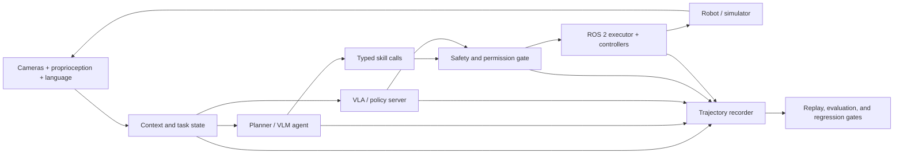

# Awesome Harness Robot

> A curated map of **agent harnesses**, **vision-language-action (VLA) systems**, and **robot foundation models**—with an emphasis on systems that can actually be trained, evaluated, integrated, and deployed.

Robot intelligence is a **model–harness–environment system**. The model predicts or plans; the harness owns tools, state, timing, safety, execution, recording, and verification; the environment includes the robot, simulator, sensors, and people around it.

This list is intentionally smaller than a paper dump. It prioritizes official code, released weights, reproducible evaluation, clear interfaces, and evidence from real or simulated closed-loop execution.

## Contents

- [What Counts as a Robot Harness?](#what-counts-as-a-robot-harness)
- [Current Landscape](#current-landscape)
- [Reference Architecture](#reference-architecture)
- [Harnesses and Development Platforms](#harnesses-and-development-platforms)
- [Robot Agent Systems](#robot-agent-systems)
- [Vision-Language-Action Models](#vision-language-action-models)
- [Robot Foundation and World Models](#robot-foundation-and-world-models)
- [Datasets and Data Infrastructure](#datasets-and-data-infrastructure)
- [Benchmarks and Evaluation](#benchmarks-and-evaluation)
- [Simulation and Digital Twins](#simulation-and-digital-twins)
- [Runtime, Safety, and Observability](#runtime-safety-and-observability)
- [Practical Starter Stacks](#practical-starter-stacks)
- [Surveys and Reading Lists](#surveys-and-reading-lists)
- [Contributing](#contributing)

## What Counts as a Robot Harness?

An **agent harness** is the runtime around a reasoning model. A **VLA harness** specializes that runtime for high-rate observations and action chunks. A **robot foundation-model harness** extends it across data collection, pre/post-training, embodiment adaptation, evaluation, and deployment.

| Layer | Owns | Typical failure if omitted |
| --- | --- | --- |
| Task and context | Goals, prompts, scene state, memory, skill registry | The model solves the wrong task or loses state. |
| Model adapter | Pre/post-processing, normalization, embodiment metadata, inference server | Actions use the wrong coordinate frame or scale. |
| Scheduler | Agent loop, policy/control rates, action chunking, retries, timeouts | Stale actions, jitter, or uncontrolled blocking. |
| Safety and permissions | Joint/workspace limits, collision checks, approvals, emergency stop | A plausible model output becomes a physical hazard. |
| Execution | ROS 2 actions/services/topics, controllers, skill calls | Plans never become deterministic robot behavior. |
| Observability | Traces, video, state/action logs, latency, interventions | Failures cannot be reproduced or attributed. |
| Verification | Task success, constraint checks, regression suites, replay | Demos look good while reliability silently regresses. |

The practical boundary is simple: **the model proposes; the harness decides whether, when, and how an action reaches hardware.**

## Current Landscape

Last verified: **2026-07-25**.

- **Robot harnesses are becoming a research category of their own.** [Guava](https://guava-harness.github.io/) studies model-agnostic embodied tool use; [ASPIRE](https://research.nvidia.com/labs/gear/aspire/) turns execution traces into an expanding skill library; and [GaP](https://graph-robots.github.io/gap/) uses multi-agent coding plus simulation to construct and refine graph-structured robot policies.
- **[Harness VLA](https://arxiv.org/abs/2607.08448) makes the harness itself the method.** It wraps a frozen VLA as a retryable contact-rich primitive, combines it with a small analytic primitive library, and uses task-specific traces plus global success/failure memory to recover and re-ground without fine-tuning the VLA.
- **Evaluation is becoming infrastructure.** [vla-evaluation-harness](https://github.com/allenai/vla-evaluation-harness) decouples model servers from benchmark containers and provides a cross-model, cross-benchmark evaluation matrix.
- **Common interfaces are winning.** [LeRobot](https://github.com/huggingface/lerobot) now spans data capture, policies, VLA/world-model integrations, evaluation, and hardware plugins; [StarVLA](https://github.com/starVLA/starVLA) focuses on composable backbones, action heads, datasets, and benchmarks.
- **Action generation is moving beyond one-token-at-a-time control.** Flow matching, diffusion heads, continuous regression, learned action tokenizers such as FAST, and action chunking are the dominant implementation families.
- **Cross-embodiment adaptation is a first-class concern.** Current stacks carry robot-specific state/action schemas, normalization statistics, embodiment tags, and camera layouts alongside checkpoints.
- **Open models cover a useful range.** Small local policies such as [SmolVLA](https://huggingface.co/blog/smolvla), open research stacks such as [OpenVLA-OFT](https://github.com/moojink/openvla-oft) and [openpi](https://github.com/Physical-Intelligence/openpi), and larger humanoid-oriented systems such as [GR00T N1.7](https://github.com/NVIDIA/Isaac-GR00T) can all be studied and adapted.
- **World models and explicit reasoning are converging with policies.** [V-JEPA 2](https://ai.meta.com/research/vjepa/), [Cosmos](https://github.com/NVIDIA/Cosmos), and [MolmoAct 2](https://github.com/allenai/molmoact2) represent complementary routes: latent prediction, generative physical-world modeling, and interpretable action reasoning.
- **The hard problems are still systems problems.** Real-time latency, train–test drift, recovery, long-horizon compounding error, safety, and comparable real-robot evaluation remain less solved than short-horizon benchmark success.

See [the landscape notes](docs/landscape.md) for a timeline and design trends.

## Reference Architecture

The slow semantic loop and fast motor loop should not share one unconstrained clock:

- **Planner loop (roughly 0.1–2 Hz):** interpret goals, select skills, recover, ask for approval.
- **Policy loop (roughly 2–30 Hz):** refresh observations and generate/fuse action chunks.
- **Servo loop (roughly 100–1000 Hz):** enforce limits, interpolate targets, stabilize contacts, and stop safely.

See [Reference Architecture](docs/reference-architecture.md) for interfaces, state machines, safety gates, and an implementation checklist.

## Harnesses and Development Platforms

### End-to-End Robot Learning

- [LeRobot](https://github.com/huggingface/lerobot) — End-to-end PyTorch stack for robot hardware, datasets, imitation/RL policies, VLAs, world models, training, and evaluation.
- [StarVLA](https://github.com/starVLA/starVLA) — Modular VLA development stack with pluggable VLM/world-model backbones, action heads, datasets, and benchmark integrations.
- [Isaac GR00T](https://github.com/NVIDIA/Isaac-GR00T) — Training, fine-tuning, inference, embodiment schemas, and deployment tools around NVIDIA's open generalist robot model.
- [openpi](https://github.com/Physical-Intelligence/openpi) — Official training and inference stack for π0, π0-FAST, and π0.5 checkpoints.
- [OpenVLA](https://github.com/openvla/openvla) — Reference stack for the 7B OpenVLA model, RLDS data, fine-tuning, and robot evaluation.
- [OpenVLA-OFT](https://github.com/moojink/openvla-oft) — Optimized OpenVLA fine-tuning and deployment with continuous actions, action chunking, parallel decoding, and proprioception.
- [RoboVLMs](https://github.com/Robot-VLAs/RoboVLMs) — Flexible research codebase for swapping VLM backbones and training/evaluating VLA variants.
- [robomimic](https://github.com/ARISE-Initiative/robomimic) — Mature imitation-learning framework and a strong non-foundation-model baseline.

### Unified Evaluation

- [vla-evaluation-harness](https://github.com/allenai/vla-evaluation-harness) — Model-server/benchmark-container abstraction, parallel rollout execution, recording, and a public leaderboard.
- [LeRobot evaluation](https://huggingface.co/docs/lerobot/index) — Unified policy evaluation and environment integration inside the LeRobot ecosystem.
- [EmbodiedBench](https://github.com/EmbodiedBench/EmbodiedBench) — Standardized evaluation for multimodal models acting as embodied agents across high- and low-level tasks.

### Robot Middleware and Execution

- [ROS 2](https://github.com/ros2/ros2) — Distributed robot middleware and the default integration boundary for sensors, tools, actions, and controllers.
- [ros2_control](https://github.com/ros-controls/ros2_control) — Real-time-capable controller and hardware-interface framework.
- [MoveIt 2](https://github.com/moveit/moveit2) — Motion planning, manipulation, collision checking, and servoing.
- [Navigation2](https://github.com/ros-navigation/navigation2) — ROS 2 navigation stack built around lifecycle nodes and behavior trees.
- [BehaviorTree.CPP](https://github.com/BehaviorTree/BehaviorTree.CPP) — Deterministic skill orchestration that pairs well with probabilistic planners and VLAs.
- [Open-RMF](https://github.com/open-rmf/rmf) — Fleet-level task, traffic, and infrastructure coordination.

## Robot Agent Systems

### Agentic Robot and VLA Harnesses

- [Harness VLA](https://harnessvla.github.io/) ([paper](https://arxiv.org/abs/2607.08448)) — Memory-guided agentic framework that treats a frozen VLA as a retryable primitive for contact-rich phases while analytic primitives handle grounding, staging, transport, navigation, and release. It learns how to compose a fixed skill library from task-specific execution traces, global success rules, and failure models; no public code repository was linked as of 2026-07-25.
- [Guava](https://guava-harness.github.io/) ([paper](https://arxiv.org/abs/2606.18363)) — Model-agnostic embodied tool-use harness built around iterative perception–reasoning–action loops, semantic action abstractions, and multimodal observations. The authors also distill the interaction pattern into Guava-Agent-4B with fewer than 2,000 simulation trajectories; code was marked “coming soon” as of 2026-07-25.
- [ASPIRE](https://research.nvidia.com/labs/gear/aspire/) ([paper](https://arxiv.org/abs/2607.00272)) — Continual code-as-policy system that records multimodal execution traces, diagnoses and validates repairs, stores reusable fixes in a growing skill library, and explores programs with evolutionary search. The project page marked code as forthcoming as of 2026-07-25.
- [GaP: Graph-as-Policy](https://graph-robots.github.io/gap/) ([paper](https://arxiv.org/abs/2607.05369)) — Multi-agent coding harness for variational automation. It assembles directed perception, planning, and control graphs from a modular robot skill library, generates internal simulations, and rehearses alternative graph structures and parameters before deployment.

### Runnable Agent-to-Robot Bridges

- [ROSA](https://github.com/nasa-jpl/rosa) — JPL's ROS Agent for inspecting, diagnosing, and operating ROS 1/2 systems through tool-using language agents.
- [ROS-LLM](https://github.com/Auromix/ROS-LLM) — ROS-oriented framework connecting language models, embodied perception, and robot functions.
- [ROSGPT](https://github.com/aniskoubaa/rosgpt) — Natural-language-to-ROS command bridge useful as a compact reference implementation.

### Planning, Tool Use, and Skill Composition

- [SayCan](https://say-can.github.io/) — Combines language-model affordances with learned value functions for grounded skill selection.
- [Code as Policies](https://code-as-policies.github.io/) — Generates robot policy code that composes perception and control APIs.
- [Inner Monologue](https://innermonologue.github.io/) — Adds environment feedback to language-model planning.
- [VoxPoser](https://voxposer.github.io/) — Uses language models and vision-language models to synthesize 3D value maps for manipulation.
- [AutoRT](https://auto-rt.github.io/) — Scales robot data collection with VLM scene understanding, LLM task proposals, and safety filtering.
- [PaLM-E](https://palm-e.github.io/) — Early embodied multimodal language model connecting continuous sensor inputs to language reasoning.

**Implementation pattern:** expose only typed, bounded skills (for example `pick(object_id)`, `navigate(pose)`, or `open_gripper()`), validate arguments outside the model, and keep raw actuator access behind deterministic controllers.

## Vision-Language-Action Models

Legend: **Open** = code and usable weights; **Partial** = some artifacts, SDK, or restricted access; **Closed** = public technical material/demo but no general model release. Always check the upstream license.

### Open and Reproducible

| Model / stack | Release | Action approach | Availability | Best fit |
| --- | --- | --- | --- | --- |
| [Octo](https://github.com/octo-models/octo) | 2024 | Transformer policy with action chunking | Open | Compact generalist policy and OXE research baseline. |
| [OpenVLA](https://github.com/openvla/openvla) | 2024 | Autoregressive discretized actions | Open | Canonical open 7B VLA and Bridge/OXE experimentation. |
| [RDT-1B](https://github.com/thu-ml/RoboticsDiffusionTransformer) | 2024 | Diffusion Transformer, 64-step chunks | Open | Bimanual manipulation and heterogeneous embodiments. |
| [CogACT](https://github.com/microsoft/CogACT) | 2024 | VLM plus specialized diffusion action module | Open | Studying decoupled cognition/action architectures. |
| [π0 / π0-FAST / π0.5](https://github.com/Physical-Intelligence/openpi) | 2024–2025 | Flow matching or FAST autoregressive tokenizer | Open | Large-scale pretraining, fine-tuning, and open-world studies. |
| [OpenVLA-OFT](https://github.com/moojink/openvla-oft) | 2025 | Parallel continuous action chunks with L1 regression | Open | Fast OpenVLA adaptation on LIBERO and ALOHA. |
| [SmolVLA](https://huggingface.co/blog/smolvla) | 2025 | Compact VLM plus flow-matching action expert | Open | Consumer hardware, LeRobot, SO-100/SO-101. |
| [X-VLA](https://github.com/2toinf/X-VLA) | 2025 | Soft prompts for cross-embodiment conditioning | Open | One policy across different robot embodiments. |
| [MolmoAct 2](https://github.com/allenai/molmoact2) | 2026 | Embodied-reasoning VLM plus flow-matching action expert | Open | Interpretable 3D reasoning, Franka, SO-100/101, and bimanual YAM. |
| [GR00T N1.7](https://github.com/NVIDIA/Isaac-GR00T) | 2026 | VLM plus diffusion Transformer action head | Open / early access | Humanoid and cross-embodiment post-training. |
| [InternVLA-A1](https://github.com/InternRobotics/InternVLA-A-series/tree/InternVLA-A1) | 2026 | Mixture-of-Transformers with understanding, visual-foresight, and flow-matching action experts | Open | Studying unified semantic reasoning, world-model-style prediction, and dynamic manipulation. |
| [LLaVA-VLA](https://github.com/OpenHelix-Team/LLaVA-VLA) | 2025 | LLaVA-derived VLA | Open | Smaller-scale architecture and training experiments. |
| [UniVLA](https://github.com/baaivision/UniVLA) | 2025 | Unified vision-language-action representation | Open | Robotics and autonomous-driving research. |

### Foundational Milestones

- [RT-1](https://robotics-transformer1.github.io/) — Scaled language-conditioned real-robot control with tokenized actions.
- [RT-2](https://robotics-transformer2.github.io/) — Co-fine-tuned web-scale vision-language knowledge into robot actions.
- [RT-X / Open X-Embodiment](https://robotics-transformer-x.github.io/) — Cross-institution dataset and cross-embodiment generalist policy effort.
- [VIMA](https://vimalabs.github.io/) — Multimodal prompt-conditioned manipulation benchmark and model.
- [RoboFlamingo](https://roboflamingo.github.io/) — Adapted a pretrained vision-language model into a robot imitation policy.

### Partial or Closed Frontier Systems

- [Gemini Robotics](https://deepmind.google/models/gemini-robotics/) — Google DeepMind's VLA family, including Robotics 1.5 and an on-device variant; access is not equivalent to open weights.
- [Gemini Robotics-ER](https://deepmind.google/models/gemini-robotics/) — Embodied-reasoning model intended to sit above robot controllers and policies.
- [Helix 02](https://www.figure.ai/news/helix-02) — Figure's proprietary hierarchical whole-body humanoid VLA.
- [Rho-alpha](https://www.microsoft.com/en-us/research/story/advancing-ai-for-the-physical-world/) — Microsoft Research early-access VLA derived from the Phi vision-language family.
- [π*0.6](https://www.physicalintelligence.company/download/pistar06.pdf) — Physical Intelligence's experience-improved VLA; research is public, but it is not part of the openpi release.

## Robot Foundation and World Models

### World and Physical-Reasoning Models

- [V-JEPA 2](https://github.com/facebookresearch/vjepa2) — Self-supervised video world model with an action-conditioned variant for model-predictive robot control.
- [NVIDIA Cosmos](https://github.com/NVIDIA/Cosmos) — World foundation-model platform for physical-AI video generation, reasoning, and synthetic data workflows.
- [DreamerV3](https://github.com/danijar/dreamerv3) — General world-model reinforcement-learning baseline across diverse domains.
- [Genie 2](https://deepmind.google/discover/blog/genie-2-a-large-scale-foundation-world-model/) — Large-scale interactive world-model research; not an open robot-control stack.

### Reusable Perception Foundations

- [SAM 2](https://github.com/facebookresearch/sam2) — Promptable image/video segmentation for object masks and tracking.
- [Grounding DINO](https://github.com/IDEA-Research/GroundingDINO) — Open-set text-conditioned detection.
- [Depth Anything V2](https://github.com/DepthAnything/Depth-Anything-V2) — Monocular depth estimation useful for spatial grounding.
- [DINOv2](https://github.com/facebookresearch/dinov2) — General visual features widely reused in robot perception.
- [OpenCLIP](https://github.com/mlfoundations/open_clip) — Open implementation of contrastive vision-language representation learning.

These models are ingredients, not robot policies. A harness still needs geometric validation, frame transforms, temporal tracking, and a safe executor.

## Datasets and Data Infrastructure

### Multi-Robot and Foundation-Model Data

- [Open X-Embodiment](https://robotics-transformer-x.github.io/) — Large cross-embodiment collection assembled from many institutions and robot platforms.
- [DROID](https://droid-dataset.github.io/) — Diverse, in-the-wild Franka manipulation dataset with a reproducible collection system.
- [BridgeData V2](https://rail-berkeley.github.io/bridgedata/) — Broad WidowX manipulation dataset used by several open VLA models.
- [RoboNet](https://www.robonet.wiki/) — Multi-robot visual-control dataset.
- [RH20T](https://rh20t.github.io/) — Multimodal real-world manipulation data across robots and sensors.
- [AgiBot World](https://github.com/OpenDriveLab/AgiBot-World) — Large-scale open dataset and toolkit oriented toward general-purpose robot learning.
- [MolmoAct 2-Bimanual YAM](https://huggingface.co/datasets/allenai/MolmoAct2-BimanualYAM-Dataset) — Open bimanual tabletop demonstrations released with MolmoAct 2.
- [LeRobot datasets](https://huggingface.co/lerobot) — Community datasets distributed through a common Hub-native format.

### Formats and Collection

- [RLDS](https://github.com/google-research/rlds) — TensorFlow-based episodic dataset format used by Open X-Embodiment and OpenVLA.
- [LeRobotDataset](https://huggingface.co/docs/lerobot/lerobot-dataset-v3) — Parquet/video-based format and tooling for recording, streaming, and sharing robot episodes.
- [robomimic datasets](https://robomimic.github.io/docs/datasets/overview.html) — HDF5 conventions and benchmark datasets for imitation learning.
- [rosbag2](https://github.com/ros2/rosbag2) — ROS 2 message recording and replay; useful as the raw operational log before learning-data conversion.
- [MCAP](https://github.com/foxglove/mcap) — Efficient multimodal robotics log container with broad tooling support.

**Do not convert too early.** Preserve raw timestamps, calibration, frame IDs, controller state, dropped-frame indicators, and operator interventions before producing a normalized training view.

## Benchmarks and Evaluation

### Manipulation and VLA

- [LIBERO](https://github.com/Lifelong-Robot-Learning/LIBERO) — Lifelong robot-learning benchmark with spatial, object, goal, and long-horizon task suites.
- [CALVIN](https://github.com/mees/calvin) — Long-horizon language-conditioned manipulation with chained tasks.
- [SimplerEnv](https://github.com/simpler-env/SimplerEnv) — Simulation-based evaluation intended to track real-world policy behavior.
- [VLABench](https://github.com/OpenMOSS/VLABench) — Language-conditioned manipulation with long-horizon reasoning and multiple evaluation tracks.
- [RoboCasa](https://github.com/robocasa/robocasa) — Large-scale household manipulation tasks built on robosuite.
- [RoboTwin](https://github.com/robotwin-Platform/RoboTwin) — Digital-twin and dual-arm manipulation benchmark.
- [ManiSkill](https://github.com/haosulab/ManiSkill) — GPU-parallel manipulation environments and tasks.
- [RLBench](https://github.com/stepjam/RLBench) — Vision-guided manipulation benchmark on CoppeliaSim.
- [BEHAVIOR-1K](https://behavior.stanford.edu/) — Long-horizon household activities in OmniGibson.
- [FurnitureBench](https://github.com/clvrai/furniture-bench) — Real-world and simulated furniture assembly.

### Agent and Embodied Reasoning

- [EmbodiedBench](https://github.com/EmbodiedBench/EmbodiedBench) — Multidimensional evaluation of multimodal embodied agents.
- [Habitat-Lab](https://github.com/facebookresearch/habitat-lab) — Embodied navigation, rearrangement, and home-assistant tasks.
- [ALFRED](https://askforalfred.com/) — Language-guided household task benchmark combining navigation and interaction.
- [TEACh](https://github.com/alexa/teach) — Dialogue-guided embodied task completion.
- [AI2-THOR](https://github.com/allenai/ai2thor) — Interactive household environments used by many embodied-agent benchmarks.

### What to Measure

A credible harness reports more than mean success:

- task success with confidence intervals and fixed seeds;
- time-to-completion, policy latency, control jitter, and deadline misses;
- interventions, retries, safety-gate rejections, and emergency stops;
- robustness to camera shifts, distractors, instruction paraphrases, object changes, and dynamics;
- open-loop action error **and** closed-loop recovery;
- performance by task, embodiment, environment, and failure category;
- exact checkpoint, normalization statistics, action horizon, control rate, simulator version, and hardware.

Treat upstream benchmark claims as **results under their stated protocol**, not a universal ranking.

## Simulation and Digital Twins

- [MuJoCo](https://github.com/google-deepmind/mujoco) — Fast general-purpose physics engine with a strong manipulation ecosystem.
- [Isaac Lab](https://github.com/isaac-sim/IsaacLab) — GPU-accelerated robot-learning framework on NVIDIA Isaac Sim.
- [ManiSkill](https://github.com/haosulab/ManiSkill) — GPU-parallel simulation and manipulation benchmark suite.
- [robosuite](https://github.com/ARISE-Initiative/robosuite) — MuJoCo manipulation framework underlying RoboCasa and many policy baselines.
- [Gazebo Sim](https://github.com/gazebosim/gz-sim) — General ROS-friendly robot simulator.
- [Genesis](https://github.com/Genesis-Embodied-AI/Genesis) — GPU-parallel physics and embodied-AI simulation platform.
- [OmniGibson](https://github.com/StanfordVL/OmniGibson) — Photorealistic household simulation used by BEHAVIOR.
- [Habitat-Sim](https://github.com/facebookresearch/habitat-sim) — High-performance embodied navigation and rearrangement simulator.

## Runtime, Safety, and Observability

### Runtime Building Blocks

- [ROS 2 lifecycle](https://design.ros2.org/articles/node_lifecycle.html) — Explicit node states for startup, recovery, and shutdown.
- [BehaviorTree.CPP](https://github.com/BehaviorTree/BehaviorTree.CPP) — Inspectable, interruptible task execution and fallback behavior.
- [MoveIt Servo](https://moveit.picknik.ai/main/doc/examples/realtime_servo/realtime_servo_tutorial.html) — Real-time Cartesian/joint jogging with collision and limit handling.
- [Zenoh](https://github.com/eclipse-zenoh/zenoh) — Communication layer for distributed and edge robotics.

### Safety

- [SROS2](https://github.com/ros2/sros2) — ROS 2 security tooling for identity, access control, and encrypted transport.
- [Safety Gymnasium](https://github.com/PKU-Alignment/safety-gymnasium) — Safe-RL environments and cost-based evaluation patterns.
- [SAFE](https://vla-safe.github.io/) — Research on zero-shot, multitask VLA failure detection.
- [SafeVLA](https://safevla.github.io/) — Research framework for safety alignment of VLA models.

At minimum, enforce joint/velocity/acceleration/force limits, workspace and keep-out zones, collision checks, stale-observation rejection, action-horizon limits, watchdogs, human-visible state, and a hardware emergency stop **outside** the learned model.

### Observability and Replay

- [Foxglove](https://github.com/foxglove/studio) — Visualizes live and recorded robotics data.
- [Rerun](https://github.com/rerun-io/rerun) — Multimodal logging and visualization for spatial and temporal data.
- [OpenTelemetry](https://opentelemetry.io/) — Vendor-neutral traces, metrics, and logs for planners, model servers, and tool calls.
- [Weights & Biases](https://github.com/wandb/wandb) — Experiment tracking for training and evaluation.
- [vla-evaluation-harness recordings](https://github.com/allenai/vla-evaluation-harness) — Structured rollout recording and mergeable evaluation output.

Correlate every semantic decision, inference call, action chunk, safety decision, controller command, and sensor frame with one episode and trace ID.

## Practical Starter Stacks

| Goal | Suggested stack | Why |
| --- | --- | --- |
| Learn on an affordable arm | SO-101 + LeRobot + ACT baseline + SmolVLA + LeRobotDataset | Low entry cost; one ecosystem for capture, training, and deployment. |
| Reproduce VLA papers in simulation | vla-evaluation-harness + LIBERO + OpenVLA-OFT / π0.5 / GR00T / MolmoAct 2 | Isolates dependencies and makes model/benchmark comparisons explicit. |
| Build a research VLA | StarVLA or RoboVLMs + LeRobot/RLDS data + LIBERO/ManiSkill | Modular backbones and action heads with reusable evaluation. |
| Adapt a strong open model to a new arm | LeRobot or openpi + 50–200 clean demonstrations + ROS 2 adapter | Starts from a released checkpoint while keeping the hardware boundary explicit. |
| Humanoid simulation and post-training | Isaac Lab + Isaac GR00T + ROS 2/ros2_control | Co-designed model, simulation, data, and accelerated deployment stack. |
| Language agent over deterministic skills | ROSA + ROS 2 + BehaviorTree.CPP + MoveIt/Nav2 | Separates semantic planning from verified robot skills. |
| Production-oriented prototype | ROS 2 + typed model server + safety supervisor + MCAP/rosbag2 + Foxglove + regression suite | Gives timing, safety, replay, and failure attribution equal weight with the policy. |

Recommended order:

1. Make a scripted or ACT/Diffusion Policy baseline reliable.
2. Record clean demonstrations and calibration metadata.
3. Integrate the VLA behind the same typed policy interface.
4. Validate in replay, then simulation, then a bounded real-robot cell.
5. Add perturbation tests and failure taxonomy before expanding autonomy.

## Surveys and Reading Lists

- [Harness VLA: Steering Frozen VLAs into Reliable Manipulation Primitives via Memory-Guided Agents](https://arxiv.org/abs/2607.08448) — Directly studies the agent-harness/VLA boundary: semantic re-grounding, non-contact motion, retry, and memory stay in the planner while the frozen VLA handles local contact-rich control.
- [Foundation Models in Robotics: Applications, Challenges, and the Future](https://arxiv.org/abs/2312.07843) — Organizes foundation models by perception, planning, and control.
- [A Survey on Robotics with Foundation Models: toward Embodied AI](https://arxiv.org/abs/2402.02385) — Broad survey of embodied foundation-model methods and applications.
- [Awesome Robotics Foundation Models](https://github.com/robotics-survey/Awesome-Robotics-Foundation-Models) — Companion collection to the foundation-model survey.
- [Awesome VLA/WAM](https://github.com/DravenALG/awesome-vla-wam) — Broad paper-oriented list of VLA and world-action-model research.
- [Awesome Physical AI](https://github.com/keon/awesome-physical-ai) — Papers spanning VLAs, world models, data, evaluation, and deployment.

## Scope and Curation Policy

An entry should have at least one of:

- official, runnable code;
- released weights or a documented public SDK;
- a dataset with a usable schema and access path;
- a benchmark with an evaluation protocol;
- a system paper that materially changed implementation practice.

Descriptions state what a project is useful for, not only what its authors claim. Commercial announcements without enough technical substance are excluded. Projects are removed when links die, licenses become unclear, or the implementation cannot be located.

This list is **curated, not exhaustive**, and is not a safety certification. Robot experiments can damage equipment or injure people.

## Contributing

Contributions are welcome. Please read [CONTRIBUTING.md](CONTRIBUTING.md) before opening a pull request.

## License

[CC0 1.0](LICENSE). Upstream projects, papers, models, datasets, and media retain their own licenses.
