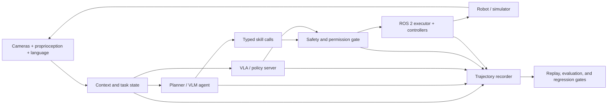

# Awesome Harness Robot

> A curated map of **agent harnesses**, **vision-language-action (VLA) systems**, and **robot foundation models**—with an emphasis on systems that can actually be trained, evaluated, integrated, and deployed.

Robot intelligence is a **model–harness–environment system**. The model predicts or plans; the harness owns tools, state, timing, safety, execution, recording, and verification; the environment includes the robot, simulator, sensors, and people around it.

This list is intentionally smaller than a paper dump. It prioritizes official code, released weights, reproducible evaluation, clear interfaces, and evidence from real or simulated closed-loop execution.

## Contents

- [What Counts as a Robot Harness?](#what-counts-as-a-robot-harness)
- [Current Landscape](#current-landscape)
- [Reference Architecture](#reference-architecture)
- [Harnesses and Development Platforms](#harnesses-and-development-platforms)
- [Robot Agent Systems](#robot-agent-systems)
- [Vision-Language-Action Models](#vision-language-action-models)
- [Robot Foundation and World Models](#robot-foundation-and-world-models)
- [Datasets and Data Infrastructure](#datasets-and-data-infrastructure)
- [Benchmarks and Evaluation](#benchmarks-and-evaluation)
- [Simulation and Digital Twins](#simulation-and-digital-twins)
- [Runtime, Safety, and Observability](#runtime-safety-and-observability)
- [Practical Starter Stacks](#practical-starter-stacks)
- [Surveys and Reading Lists](#surveys-and-reading-lists)
- [Contributing](#contributing)

## What Counts as a Robot Harness?

An **agent harness** is the runtime around a reasoning model. A **VLA harness** specializes that runtime for high-rate observations and action chunks. A **robot foundation-model harness** extends it across data collection, pre/post-training, embodiment adaptation, evaluation, and deployment.

| Layer | Owns | Typical failure if omitted |
| --- | --- | --- |
| Task and context | Goals, prompts, scene state, memory, skill registry | The model solves the wrong task or loses state. |
| Model adapter | Pre/post-processing, normalization, embodiment metadata, inference server | Actions use the wrong coordinate frame or scale. |
| Scheduler | Agent loop, policy/control rates, action chunking, retries, timeouts | Stale actions, jitter, or uncontrolled blocking. |
| Safety and permissions | Joint/workspace limits, collision checks, approvals, emergency stop | A plausible model output becomes a physical hazard. |
| Execution | ROS 2 actions/services/topics, controllers, skill calls | Plans never become deterministic robot behavior. |
| Observability | Traces, video, state/action logs, latency, interventions | Failures cannot be reproduced or attributed. |
| Verification | Task success, constraint checks, regression suites, replay | Demos look good while reliability silently regresses. |

The practical boundary is simple: **the model proposes; the harness decides whether, when, and how an action reaches hardware.**

## Current Landscape

Last verified: **2026-08-18**.

- **Robot harnesses are becoming a research category of their own.** [Guava](https://guava-harness.github.io/) studies model-agnostic embodied tool use; [ASPIRE](https://research.nvidia.com/labs/gear/aspire/) turns execution traces into an expanding skill library; and [GaP](https://graph-robots.github.io/gap/) uses multi-agent coding plus simulation to construct and refine graph-structured robot policies.
- **Robot middleware is being reframed as the Physical AI harness layer.** [Harness Engineering for Physical AI](https://arxiv.org/abs/2606.09416) argues that ROS 2-class middleware should compose output projection, resource isolation, and fallback transfer across control, compute, and communication. It is a position/design paper proposing a ROS 2 Harness Profile, not an implemented or experimentally validated system.
- **Harness optimization now reaches complete robot policy repositories.** [RHO](https://arxiv.org/abs/2606.16458) uses a tool-enabled coding agent and execution feedback to evolve interpretable multi-file repositories-as-policies during training, then deploys them without test-time code generation. Its Robosuite, LIBERO-PRO, and O3DE results are author-reported and simulation-only; no official code repository was linked as of 2026-08-16.
- **Recovery is becoming a first-class harness primitive.** [AgentRewind](https://arxiv.org/abs/2608.14380) checkpoints aligned agent context and controlled environment state, then resumes from an earlier point while retaining information from the failed attempt. Its evidence is on long-horizon engineering tasks rather than robots.
- **Transactional durability is being formalized for agents.** [Agentic Transaction](https://arxiv.org/abs/2608.13900) reinterprets ACID as Semantic Atomicity, Consistency, Isolation, and Durability for long-horizon agent execution and instantiates them in a data agent with exploration–execution–validation cycles, reporting a 10.6% gain over prior agents including Claude Code; no official implementation was linked as of 2026-08-17.
- **Test-time digital twins are becoming verification-gated harnesses.** [Twin](https://arxiv.org/abs/2608.14490) has a coding agent write an executable world model of an unknown environment, withholds scored actions until the model reproduces every observed transition, and repairs the model from prediction mismatches; MIT-licensed code and action-by-action replays are public. Current evidence is ARC-AGI-3 games rather than robotics.
- **Model and harness evolution are being coupled.** [HELIX](https://arxiv.org/abs/2608.13951) represents harness changes as source-traceable typed artifacts and turns verified sibling trajectories into model-training records. The paper evaluates one code-repair round, not robotics; the claimed `HKUDS/HELIX` repository returned 404 on 2026-08-17 but is now live (MIT-licensed TypeScript workspace) as of 2026-08-18.
- **Rollback must restore what the model attends, not only the transcript.** [Aborted but Not Forgotten](https://arxiv.org/abs/2608.15939) shows retained KV-cache state can keep an agent attending to content the application believes it discarded after a logical abort (25 of 63 audited cells across seven open-weight families), formalizing rollback consistency as a cross-layer harness guarantee; no public artifact link was located on the arXiv record as of 2026-08-18.
- **The harness itself is now an RL optimization target.** [ClawGym II](https://arxiv.org/abs/2608.16798) runs black-box PPO/GRPO through opaque harnesses by sandboxing rollouts, proxying model calls, and reconstructing multi-turn trajectories as prefix trees, including mix-harness training across heterogeneous harnesses; reported Pass@1 gains are on digital long-horizon agents.
- **Harness scaling is becoming a reproducible research result.** [StateM](https://arxiv.org/abs/2608.15089) ([code](https://github.com/henryqin1997/statem)) organizes execution around durable states, checked transitions, and recoverable runbooks, and reports raising GPT-5.6 Sol xhigh to 95.3% raw accuracy on Terminal-Bench 2.1 at ~$15 of final-score API usage; [Evo-Harness](https://arxiv.org/abs/2608.15071) ([code](https://github.com/A-EVO-Lab/a-evolve)) formalizes online harness learning, compiling noisy single-shot executions into reusable skill harnesses for a frozen solver. Both are digital-agent results with released implementations.
- **Closed-loop embodied harnesses are learning online.** [Zetta](https://air-embodied-brain.github.io/zetta/) ([paper](https://arxiv.org/abs/2608.16590)) evolves code-based runtime critics and recovery skills at three timescale-separated loops while the base policy stays frozen, reporting 90.8% LIBERO-Pro / 93.6% RoboCasa with an 11.1× speedup; the repository is public but asserts no license as of 2026-08-18.
- **Robot foundation models are adding test-time compute.** [τ0-VLA](https://tau0-vla.github.io/) ([paper](https://arxiv.org/abs/2608.16885), [code](https://github.com/sii-research/tau-0-vla), [weights](https://huggingface.co/sii-research/tau-0-vla)) makes high-level subtask generation a compute-scalable inference problem with world-model-guided search over alternatives, trained on 40,115 hours of heterogeneous real-world data; code (Apache-2.0) and weights are public.
- **Evaluation is being threaded from benchmark to robot.** [DeepInsight II](https://arxiv.org/abs/2608.16556) reproduces released checkpoints across navigation and manipulation benchmarks, places whole-body controllers under one metric contract, and carries matched cohorts from parallel simulation to real robots with shared trace identity so the sim-to-real gap becomes a native reduction.
- **World-model evaluation is gaining calibration and reasoning.** [CaliBench](https://arxiv.org/abs/2608.16829) tests the aleatoric calibration of stochastic video world models against closed-form reference distributions; [HarnessEval-W](https://mirros-lab.github.io/HarnessEval-W/) ([code](https://github.com/MirroS-Lab/HarnessEval-W)) agentifies world-model evaluation into verifiable evidence trees; and [RigidBench](https://arxiv.org/abs/2608.15555) ([code](https://github.com/swarnim-j/RigidBench), [data](https://doi.org/10.5281/zenodo.21649156)) separates motion, geometry, and visual-similarity errors in generated rollouts with released simulator-grounded data.
- **Coding-agent reliability is becoming a documented systems discipline.** [Engineering Reliable Coding Agents](https://arxiv.org/abs/2608.13867) ([companion](https://github.com/sjarmak/engineering-reliable-coding-agents)) packages runnable evaluation and operation protocols, a machine-readable catalog of 206 reliability records, and reusable agent skills for separating model capability from harness, state, retrieval, permissions, and observability effects.
- **Orchestration is moving from a paper abstraction to a modular system boundary.** [RoboBRIDGE](https://arxiv.org/abs/2607.27881) separates monitoring, perception, planning, control, and robot interfaces around pretrained VLAs, while [Embodied Agents Take Control](https://arxiv.org/abs/2607.26148) directly evaluates general software-agent harnesses holding the perceive–act–verify–correct loop in zero-shot navigation.
- **Open physical-agent runtimes are appearing.** [OpenETA](https://github.com/OpenMOSS/OpenETA) exposes planners, typed tools and skills, host-owned execution gates, fresh-observation turns, replayable trajectories, and auditable memory behind common simulation and real-robot adapters.
- **The orchestration gap is now being measured directly.** [Physical Agency](https://arxiv.org/abs/2607.21725) wraps frozen VLAs and parameterized skills in a closed-loop planner that decomposes goals, verifies outcomes, and recovers without additional policy training.
- **Improvement and verification are entering the execution loop.** [HERO](https://arxiv.org/abs/2607.26809) bootstraps experience and consolidates repeated interactions into visuomotor policies, while [CheckVLA](https://arxiv.org/abs/2607.26789) uses a frozen action-conditioned world model to detect deviations and rewrite still-deployable action suffixes.
- **Physical autoresearch now has an explicit harness.** [ENPIRE](https://research.nvidia.com/labs/gear/enpire/) turns reset, safety, verification, policy improvement, audited rollout, and multi-agent experiment evolution into a closed loop over real robot fleets.
- **Autoresearch is acquiring recoverable executable state.** [ScienceFlow](https://arxiv.org/abs/2608.14354) segments long-horizon research into executable workspaces, re-anchors between live and archived research states, and gates compute allocation on validated progress; the authors report a 70.22% Any-Medal score on MLE-bench. No official code was linked as of 2026-08-17.
- **The harness itself is becoming an optimization target.** [Self-Harness](https://arxiv.org/abs/2606.09498) mines recurring failures from execution traces, proposes bounded model-specific changes to the surrounding agent system, and promotes them only through regression tests. It is a general coding-agent result rather than a robotics evaluation, but its trace–edit–validate loop is directly relevant to safer offline robot-harness improvement.
- **Harness use is now learned, not scripted.** [EvoHarness-RL](https://arxiv.org/abs/2608.05446) learns when to read, update, and consolidate external harness state, while [EnvACE](https://arxiv.org/abs/2608.06197) trains agents to rehearse environment responses instead of touching an external simulator; both are general-agent results with no robot evaluation yet.
- **Harness training and audit are becoming infrastructure.** [OpenForgeRL](https://arxiv.org/abs/2607.21557) records harness model calls as training data for harness-native agents, while [A²E](https://arxiv.org/abs/2608.07346) audits agent harnesses end-to-end with instrumented execution traces and multidimensional metrics.
- **Harness evolution is acquiring safety and evaluation boundaries.** [SHE](https://arxiv.org/abs/2608.09885) attributes failures to four separately evolvable safety artifacts, while [Evo-Bench](https://arxiv.org/abs/2608.09096) tests whether improvements transfer beyond the tasks used to evolve them. Both are digital-agent results, not robot validation.
- **Harnesses can transfer capability without changing model weights.** [AI4AI at Test-Time](https://arxiv.org/abs/2608.12307) uses a stronger builder model to move reasoning into deterministic code, routing, and output enforcement around a weaker target; [Harness-IF](https://arxiv.org/abs/2608.11727) tests whether agents actually follow rules across five harness instruction surfaces. Both are coding/digital-agent results rather than robot validation.
- **Safety evaluation is becoming execution-grounded.** [REDAgentBench](https://arxiv.org/abs/2608.10669) verifies harmful effects from sandbox service receipts and final state rather than collapsing exposure, execution, visibility, and adjudication into one model-judged score; its current evidence is for digital agents, not robots.
- **Persistent skill learning creates a new safety lifecycle.** [SkillMisevo](https://github.com/henrymao2004/misevolve) tracks whether unsafe experience becomes an authored skill, is retrieved on benign work, and causes fresh-session harm; its mitigation governs both skill writes and later reuse across four coding-agent harnesses.
- **[Harness VLA](https://arxiv.org/abs/2607.08448) makes the harness itself the method.** It wraps a frozen VLA as a retryable contact-rich primitive, combines it with a small analytic primitive library, and uses task-specific traces plus global success/failure memory to recover and re-ground without fine-tuning the VLA.
- **Evaluation is becoming infrastructure.** [vla-evaluation-harness](https://github.com/allenai/vla-evaluation-harness) decouples model servers from benchmark containers; [HarnessOpt-Bench](https://arxiv.org/abs/2608.06301) places harness optimization behind a metered, held-out evaluation boundary; and [GAUGE](https://arxiv.org/abs/2608.05948) diagnoses which physical laws simulators and video world models violate.
- **Robot policies are gaining a shared systems contract.** [XPolicyLab](https://github.com/XPolicyLab/XPolicyLab) standardizes observation, action, trajectory, reset, serving, and evaluation interfaces across 42 policies, RoboTwin, RoboDojo, and real-robot clients.
- **VLA reasoning is moving from generation to consumption.** [In-Context VLA](https://arxiv.org/abs/2608.05738) reports that free-form textual chain-of-thought degrades low-level control and instead feeds structured perceptual evidence plus agentic tool queries into the policy; the results are author-reported on simulation and eight real-robot tasks.
- **In-context robot adaptation is becoming structured.** [StellaVLA](https://arxiv.org/abs/2608.11671) converts one retrieved robot, human-hand, or XR trajectory into a task plan, subgoals, and verbalized 3D motion, then removes the language path from high-rate deployment inference.
- **VLA evaluation is being stress-tested at scale.** [VLA-Arena](https://arxiv.org/abs/2512.22539) benchmarks 170 tasks across Safety, Distractor, Extrapolation, and Long Horizon dimensions with fine-tuning restricted to the easiest difficulty level.
- **Common interfaces are winning.** [LeRobot](https://github.com/huggingface/lerobot) now spans data capture, policies, VLA/world-model integrations, evaluation, and hardware plugins; [StarVLA](https://github.com/starVLA/starVLA) focuses on composable backbones, action heads, datasets, and benchmarks.
- **Action generation is moving beyond one-token-at-a-time control.** Flow matching, diffusion heads, continuous regression, learned action tokenizers such as FAST, and action chunking are the dominant implementation families.
- **Cross-embodiment adaptation is a first-class concern.** Current stacks carry robot-specific state/action schemas, normalization statistics, embodiment tags, and camera layouts alongside checkpoints. [LingBot-VLA 2.0](https://github.com/Robbyant/lingbot-vla-v2) uses a 55-dimensional canonical schema, while Qwen-RobotManip reports an 80-dimensional masked schema and camera-frame motion alignment.
- **Open models cover a useful range.** Small local policies such as [SmolVLA](https://huggingface.co/blog/smolvla), open research stacks such as [OpenVLA-OFT](https://github.com/moojink/openvla-oft) and [openpi](https://github.com/Physical-Intelligence/openpi), and larger humanoid-oriented systems such as [GR00T N1.7](https://github.com/NVIDIA/Isaac-GR00T) can all be studied and adapted.
- **World-model interfaces are becoming embodiment-aware and multimodal.** [Robot-Factored World Models](https://bjkim95.github.io/rofacto/) exposes controller-realized robot motion as rendered geometry, [ViTacWorld](https://vitacworld.github.io/) predicts synchronized visual and tactile outcomes, and [GeniWorld](https://chenghaogu.github.io/GeniWorld/) turns URDF-rendered actions into an interactive policy-evaluation interface.
- **World models are also becoming planner-facing artifacts.** [World Action Planner](https://arxiv.org/abs/2607.27599) searches over imagined visual outcomes, while [VisualPatchWorld](https://github.com/HKBU-KnowComp/VisualPatchWorld) induces inspectable dynamics programs that can be rolled forward inside model-predictive control.
- **World models are becoming evaluated objects.** [XEWorld](https://arxiv.org/abs/2608.05799) tests whether action-conditioned world models render unseen embodiments and finds they mostly match visual patterns rather than physical kinematics, while [DynamicWAM](https://arxiv.org/abs/2608.00793) releases a motion-conditioned compact WAM with asynchronous chunking for dynamic manipulation.
- **World models are becoming diagnosis interfaces.** [Onto-EV-WM](https://arxiv.org/abs/2608.13901) grounds world-model failure signals in typed task predicates and correction routes with verification-gated acceptance, reporting 85.00% success over the 10,030-task LIBERO-Plus registry; evidence is simulation-only.
- **One WAM checkpoint can now expose multiple compute modes.** [Flex-π](https://flex-pi.github.io/) jointly denoises actions with RGB, pointmap geometry, and semantic latents, then enables different observed/predicted stream subsets at deployment. The official repository is only a release placeholder as of 2026-08-12.
- **Future conditioning no longer requires iterative video rollout.** [RIFT](https://arxiv.org/abs/2608.11521) first probes whether WAM actions consume future-cache content, then replaces iterative cache production with learned anticipation tokens and a single backbone pass; current evidence is simulation-only.
- **Serving and intervention now have explicit contracts.** [World Action Models in Real Time](https://arxiv.org/abs/2608.01880) studies temporal alignment and asynchronous chunk serving, [CoWAM](https://arxiv.org/abs/2608.02578) gates bimanual policy interventions through typed coordination obligations, and [SAFECAST](https://arxiv.org/abs/2608.04246) calibrates VLA failure detectors under deployment shift.
- **VLA monitoring is moving earlier and deeper.** [ContactGuard](https://arxiv.org/abs/2608.13438) predicts failure before a planned chunk reaches contact, while [Decoding Task Progress](https://arxiv.org/abs/2608.13474) reads stalled progress directly from VLA activations as a lightweight deployment signal.
- **VLA memory is moving from context to persistent state.** [AtlasVLA](https://arxiv.org/abs/2608.06729) keeps a 4D voxel-hashed world state plus an ego-working memory so policies survive partial observability and long horizons, while [PSG-JEPA](https://arxiv.org/abs/2608.06799) grounds JEPA latents in proprioceptive state to make world-model representations control-relevant.
- **WAM harnesses are closing the prediction–execution loop.** [HarnessWAM](https://arxiv.org/abs/2608.09516) adds task state, capability-constrained skills, verification, and recovery; [TempoWAM](https://arxiv.org/abs/2608.09492) decides how much of each chunk to execute from observed progress; and [WorldSimProbe](https://arxiv.org/abs/2608.09298) tests whether imagined actions actually cause grounded motion and interaction.
- **Perception is part of the safety boundary.** [Hijacking Robots with a Piece of Paper](https://arxiv.org/abs/2608.05715) shows physical signage can prompt-inject VLM-controlled robots (up to 29.4% attack success across three frontier VLMs), and [Failing Gracefully](https://arxiv.org/abs/2608.05313) scores the impact of inevitable robot failures rather than only their probability.
- **Robot-team coordination is a security boundary.** [When Coordination Becomes a Threat](https://arxiv.org/abs/2608.06830) attacks communication in LLM-planned multi-robot systems across DMAS and HMAS architectures, and [AutoIntervene](https://arxiv.org/abs/2608.07065) adds calibrated operator handoff for action-chunking policies.
- **The hard problems are still systems problems.** Real-time latency, train–test drift, recovery, long-horizon compounding error, safety, and comparable real-robot evaluation remain less solved than short-horizon benchmark success.

See [the landscape notes](docs/landscape.md) for a timeline and design trends.

## Reference Architecture

The slow semantic loop and fast motor loop should not share one unconstrained clock:

- **Planner loop (roughly 0.1–2 Hz):** interpret goals, select skills, recover, ask for approval.
- **Policy loop (roughly 2–30 Hz):** refresh observations and generate/fuse action chunks.
- **Servo loop (roughly 100–1000 Hz):** enforce limits, interpolate targets, stabilize contacts, and stop safely.

See [Reference Architecture](docs/reference-architecture.md) for interfaces, state machines, safety gates, and an implementation checklist.

## Harnesses and Development Platforms

### General Harness Design and Self-Improvement

- [Self-Harness: Harnesses That Improve Themselves](https://arxiv.org/abs/2606.09498) — Keeps the base model fixed while the same model mines verifier-grounded failure patterns, proposes minimal changes to prompts, tools, memory, runtime controls, skills, or subagents, and promotes candidates through held-in/held-out regression gates. Evaluated on Terminal-Bench-2.0 rather than robots; no official code link was present as of 2026-07-26.
- [Harness-R1](https://github.com/DeepExperience/Harness-R1) ([paper](https://arxiv.org/abs/2608.02276), [models](https://huggingface.co/ShaoShuai0605/Harness-R1)) — Trains a separate 9B harness engineer with supervised cold start and online reinforcement learning to turn batches of agent failures into validated executable lifecycle-hook patches while the target model stays frozen. The Apache-2.0 repository and model weights are public. Results are author-reported on WebShop, ALFWorld, and DBBench rather than robots, so transfer to a physical-agent harness remains unvalidated.
- [HarnessOpt-Bench](https://arxiv.org/abs/2608.06301) — Evaluates end-to-end harness optimization under fixed, expensive, stochastic target-evaluation budgets. A trusted execution environment hides the held-out test partition, meters target-agent resources, and preserves candidate versions for audit; the authors report 111 runs over five frontier optimizer models and four downstream digital-agent tasks. It contains no robot experiment, and no official code or benchmark release was linked as of 2026-08-07.
- [EvoHarness-RL](https://arxiv.org/abs/2608.05446) — Learns a self-evolving runtime harness for long-horizon LLM agents instead of hand-crafting prompts and workspace conventions. Belief, Progress, and Experience become policy-facing harness state: supervised fine-tuning teaches the harness action space, and cost-aware GRPO learns when to read, update, and consolidate state. On ALFWorld with Qwen3-8B the authors report 96.9% success and describe harness annealing and harness evolution. Digital-agent results only; no official code link was located as of 2026-08-10.
- [EnvACE](https://arxiv.org/abs/2608.06197) ([code](https://github.com/Within-yao/EnvACE)) — Agentic reinforcement learning that replaces external environment interaction during training with world rehearsal: the policy alternates between generating tool calls and playing the environment response, jointly optimized end-to-end, yielding an internalized agent world model with private rehearsal at test time. The released repository includes the agent system and simulator core; reported gains are on digital tool-use benchmarks (BFCL-v4, tau²-Bench, VitaBench, FinMCP-Bench), not robots.
- [OpenForgeRL](https://arxiv.org/abs/2607.21557) — Open-source framework for training harness-native agents end-to-end in arbitrary environments: a lightweight proxy records the harness's model calls as training data for a standard RL codebase (for example veRL), while a Kubernetes orchestrator runs each rollout in an isolated container. This makes stateful, multi-process harnesses such as Claude Code, Codex, and OpenClaw trainable; the paper describes it as open-source, but no official repository link was located on the arXiv record as of 2026-08-10.
- [A²E: Agent Auditing Engine](https://arxiv.org/abs/2608.07346) ([code](https://github.com/datamllab/A2E)) — End-to-end evaluation engine for agent harnesses. An Agent Task Protocol integrates evaluation tasks across harnesses, an automatically instrumented Monitor captures standardized execution traces, and multidimensional metrics assess harness capabilities beyond correctness alone. The official repository is public; evaluated harnesses and tasks are digital-agent focused.
- [SHE: Safety Harness Evolution](https://arxiv.org/abs/2608.09885) — Decomposes a safety harness into System Prompt, Rule Bank, Safety Memory, and Tool Policy, attributes rollout failures to the responsible artifact, and promotes localized refinements through safety–utility validation. The authors report a 3.1× attack-success-rate reduction on Agent-SafetyBench and transfer to AgentHarm; there is no robot experiment or official code link as of 2026-08-11.
- [Evo-Bench](https://arxiv.org/abs/2608.09096) — Benchmark for intrinsic harness evolution across Search, Office, and General agents, using harness-sensitive task construction and sensitivity-aware splits to separate transferable framework improvements from base-model strength and task overfitting. Digital-agent results only; no official benchmark release was linked as of 2026-08-11.
- [REDAgentBench](https://arxiv.org/abs/2608.10669) — Executable red-teaming framework that derives attacks from explicit safety constraints, runs them in isolated service sandboxes, and verifies effects from receipts and final-state changes. Its 1,661 cases span five service surfaces, six models, and three harnesses. Results are author-reported and digital-agent only; no official code or benchmark repository was linked as of 2026-08-12.
- [AI4AI at Test-Time](https://arxiv.org/abs/2608.12307) — Strong-to-weak scaffolding in which a builder model iteratively constructs an inference-time harness for a weaker frozen target. Reported gains mainly come from deterministic code, routing, and strict answer enforcement. Evaluated on Theory-of-Mind benchmarks rather than robots; no official code link was located as of 2026-08-13.
- [Harness-IF](https://arxiv.org/abs/2608.11727) — Execution-grounded benchmark for operational instruction following across system prompts, project files, user instructions, tools, and skill descriptions. Against-Prior Accuracy withholds rules to separate compliance from coincidence, and a conflict pilot probes surface precedence. Coding-agent results only; no official benchmark repository was linked as of 2026-08-13.
- [SkillMisevo / Practice Makes Unsafe](https://github.com/henrymao2004/misevolve) ([paper](https://arxiv.org/abs/2608.12851)) — Lifecycle-aware benchmark for persistent skill poisoning across Claude Code, Codex, OpenClaw, and Hermes. It separates unsafe authoring, retrieval, benign-task contamination, and fresh-session carryover; SafeEvolve repairs skill content and governs reuse. Results are digital-agent only, and the public implementation declares no repository license as of 2026-08-14.
- [AgentRewind](https://arxiv.org/abs/2608.14380) — Runtime recovery framework that records aligned checkpoints of agent context and controlled environment state, rewinds both after a propagated error, and resumes with information from previous attempts. MettleBench evaluates long-horizon engineering work across models, strategies, and harnesses. Results are digital-agent only, and no official code or benchmark release was linked as of 2026-08-17; robotics transfer additionally requires safe physical rollback or compensating actions because hardware state is rarely reversible.
- [HELIX](https://arxiv.org/abs/2608.13951) ([code](https://github.com/HKUDS/HELIX)) — Source-traceable substrate for model–harness co-evolution built from typed ports, reusable atoms, recipes, product shells, and runtime policies. It preserves intervention identity, trajectories, tests, and provenance while converting complementary sibling outcomes into SFT, critic, filter, and preference data. The reported evidence is one SWE-bench code-repair evolution round with no robot experiment. The MIT-licensed repository is now live (TypeScript workspace decomposing OpenCode, Pi Mono, Nanobot, and Hermes into 1,332 harness atoms with 96 standard swap ports) as of 2026-08-18.
- [Agentic Transaction](https://arxiv.org/abs/2608.13900) — Reinterprets classical ACID for LLM-agent execution as Semantic Atomicity, Consistency, Isolation, and Durability, and instantiates them in a data agent through transactional exploration–execution–validation cycles, confidence-divergence-based validation, semantic dependency-aware isolation, and transaction-aware state management. The authors report a 10.6% improvement over prior agents including Claude Code on widely used benchmarks; no official implementation was linked as of 2026-08-17.
- [ScienceFlow](https://arxiv.org/abs/2608.14354) — Long-horizon autoresearch harness that organizes ML and scientific research into executable workspaces, represents research progress as recoverable executable state, and uses Executable-State Transition through Re-Anchoring (ESTRA) plus an evidence-aware execution controller to continue, redirect, or stop lines of work under budget. The authors report a 70.22% Any-Medal score on MLE-bench within a 24-hour budget; no official code or repository link was located as of 2026-08-17.
- [Engineering Reliable Coding Agents](https://arxiv.org/abs/2608.13867) ([companion](https://github.com/sjarmak/engineering-reliable-coding-agents)) — A 314-page engineering monograph with an Apache-2.0 companion artifact treating coding-agent reliability as a property of the system around the model: harness, execution state, retrieval, memory and state management, permissions, review interfaces, and resource allocation. It contributes runnable evaluation and operation protocols, a machine-readable catalog of 206 reliability records, an evidence ledger, and reusable agent skills for distinguishing model capability from infrastructure effects. Scope is digital agents, not robot validation.
- [Twin](https://arxiv.org/abs/2608.14490) ([code](https://github.com/Alexyskoutnev/TWIN-ARC-AGI-3), [replays](https://arc-agi-3-twin.vercel.app/)) — Test-time world-model inference harness for unknown environments: a coding agent writes an executable world model of the task, the harness withholds scored actions until the model reproduces every observed transition, and each prediction mismatch becomes a counterexample that repairs the model. The MIT-licensed implementation and action-by-action replays are public; the authors report clearing 97.8% of ARC-AGI-3 levels versus 7.8% for the base model played directly. Evidence is game-domain; robot transfer would require observation and physics grounding.
- [StateM](https://arxiv.org/abs/2608.15089) ([code](https://github.com/henryqin1997/statem)) — Harness-scaling runtime for long-horizon agents that organizes execution around durable states, phase-local context, checked transitions, recoverable runbooks, and versioned procedural practices, turning postmortem findings into executable preconditions. The Apache-2.0 repository contains a runnable runtime package with tests and docs. The authors report raising GPT-5.6 Sol xhigh to 95.3% raw accuracy on Terminal-Bench 2.1 across 445 trials at ~$15 of final-score API usage (versus $574.68 for the reference), with runbooks transferring across models. Digital terminal agents; no robot experiment.
- [Evo-Harness](https://arxiv.org/abs/2608.15071) ([code](https://github.com/A-EVO-Lab/a-evolve)) — Online harness learning: a frozen solver processes a task stream while an external skill harness is compiled from execution context and grounded feedback (`Select → Inject → Execute → Reflect → Compile → Update`), storing all learning as inspectable Markdown skill files. The MIT-licensed implementation on the `release/evo-harness` branch includes the five benchmark pipelines (TerminalBench2, SWE-bench, CL-Bench, WebArena-Infinity). Digital agents; no robot experiment.
- [ClawGym II](https://arxiv.org/abs/2608.16798) — Black-box reinforcement learning through opaque agent harnesses: sandboxed concurrent rollouts, a serving proxy that captures model calls at the model boundary, prefix-tree reconstruction of multi-turn trajectories, PPO/GRPO optimization over the tree, and mix-harness training that lets one model be jointly optimized by heterogeneous harnesses. The authors report Pass@1 gains of 9.98 and 14.81 points on ClawGym-Bench through OpenClaw and Claude Code with Qwen3-30A3B, stable over 200–400 optimization steps. Digital long-horizon agents; no official code link was located as of 2026-08-18.
- [Bounded Agents](https://arxiv.org/abs/2608.15888) ([code](https://github.com/xmuruaga/bounded-agents)) — Delegation security for multi-agent systems: the Agentic Principal Chain evaluates every proposed action against six conjunctive checks (identity, scope and composition, context, approval, evidence, intent) over accumulated session state, narrows delegated scope monotonically across hops, and enforces composition restrictions outside the model. The Apache-2.0 reference implementation ships 215 tests with zero runtime dependencies. The authors report AgentDojo exfiltration falling from 75–100% to 0% and all 544 InjecAgent data-stealing cases blocked, at a utility cost of 8.6–13.9 percentage points. Digital agents; no robot experiment.
- [SCOPE](https://arxiv.org/abs/2608.15043) ([code](https://github.com/YuhuaJiang2002/SCOPE)) — Score-isolated, auditable inference-time adaptation for frozen video world models: external controls live in a typed state updated only through bounded, evidence-supported changes, with selection-aware conformal risk control, score-blind candidate filtering, exact base fallback, and the policy frozen before held-out evaluation. The authors report +14.24 (95% CI [+8.10, +21.23]) over the frozen base on Physics-IQ, with gains that do not transfer uniformly across backbones. Video-world-model domain, not robotics; the repository asserts no license as of 2026-08-18.
- [Aborted but Not Forgotten](https://arxiv.org/abs/2608.15939) — Cross-layer rollback consistency for stateful language agents: clearing a rejected branch from the application transcript is not a complete abort when the serving session retains KV state, because the model can keep attending to content the application believes it discarded. A same-token/different-cache audit across seven open-weight families (3.8B–36B) shows retained KV alone flips a typed protected effect in 25 of 63 audited cells, including under LangGraph time-travel; transaction-local cache restoration closes the channel without a global flush. Digital agents; the paper reports released artifacts but no public link was located on the arXiv record as of 2026-08-18.

### End-to-End Robot Learning

- [LeRobot](https://github.com/huggingface/lerobot) — End-to-end PyTorch stack for robot hardware, datasets, imitation/RL policies, VLAs, world models, training, and evaluation.
- [StarVLA](https://github.com/starVLA/starVLA) — Modular VLA development stack with pluggable VLM/world-model backbones, action heads, datasets, and benchmark integrations.
- [XPolicyLab](https://github.com/XPolicyLab/XPolicyLab) ([paper](https://arxiv.org/abs/2608.09892), [project](https://xpolicylab.github.io/)) — Shared observation/action/trajectory schemas and a dependency-isolated policy-server/environment-client contract for installation, debugging, serving, evaluation, and deployment. The public repository integrates 42 VLA, WAM, and baseline policies with RoboTwin, RoboDojo, and real-robot paths; integration-effort results are author-reported.
- [Isaac GR00T](https://github.com/NVIDIA/Isaac-GR00T) — Training, fine-tuning, inference, embodiment schemas, and deployment tools around NVIDIA's open generalist robot model.
- [openpi](https://github.com/Physical-Intelligence/openpi) — Official training and inference stack for π0, π0-FAST, and π0.5 checkpoints.
- [OpenVLA](https://github.com/openvla/openvla) — Reference stack for the 7B OpenVLA model, RLDS data, fine-tuning, and robot evaluation.
- [OpenVLA-OFT](https://github.com/moojink/openvla-oft) — Optimized OpenVLA fine-tuning and deployment with continuous actions, action chunking, parallel decoding, and proprioception.
- [RoboVLMs](https://github.com/Robot-VLAs/RoboVLMs) — Flexible research codebase for swapping VLM backbones and training/evaluating VLA variants.
- [robomimic](https://github.com/ARISE-Initiative/robomimic) — Mature imitation-learning framework and a strong non-foundation-model baseline.

### Unified Evaluation

- [vla-evaluation-harness](https://github.com/allenai/vla-evaluation-harness) — Model-server/benchmark-container abstraction, parallel rollout execution, recording, and a public leaderboard.
- [LeRobot evaluation](https://huggingface.co/docs/lerobot/index) — Unified policy evaluation and environment integration inside the LeRobot ecosystem.
- [EmbodiedBench](https://github.com/EmbodiedBench/EmbodiedBench) — Standardized evaluation for multimodal models acting as embodied agents across high- and low-level tasks.

### Robot Middleware and Execution

- [ROS 2](https://github.com/ros2/ros2) — Distributed robot middleware and the default integration boundary for sensors, tools, actions, and controllers.
- [ros2_control](https://github.com/ros-controls/ros2_control) — Real-time-capable controller and hardware-interface framework.
- [MoveIt 2](https://github.com/moveit/moveit2) — Motion planning, manipulation, collision checking, and servoing.
- [Navigation2](https://github.com/ros-navigation/navigation2) — ROS 2 navigation stack built around lifecycle nodes and behavior trees.
- [BehaviorTree.CPP](https://github.com/BehaviorTree/BehaviorTree.CPP) — Deterministic skill orchestration that pairs well with probabilistic planners and VLAs.
- [Open-RMF](https://github.com/open-rmf/rmf) — Fleet-level task, traffic, and infrastructure coordination.

## Robot Agent Systems

### Agentic Robot and VLA Harnesses

- [Harness Engineering for Physical AI](https://arxiv.org/abs/2606.09416) — Position and systems-design paper identifying robot middleware as the Physical AI harness boundary. It proposes Projection to gate learned-model outputs, Isolation to bound inference and transmission resources, and Transfer to fall back to a verified baseline, packaged as a prospective ROS 2 Harness Profile spanning ROS 2, DDS, and Zenoh. The paper provides architecture and requirements rather than an implementation or robot experiment; no official code was linked as of 2026-08-16.
- [RHO: Your Coding Agent is Secretly a Roboticist](https://arxiv.org/abs/2606.16458) — Robotics Harness Optimization moves Code-as-Policies search to training time: a bounded coding agent edits and evaluates multi-file repositories-as-policies using reflective environment feedback and Pareto-frontier selection. The selected repository executes without deployment-time code generation. The authors report gains on Robosuite, LIBERO-PRO, and an O3DE agent stack; all reported experiments are simulated, and no official implementation repository was linked as of 2026-08-16.
- [ART: Agentic Robot with Tool-use](https://arxiv.org/abs/2608.14047) — Tool-injection framework that fine-tunes a VLA to call off-the-shelf low-level vision, high-level affordance, and embodiment tools inside long trajectories. The authors report simulation and real-world gains using 30K tool-use/action trajectories, including dark and novel-viewpoint manipulation. The paper is in CVPR 2026 Findings, but no official project, dataset, model, or code release was linked as of 2026-08-17.
- [OpenETA](https://github.com/OpenMOSS/OpenETA) ([paper](https://arxiv.org/abs/2608.03924), [project](https://openmoss.ai/OpenETA/)) — Open implementation of the Embodied Task Agent paradigm: a planner issues one typed world-changing tool call, a host-owned interface validates and executes it, and the world returns the result plus a fresh observation before the next decision. The Apache-2.0 repository includes simulation and real-robot adapters, reusable skills and memory, replayable logs, tests, and a UR5e integration path; benchmark and hardware results are author-reported.
- [ENPIRE](https://research.nvidia.com/labs/gear/enpire/) ([paper](https://arxiv.org/abs/2606.19980), [analysis](sources/enpire-2606.19980.md)) — Physical-autoresearch harness with Environment, Policy Improvement, Rollout, and Evolution modules. Coding agents build reset and verification routines, revise policy or training code, run budgeted trials on one or more real robots, and exchange successful recipes through Git branches. The authors report a 99% **pass@8** rate on showcased dexterous tasks; this allows up to eight in-context retries per subtask and should not be read as 99% single-attempt success. No public implementation repository was linked as of 2026-08-03.
- [RoboBRIDGE](https://arxiv.org/abs/2607.27881) — Five-module orchestration layer—Monitor, Perceptor, Planner, Controller, and Robot Interface—that turns pretrained VLAs or other policies into closed-loop agents. It combines rapid failure detection, hierarchical recovery, asynchronous perception, replanning, and embodiment abstraction; the authors report LIBERO, RoboCasa, and multi-platform real-robot studies. No official public code repository was located as of 2026-07-31.
- [Embodied Agents Take Control](https://arxiv.org/abs/2607.26148) — Controlled study of general software-engineering agent harnesses directly operating a monocular navigation interface through perceive–act–verify–correct loops. It highlights model choice, tool-interface design, latency, context growth, and long-horizon degradation rather than presenting a new robot policy; no official code link was present on the arXiv page as of 2026-07-31.
- [HERO / Practice Makes Policies](https://arxiv.org/abs/2607.26809) — Self-improving hierarchical embodied agent that bootstraps manipulation from heuristic reasoning, reuses successful exemplars, and consolidates repeated experience into closed-loop visuomotor policies without human demonstrations. The paper reports reduced human intervention and diverse manipulation experiments; no official code link was present as of 2026-07-31.
- [CheckVLA](https://arxiv.org/abs/2607.26789) — Execution-time verifier for open-loop VLA action chunks. A frozen action-conditioned world model, conformal intervention threshold, latency-aware suffix replacement, and event-driven keyframe memory restore feedback during long-horizon execution. Results reported to date are on RoboCasa365 simulation, and no official code link was present as of 2026-07-31.
- [CoWAM](https://arxiv.org/abs/2608.02578) — Selective intervention layer for bimanual policies that turns synchronization, role compatibility, and collision convergence into typed admissibility checks, calibrated gates, and an abstention fallback. The authors report gains across eight simulated tasks while keeping harmful interventions below 1%; no official code link was present as of 2026-08-06, and the evidence is simulation-only.
- [Harness VLA](https://harnessvla.github.io/) ([paper](https://arxiv.org/abs/2607.08448)) — Memory-guided agentic framework that treats a frozen VLA as a retryable primitive for contact-rich phases while analytic primitives handle grounding, staging, transport, navigation, and release. It learns how to compose a fixed skill library from task-specific execution traces, global success rules, and failure models; no public code repository was linked as of 2026-07-25.
- [In-Context VLA](https://arxiv.org/abs/2608.05738) — Argues empirically and analytically that free-form textual chain-of-thought degrades low-level VLA control (ungrounded reasoning, latency, conflicting reasoning-versus-action objectives) and instead gives a VLA language competence through in-context post-training on structured perceptual evidence plus an agentic tool-use interface (open-vocabulary detectors, monocular depth, and VLM queries). The authors report SOTA performance and efficiency against CoT-based methods on RoboCasa-GR1, SimplerEnv, LIBERO, and eight real-robot manipulation tasks; no official code link was located as of 2026-08-10.
- [AtlasVLA](https://arxiv.org/abs/2608.06729) — Adds a persistent world-ego state to VLA policies for long-horizon, partially observable tasks. A 4D Persistent World State Memory lifts transient 2D observations into a voxel-hashed spatial state to resolve visual blind spots, an Ego-Working State Memory tracks historical ego state and task progress, and a diffusion Transformer conditions on the joint state. Results are author-reported; no official code or project link was located as of 2026-08-10.
- [Agentic Harnesses](https://arxiv.org/abs/2608.09857) — LLM-driven verification middleware between a planning server and robot-facing MCP server, with approve, reject-for-reformulation, and human-escalation outcomes. The reported precision and adversarial-containment results are author-reported; no public code or independent hardware validation was located as of 2026-08-11.
- [HarnessWAM](https://arxiv.org/abs/2608.09516) — Wraps a WAM with an evidence-grounded scene belief, structured task graph, capability-constrained skill projection, and event-driven dual-timescale verification/recovery loop. RoboMemArena and RoboCerebra results are author-reported; no official code link was located as of 2026-08-11.
- [HyMeS / Skills in Weights, Memory in Code](https://arxiv.org/abs/2608.09410) — Keeps reusable motor skills in a Markovian VLA while a coding agent evolves executable memory-management heuristics from rollout feedback; multimodal stage-completion checks update memory and close the steering/execution loop. Results are author-reported and no official code link was located as of 2026-08-11.
- [Physical Agency / Pigey](https://arxiv.org/abs/2607.21725) — Closed-loop physical agent orchestrator that plans, decomposes goals, invokes existing VLA policies or parameterized skills, verifies low-level observations, and recovers from failures without additional data collection or post-training. The paper reports simulation and real-robot manipulation results; no official project or code link was located as of 2026-07-27.
- [Guava](https://guava-harness.github.io/) ([paper](https://arxiv.org/abs/2606.18363)) — Model-agnostic embodied tool-use harness built around iterative perception–reasoning–action loops, semantic action abstractions, and multimodal observations. The authors also distill the interaction pattern into Guava-Agent-4B with fewer than 2,000 simulation trajectories; code was marked “coming soon” as of 2026-07-25.
- [ASPIRE](https://research.nvidia.com/labs/gear/aspire/) ([paper](https://arxiv.org/abs/2607.00272)) — Continual code-as-policy system that records multimodal execution traces, diagnoses and validates repairs, stores reusable fixes in a growing skill library, and explores programs with evolutionary search. The project page marked code as forthcoming as of 2026-07-25.
- [GaP: Graph-as-Policy](https://graph-robots.github.io/gap/) ([paper](https://arxiv.org/abs/2607.05369)) — Multi-agent coding harness for variational automation. It assembles directed perception, planning, and control graphs from a modular robot skill library, generates internal simulations, and rehearses alternative graph structures and parameters before deployment.
- [Zetta ζ](https://air-embodied-brain.github.io/zetta/) ([paper](https://arxiv.org/abs/2608.16590), [code](https://github.com/air-embodied-brain/Zetta-Embodiment)) — Closed-loop embodied harness for self-evolving physical intelligence. Three timescale-separated loops provide action-frequency governance, rollout-level critic–recovery proposals, and validation-gated skill updates, so code-based runtime critics and recovery skills evolve online while the base policy stays frozen; Z-Infra decouples agent logic from heterogeneous execution resources. The authors report 90.8% on LIBERO-Pro and 93.6% on RoboCasa with an 11.1× inference speedup and zero-shot skill transfer. Results are author-reported; the repository is public but asserts no license as of 2026-08-18.
- [BATON](https://arxiv.org/abs/2608.16889) — Long-horizon robot manipulation harness that freezes a VLA and puts an LLM agent in charge: subtask-level exploration in the cheap short-horizon regime makes failure cost additive (T·K) instead of multiplicative (T^K), and a transition-aware memory governs VLA invocation (verifier agent), cross-subtask handoff (entry-state restoration), and lookahead strategy selection. No parameters are updated. The authors report +11.6% task success and +14.9% cumulative success over the SoTA on RoboMemArena; no official code link was located as of 2026-08-18.

### Runnable Agent-to-Robot Bridges

- [ROSA](https://github.com/nasa-jpl/rosa) — JPL's ROS Agent for inspecting, diagnosing, and operating ROS 1/2 systems through tool-using language agents.
- [ROS-LLM](https://github.com/Auromix/ROS-LLM) — ROS-oriented framework connecting language models, embodied perception, and robot functions.
- [ROSGPT](https://github.com/aniskoubaa/rosgpt) — Natural-language-to-ROS command bridge useful as a compact reference implementation.

### Planning, Tool Use, and Skill Composition

- [SayCan](https://say-can.github.io/) — Combines language-model affordances with learned value functions for grounded skill selection.
- [Code as Policies](https://code-as-policies.github.io/) — Generates robot policy code that composes perception and control APIs.
- [Inner Monologue](https://innermonologue.github.io/) — Adds environment feedback to language-model planning.
- [VoxPoser](https://voxposer.github.io/) — Uses language models and vision-language models to synthesize 3D value maps for manipulation.
- [AutoRT](https://auto-rt.github.io/) — Scales robot data collection with VLM scene understanding, LLM task proposals, and safety filtering.
- [PaLM-E](https://palm-e.github.io/) — Early embodied multimodal language model connecting continuous sensor inputs to language reasoning.

**Implementation pattern:** expose only typed, bounded skills (for example `pick(object_id)`, `navigate(pose)`, or `open_gripper()`), validate arguments outside the model, and keep raw actuator access behind deterministic controllers.

## Vision-Language-Action Models

Legend: **Open** = code and usable weights; **Partial** = some artifacts, SDK, or restricted access; **Closed** = public technical material/demo but no general model release. Always check the upstream license.

### Open and Reproducible

| Model / stack | Release | Action approach | Availability | Best fit |
| --- | --- | --- | --- | --- |
| [Octo](https://github.com/octo-models/octo) | 2024 | Transformer policy with action chunking | Open | Compact generalist policy and OXE research baseline. |
| [OpenVLA](https://github.com/openvla/openvla) | 2024 | Autoregressive discretized actions | Open | Canonical open 7B VLA and Bridge/OXE experimentation. |
| [RDT-1B](https://github.com/thu-ml/RoboticsDiffusionTransformer) | 2024 | Diffusion Transformer, 64-step chunks | Open | Bimanual manipulation and heterogeneous embodiments. |
| [CogACT](https://github.com/microsoft/CogACT) | 2024 | VLM plus specialized diffusion action module | Open | Studying decoupled cognition/action architectures. |
| [π0 / π0-FAST / π0.5](https://github.com/Physical-Intelligence/openpi) | 2024–2025 | Flow matching or FAST autoregressive tokenizer | Open | Large-scale pretraining, fine-tuning, and open-world studies. |
| [OpenVLA-OFT](https://github.com/moojink/openvla-oft) | 2025 | Parallel continuous action chunks with L1 regression | Open | Fast OpenVLA adaptation on LIBERO and ALOHA. |
| [SmolVLA](https://huggingface.co/blog/smolvla) | 2025 | Compact VLM plus flow-matching action expert | Open | Consumer hardware, LeRobot, SO-100/SO-101. |
| [X-VLA](https://github.com/2toinf/X-VLA) | 2025 | Soft prompts for cross-embodiment conditioning | Open | One policy across different robot embodiments. |
| [MolmoAct 2](https://github.com/allenai/molmoact2) | 2026 | Embodied-reasoning VLM plus flow-matching action expert | Open | Interpretable 3D reasoning, Franka, SO-100/101, and bimanual YAM. |
| [GR00T N1.7](https://github.com/NVIDIA/Isaac-GR00T) | 2026 | VLM plus diffusion Transformer action head | Open / early access | Humanoid and cross-embodiment post-training. |
| [InternVLA-A1](https://github.com/InternRobotics/InternVLA-A-series/tree/InternVLA-A1) | 2026 | Mixture-of-Transformers with understanding, visual-foresight, and flow-matching action experts | Open | Studying unified semantic reasoning, world-model-style prediction, and dynamic manipulation. |
| [LingBot-VLA 2.0](https://github.com/Robbyant/lingbot-vla-v2) | 2026 | 55-dimensional canonical state/action schema with a sparse MoE action expert and predictive-dynamics distillation | Open | Cross-embodiment bimanual, whole-body, and long-horizon mobile-manipulation research. |
| [TurboVLA](https://github.com/H-EmbodVis/TurboVLA) | 2026 | Lightweight bidirectional vision–language interaction with continuous action chunks | Open | Real-time VLA inference research on consumer GPUs; official training and evaluation code is available. |
| [LLaVA-VLA](https://github.com/OpenHelix-Team/LLaVA-VLA) | 2025 | LLaVA-derived VLA | Open | Smaller-scale architecture and training experiments. |
| [UniVLA](https://github.com/baaivision/UniVLA) | 2025 | Unified vision-language-action representation | Open | Robotics and autonomous-driving research. |
| [τ0-VLA](https://tau0-vla.github.io/) ([paper](https://arxiv.org/abs/2608.16885)) | 2026 | Hierarchical: world-model-guided test-time compute over subtask generation, low-level executor across embodiments | Open | Long-horizon manipulation where consequential choices deserve extra inference. |

### In-Context Adaptation

- [StellaVLA](https://arxiv.org/abs/2608.11671) — Conditions a VLA on one retrieved, automatically structured demonstration containing a task plan, subgoals, and verbalized 3D motion. Robot, human-hand, and XR demonstrations share the interface; a dual-training design removes language generation during deployment. VLA-Arena, LIBERO, and real-robot results are author-reported, and no official code or weights link was located as of 2026-08-13.

### Foundational Milestones

- [RT-1](https://robotics-transformer1.github.io/) — Scaled language-conditioned real-robot control with tokenized actions.
- [RT-2](https://robotics-transformer2.github.io/) — Co-fine-tuned web-scale vision-language knowledge into robot actions.
- [RT-X / Open X-Embodiment](https://robotics-transformer-x.github.io/) — Cross-institution dataset and cross-embodiment generalist policy effort.
- [VIMA](https://vimalabs.github.io/) — Multimodal prompt-conditioned manipulation benchmark and model.
- [RoboFlamingo](https://roboflamingo.github.io/) — Adapted a pretrained vision-language model into a robot imitation policy.

### Partial or Closed Frontier Systems

- [Qwen robotics foundation-model family](https://github.com/QwenLM/Qwen-VLA) — [Qwen-VLA](https://arxiv.org/abs/2605.30280) unifies manipulation, navigation, and trajectory prediction; [Qwen-RobotManip](https://arxiv.org/abs/2606.17846) studies representation, motion, and behavior alignment at scale; and [Qwen-RobotNav](https://arxiv.org/abs/2606.18112) exposes task mode and observation-budget controls to an upper-level navigation agent. The authors report simulation and real-robot evaluations. The official repositories contain technical material and demos rather than implementations or checkpoints; the RobotManip and RobotNav repositories explicitly state that model weights are not planned for release as of 2026-08-03.
- [Gemini Robotics](https://deepmind.google/models/gemini-robotics/) — Google DeepMind's VLA family, including Robotics 1.5 and an on-device variant; access is not equivalent to open weights.
- [Gemini Robotics-ER](https://deepmind.google/models/gemini-robotics/) — Embodied-reasoning model intended to sit above robot controllers and policies.
- [Helix 02](https://www.figure.ai/news/helix-02) — Figure's proprietary hierarchical whole-body humanoid VLA.
- [ReflexVLA](https://reflexvla.github.io/) ([paper](https://arxiv.org/abs/2608.14379)) — Compact reaction-critical VLA combining latent future prediction, multi-frame temporal fusion, batched visual encoding, and CUDA Graph replay. ReflexBench decouples simulator time from policy inference and injects configurable latency; the authors also report three real-world dynamic tasks. The project page says code will be released only after acceptance, so neither model nor benchmark is currently runnable from official artifacts.
- [Rho-alpha](https://www.microsoft.com/en-us/research/story/advancing-ai-for-the-physical-world/) — Microsoft Research early-access VLA derived from the Phi vision-language family.
- [π*0.6](https://www.physicalintelligence.company/download/pistar06.pdf) — Physical Intelligence's experience-improved VLA; research is public, but it is not part of the openpi release.

## Robot Foundation and World Models

### World and Physical-Reasoning Models

- [V-JEPA 2](https://github.com/facebookresearch/vjepa2) — Self-supervised video world model with an action-conditioned variant for model-predictive robot control.
- [NVIDIA Cosmos](https://github.com/NVIDIA/Cosmos) — World foundation-model platform for physical-AI video generation, reasoning, and synthetic data workflows.
- [Qwen-RobotWorld](https://arxiv.org/abs/2606.17030) ([official blog](https://qwen.ai/blog?id=qwen-robotworld)) — Language-conditioned video world model spanning manipulation, navigation, autonomous driving, and human-to-robot transfer, with proposed uses in synthetic data, policy evaluation, and planning. Results are author-reported; no official code or weights release was located as of 2026-08-03.
- [Robot-Factored World Models](https://bjkim95.github.io/rofacto/) ([paper](https://arxiv.org/abs/2607.22535)) — Converts actions into controller-realized nominal trajectories and camera-aligned URDF renderings, giving a video world model a shared geometric action interface across viewpoints and robot embodiments. An [official repository](https://github.com/bjkim95/rofacto) now exists, but it still says “Code coming soon” and contains no implementation as of 2026-08-02.
- [ViTacWorld](https://vitacworld.github.io/) ([paper](https://arxiv.org/abs/2607.22530)) — Action-conditioned visual–tactile world model used to synthesize contact-rich policy rollouts and estimate policy outcomes before deployment. The authors report real-robot augmentation experiments; code was marked “coming soon” as of 2026-07-27.
- [World Action Planner](https://arxiv.org/abs/2607.27599) — Uses a VLM to propose action plans and a multi-task pose/image-conditioned world model to iteratively optimize them against imagined outcomes. The authors report compositional and zero-shot generalization beyond evaluated VLA and WAM baselines; the project page was announced, but no public code repository was verified as of 2026-07-31.
- [World Action Models in Real Time](https://arxiv.org/abs/2608.01880) — Empirical deployment study comparing six synchronous and asynchronous action-chunk strategies on a 10 Hz bimanual robot. The authors identify observation–prediction–execution alignment as the key boundary and report prefix-conditioned generation as the best overall trade-off; no official code link was present as of 2026-08-06.
- [ω-0](https://arxiv.org/abs/2608.06375) — Latent predictive world-action model for concurrent real-world humanoid locomotion and manipulation. It couples future-observation embeddings with diffusion-based whole-body action generation and introduces the author-reported 40+ hour ω-HOME dataset and 11-task evaluation; no official project, code, dataset, or weights link was present as of 2026-08-07.
- [GeniWorld](https://chenghaogu.github.io/GeniWorld/) ([paper](https://arxiv.org/abs/2608.06332)) — Interactive manipulation world model that converts numeric actions into URDF-rendered visual actions, decouples embodiment kinematics from environment dynamics, and supports closed-loop policy evaluation and synthetic rollouts. Results are author-reported; the official project page did not expose code, data, or weights as of 2026-08-07.
- [XEWorld](https://arxiv.org/abs/2608.05799) — Controlled cross-embodiment testbed asking whether action-conditioned world models render robots they have never seen. Evaluating held-out robots in physically identical scenes, the authors find current models act as 2D visual pattern matchers whose generalization tracks visual rather than kinematic similarity, need heavily grounded pixel-space actions and spatial-temporal alignment for zero-shot transfer, and suffer catastrophic forgetting under few-shot adaptation; no official code or benchmark link was located as of 2026-08-10.
- [Onto-EV-WM](https://arxiv.org/abs/2608.13901) — Ontology-grounded diagnosis and verification-gated correction interface layered over an action-conditioned world model: a task-local TBox records unmet task predicates and their arguments, source-specific grounding maps predicted or simulator-observed states to task ABoxes, and deterministic rules attach a correction-route label so failures become typed, reviewable records with predicate-gated acceptance. The authors report PointMaze and LIBERO results including 85.00% success across the 10,030-task LIBERO-Plus registry; evidence is simulation-only, real-robot recovery is not evaluated, and no official code was linked as of 2026-08-17.
- [DynamicWAM](https://arxiv.org/abs/2608.00793) ([project](https://dynamicwam.github.io/), [code](https://github.com/Autumn1337/DynamicWAM)) — Compact world-action model for dynamic manipulation with dual-path motion conditioning: history-flow optical-flow frames through a frozen video VAE plus kinematic descriptors (displacement, duration, velocity, acceleration) fused via joint world-action attention, with a distilled backbone and real-time chunking for asynchronous execution. The authors report a 38.2% success rate on DOMINO and 46.7% average success across 12 real-world tasks, exceeding the strongest baseline by 22.9 points; code and project page are public.
- [Flex-π](https://flex-pi.github.io/) ([paper](https://arxiv.org/abs/2608.10860), [repository](https://github.com/geyan21/flex-pi)) — Multi-stream 6B WAM that jointly denoises actions with RGB, pointmap geometry, and DINO semantic latents. Per-stream dropout lets one checkpoint operate from action-only inference to full joint future generation, making compute and foresight a deployment choice. Real-world bimanual results are author-reported; the official repository says code and checkpoints are forthcoming and contains no implementation as of 2026-08-12.
- [RIFT / Keep the Future, Drop the Rollout](https://arxiv.org/abs/2608.11521) — Uses cache interventions to show that tested WAMs consume future representations, then learns anticipation tokens that construct a complete future K/V cache in one backbone pass while preserving the action model's future-read interface. The authors report 68.2–89.1% lower chunk latency with competitive LIBERO and RoboTwin results; no real-robot experiment or official code link was located as of 2026-08-13.
- [PSG-JEPA / Is Forward Prediction Enough?](https://arxiv.org/abs/2608.06799) — Asks whether JEPA forward prediction alone yields control-relevant representations and adds physical grounding: individual latents are grounded in robot proprioceptive state and latent pairs in multi-horizon joint-angle changes, applied only during training so inference cost is unchanged. The authors report improved latent identifiability, planning, and policy performance at three evaluation levels; an official repository exists but marks code as coming soon as of 2026-08-10.
- [VisualPatchWorld](https://github.com/HKBU-KnowComp/VisualPatchWorld) ([paper](https://arxiv.org/abs/2607.25236)) — Induces qualitative dynamics programs from short probes and state–action traces, then rolls the inspectable code forward inside model-predictive control. The MIT-licensed repository includes implementation, induced models, result artifacts, and reproduction scripts; reported evidence is in four simulated control environments.
- [DreamerV3](https://github.com/danijar/dreamerv3) — General world-model reinforcement-learning baseline across diverse domains.
- [Genie 2](https://deepmind.google/discover/blog/genie-2-a-large-scale-foundation-world-model/) — Large-scale interactive world-model research; not an open robot-control stack.

### Reusable Perception Foundations

- [SAM 2](https://github.com/facebookresearch/sam2) — Promptable image/video segmentation for object masks and tracking.
- [Grounding DINO](https://github.com/IDEA-Research/GroundingDINO) — Open-set text-conditioned detection.
- [Depth Anything V2](https://github.com/DepthAnything/Depth-Anything-V2) — Monocular depth estimation useful for spatial grounding.
- [DINOv2](https://github.com/facebookresearch/dinov2) — General visual features widely reused in robot perception.
- [OpenCLIP](https://github.com/mlfoundations/open_clip) — Open implementation of contrastive vision-language representation learning.

These models are ingredients, not robot policies. A harness still needs geometric validation, frame transforms, temporal tracking, and a safe executor.

## Datasets and Data Infrastructure

### Multi-Robot and Foundation-Model Data

- [Open X-Embodiment](https://robotics-transformer-x.github.io/) — Large cross-embodiment collection assembled from many institutions and robot platforms.
- [DROID](https://droid-dataset.github.io/) — Diverse, in-the-wild Franka manipulation dataset with a reproducible collection system.
- [BridgeData V2](https://rail-berkeley.github.io/bridgedata/) — Broad WidowX manipulation dataset used by several open VLA models.
- [RoboNet](https://www.robonet.wiki/) — Multi-robot visual-control dataset.
- [RH20T](https://rh20t.github.io/) — Multimodal real-world manipulation data across robots and sensors.
- [AgiBot World](https://github.com/OpenDriveLab/AgiBot-World) — Large-scale open dataset and toolkit oriented toward general-purpose robot learning.
- [MolmoAct 2-Bimanual YAM](https://huggingface.co/datasets/allenai/MolmoAct2-BimanualYAM-Dataset) — Open bimanual tabletop demonstrations released with MolmoAct 2.
- [LeRobot datasets](https://huggingface.co/lerobot) — Community datasets distributed through a common Hub-native format.

### Formats and Collection

- [RLDS](https://github.com/google-research/rlds) — TensorFlow-based episodic dataset format used by Open X-Embodiment and OpenVLA.
- [LeRobotDataset](https://huggingface.co/docs/lerobot/lerobot-dataset-v3) — Parquet/video-based format and tooling for recording, streaming, and sharing robot episodes.
- [robomimic datasets](https://robomimic.github.io/docs/datasets/overview.html) — HDF5 conventions and benchmark datasets for imitation learning.
- [rosbag2](https://github.com/ros2/rosbag2) — ROS 2 message recording and replay; useful as the raw operational log before learning-data conversion.
- [MCAP](https://github.com/foxglove/mcap) — Efficient multimodal robotics log container with broad tooling support.

**Do not convert too early.** Preserve raw timestamps, calibration, frame IDs, controller state, dropped-frame indicators, and operator interventions before producing a normalized training view.

## Benchmarks and Evaluation

### Manipulation and VLA

- [LIBERO](https://github.com/Lifelong-Robot-Learning/LIBERO) — Lifelong robot-learning benchmark with spatial, object, goal, and long-horizon task suites.
- [CALVIN](https://github.com/mees/calvin) — Long-horizon language-conditioned manipulation with chained tasks.
- [SimplerEnv](https://github.com/simpler-env/SimplerEnv) — Simulation-based evaluation intended to track real-world policy behavior.
- [VLABench](https://github.com/OpenMOSS/VLABench) — Language-conditioned manipulation with long-horizon reasoning and multiple evaluation tracks.
- [RoboCasa](https://github.com/robocasa/robocasa) — Large-scale household manipulation tasks built on robosuite.
- [RoboTwin](https://github.com/robotwin-Platform/RoboTwin) — Digital-twin and dual-arm manipulation benchmark.
- [ManiSkill](https://github.com/haosulab/ManiSkill) — GPU-parallel manipulation environments and tasks.
- [RLBench](https://github.com/stepjam/RLBench) — Vision-guided manipulation benchmark on CoppeliaSim.
- [BEHAVIOR-1K](https://behavior.stanford.edu/) — Long-horizon household activities in OmniGibson.
- [FurnitureBench](https://github.com/clvrai/furniture-bench) — Real-world and simulated furniture assembly.
- [VLA-Arena](https://github.com/PKU-Alignment/VLA-Arena) ([paper](https://arxiv.org/abs/2512.22539)) — Open-source benchmark quantifying VLA capability boundaries along task-structure, language-command, and visual-observation difficulty axes: 11 task suites across Safety, Distractor, Extrapolation, and Long Horizon (170 tasks), with fine-tuning restricted to the L0 difficulty level to test generalization. The official repository includes environments, skills, and an RLDS dataset builder; model results are author-reported.
- [ReflexBench](https://reflexvla.github.io/) ([paper](https://arxiv.org/abs/2608.14379)) — Six reaction-critical manipulation tasks with independently advancing simulation, synchronous/asynchronous inference, and configurable latency. It exposes observation–inference–execution delay that static benchmarks hide. Results and real-world comparisons are author-reported, and the project page promises code only after acceptance as of 2026-08-17.

### Agent and Embodied Reasoning

- [RoboGraph / Task-State Horizons](https://arxiv.org/abs/2608.08036) — Compiles causal task-state dependencies, including unexpected failures and interventions, into executable symbolic graphs and evaluates 15 agentic models over 588 episodes in 84 scenes. Results and the stated benchmark release are author-reported; no public repository was verified as of 2026-08-11.
- [EmbodiedBench](https://github.com/EmbodiedBench/EmbodiedBench) — Multidimensional evaluation of multimodal embodied agents.
- [Habitat-Lab](https://github.com/facebookresearch/habitat-lab) — Embodied navigation, rearrangement, and home-assistant tasks.
- [ALFRED](https://askforalfred.com/) — Language-guided household task benchmark combining navigation and interaction.
- [TEACh](https://github.com/alexa/teach) — Dialogue-guided embodied task completion.
- [AI2-THOR](https://github.com/allenai/ai2thor) — Interactive household environments used by many embodied-agent benchmarks.
- [DeepInsight II](https://arxiv.org/abs/2608.16556) — Evaluation continuity across the Physical AI stack: reproduces released-checkpoint references on two navigation and four manipulation benchmarks, places four released whole-body controllers under one workload/metric contract (MotionBench), and carries a qualified cohort from parallel simulation to matched real-robot trials in which simulated and physical rollouts share a parent trace identity, making the sim-to-real gap a native reduction. A composed System 2–1–0 study maps trace localization to five evidence-grounded handoff labels with concrete repair actions and a measured repairability criterion. An evaluation report; no new public artifacts were linked as of 2026-08-18.

### Simulation and World-Model Fidelity

- [GAUGE](https://arxiv.org/abs/2608.05948) — Real-world-grounded diagnostic benchmark spanning 22 controlled task families, calibrated physical metadata, uncertainty annotations, and task-specific observables. The authors compare Isaac Sim, Genesis, and Newton plus six image-to-video models, finding different failures in contact, deformation, momentum transfer, and inferred dynamics; no official code or dataset link was present as of 2026-08-07.
- [WorldSimProbe](https://arxiv.org/abs/2608.09298) — Tests an Observable Simulator Contract: supplied actions must induce corresponding robot motion, and environment responses must be grounded in that realized motion. The authors evaluate six open action-conditioned world models on more than 18,000 RoboTwin, ManiSkill, and LIBERO instances; no official benchmark artifact was linked as of 2026-08-11.
- [CaliBench](https://arxiv.org/abs/2608.16829) — Tests the aleatoric calibration of stochastic video world models by scoring generations in physically interpretable discrete outcome spaces (Galton boards, Bernoulli forks, dice/cards/lottery, roulette) whose reference distributions are known in closed form, decomposing performance into scorability and calibration and releasing a mean-normalized-total-variation metric. Across nine scenes and six image-to-video models the authors find pervasive miscalibration and outcome collapse. Protocol and metric are described in the paper; no separate repository was located as of 2026-08-18.
- [HarnessEval-W](https://mirros-lab.github.io/HarnessEval-W/) ([paper](https://arxiv.org/abs/2608.16859), [code](https://github.com/MirroS-Lab/HarnessEval-W)) — Agentified world-model evaluation: an evaluation pipeline interprets each case, decomposes it into measurable subproblems, spawns specialized diagnostic sub-agents, and has a parent agent validate evidence into a final verdict, producing a transparent evidence tree per rollout. Applied to 18 world models over 330 cases; the pipeline is released as a live benchmark (no license asserted as of 2026-08-18).
- [RigidBench](https://arxiv.org/abs/2608.15555) ([code](https://github.com/swarnim-j/RigidBench), [data](https://doi.org/10.5281/zenodo.21649156)) — Simulator-grounded benchmark that separates motion, geometry, identity, background stability, and visual similarity when scoring generated continuations against reference rollouts, with per-frame masks, depth, 6-DoF trajectories, and contacts. Rankings depend strongly on the measurement (higher SSIM accompanies larger 3D trajectory error, r = 0.89); the MIT-licensed code and a 5,000-video dataset with exact simulator state are public.

### What to Measure

A credible harness reports more than mean success:

- task success with confidence intervals and fixed seeds;
- time-to-completion, policy latency, control jitter, and deadline misses;
- interventions, retries, safety-gate rejections, and emergency stops;
- robustness to camera shifts, distractors, instruction paraphrases, object changes, and dynamics;
- open-loop action error **and** closed-loop recovery;
- performance by task, embodiment, environment, and failure category;
- exact checkpoint, normalization statistics, action horizon, control rate, simulator version, and hardware.

Treat upstream benchmark claims as **results under their stated protocol**, not a universal ranking.

## Simulation and Digital Twins

- [MuJoCo](https://github.com/google-deepmind/mujoco) — Fast general-purpose physics engine with a strong manipulation ecosystem.
- [Isaac Lab](https://github.com/isaac-sim/IsaacLab) — GPU-accelerated robot-learning framework on NVIDIA Isaac Sim.
- [ManiSkill](https://github.com/haosulab/ManiSkill) — GPU-parallel simulation and manipulation benchmark suite.
- [robosuite](https://github.com/ARISE-Initiative/robosuite) — MuJoCo manipulation framework underlying RoboCasa and many policy baselines.
- [Gazebo Sim](https://github.com/gazebosim/gz-sim) — General ROS-friendly robot simulator.
- [Genesis](https://github.com/Genesis-Embodied-AI/Genesis) — GPU-parallel physics and embodied-AI simulation platform.
- [OmniGibson](https://github.com/StanfordVL/OmniGibson) — Photorealistic household simulation used by BEHAVIOR.
- [Habitat-Sim](https://github.com/facebookresearch/habitat-sim) — High-performance embodied navigation and rearrangement simulator.

## Runtime, Safety, and Observability

### Runtime Building Blocks

- [ContactGuard](https://arxiv.org/abs/2608.13438) — Pre-contact monitor for chunked visuomotor policies. An action-conditioned latent world model predicts the consequence of the policy's planned chunk, and a lightweight probe aborts when the predicted post-contact latent indicates likely failure. The authors report live real-robot abort experiments; no official code link was located as of 2026-08-14.
- [VLA task-progress probe](https://arxiv.org/abs/2608.13474) — Linear probe that reads normalized time remaining from π0.5 residual activations and uses stalled predicted progress as a label-free OOD/runtime signal. It generalizes to unseen tasks but does not meaningfully steer the policy. Results are author-reported; no official code or probe weights were linked as of 2026-08-14.
- [TempoWAM](https://arxiv.org/abs/2608.09492) — Plug-in execution protocol for WAM action chunks that estimates progress from current observations, instructions, remaining actions, and execution history, then decides whether to continue or replan. The authors report real-robot efficiency and success gains; no official code link was located as of 2026-08-11.
- [ROS 2 lifecycle](https://design.ros2.org/articles/node_lifecycle.html) — Explicit node states for startup, recovery, and shutdown.
- [BehaviorTree.CPP](https://github.com/BehaviorTree/BehaviorTree.CPP) — Inspectable, interruptible task execution and fallback behavior.
- [MoveIt Servo](https://moveit.picknik.ai/main/doc/examples/realtime_servo/realtime_servo_tutorial.html) — Real-time Cartesian/joint jogging with collision and limit handling.
- [Zenoh](https://github.com/eclipse-zenoh/zenoh) — Communication layer for distributed and edge robotics.

### Safety

- [SROS2](https://github.com/ros2/sros2) — ROS 2 security tooling for identity, access control, and encrypted transport.
- [Safety Gymnasium](https://github.com/PKU-Alignment/safety-gymnasium) — Safe-RL environments and cost-based evaluation patterns.
- [SAFE](https://vla-safe.github.io/) — Research on zero-shot, multitask VLA failure detection.
- [SafeVLA](https://safevla.github.io/) — Research framework for safety alignment of VLA models.
- [FORGE-plus](https://arxiv.org/abs/2607.21227) — Frozen text-only LLM selects a per-object force ceiling and bounded recovery maneuver while the low-level controller enforces the ceiling and prevents recovery from raising it. All reported experiments are rigid-body simulation; the paper makes no sim-to-real claim.
- [SAFECAST](https://arxiv.org/abs/2608.04246) — Trains and calibrates hidden-state VLA failure probes with visual and language contrast-set perturbations. The authors report improved ROC-AUC under shift on real-world DROID rollout data and LIBERO simulation across multiple VLM backbones; no official code link was present as of 2026-08-06.
- [Hijacking Robots with a Piece of Paper](https://arxiv.org/abs/2608.05715) — Systematic study of physical prompt injection against VLM-controlled sorting robots: adversarial text in the robot's visual field acts as indirect prompt injection into the reasoning stack. A four-category taxonomy and a 20-prompt benchmark across three layouts and three command formulations; over 5,670 trials on GPT-4o, Gemini 2.5 Flash, and Qwen3-VL-32B, attacks succeeded at 27.0%, 29.4%, and 5.0%. Simple mitigations (prompt-based defense, two-stage verification, text masking) substantially reduce risk but may impair tasks that require reading in-scene labels; no official code link was located as of 2026-08-10.
- [Failing Gracefully](https://arxiv.org/abs/2608.05313) — Treats some robot failures as inevitable and introduces a safety formulation that scores both the probability of impactful interactions between a failing robot and surrounding entities and the severity of outcomes, letting planners trade safety against task efficiency. FailBench adds a MuJoCo-based simulation framework spanning sensing and actuator failure modes; results are author-reported and simulation-based (ICRA 2026), and no official code link was located as of 2026-08-10.
- [When Coordination Becomes a Threat](https://arxiv.org/abs/2608.06830) — Studies communication attacks in LLM-controlled multi-robot systems. An External Entry Point Attack and a Privileged In-System Attack are evaluated across DMAS, HMAS-1, and HMAS-2 architectures to probe how attacker access settings shape attack propagation in robot teams. Simulation-based and author-reported; no official code link was located as of 2026-08-10.
- [AutoIntervene](https://arxiv.org/abs/2608.07065) ([project](https://aus.bot/research/autointervene/)) — Calibrated online intervention for action-chunking imitation policies: proposed chunks are scored against a visual-action support memory built from successful executions, with phase-local support governing policy-to-operator transfer and global support governing return to policy after operator recovery. The official project page is reachable; no implementation release was verified as of 2026-08-10.
- [Bit-Flip Attacks on VLAs](https://arxiv.org/abs/2608.15475) — First weight-integrity (Rowhammer-style) attack on quantized VLAs: a few gradient-selected bit flips drive closed-loop success to 0%, damage concentrates in a few action-generating layers, and the flip budget depends sharply on the action head (1–5 flips for direct regression/token policies, ~100–300 for evaluated flow-matching policies). Task-calibrated emulated flips yield 0/20 real-robot successes versus 14/20 clean, establishing weight integrity as a security boundary for embodied foundation models. Code is included as arXiv ancillary material.

At minimum, enforce joint/velocity/acceleration/force limits, workspace and keep-out zones, collision checks, stale-observation rejection, action-horizon limits, watchdogs, human-visible state, and a hardware emergency stop **outside** the learned model.

### Observability and Replay

- [Foxglove](https://github.com/foxglove/studio) — Visualizes live and recorded robotics data.
- [Rerun](https://github.com/rerun-io/rerun) — Multimodal logging and visualization for spatial and temporal data.
- [OpenTelemetry](https://opentelemetry.io/) — Vendor-neutral traces, metrics, and logs for planners, model servers, and tool calls.
- [Weights & Biases](https://github.com/wandb/wandb) — Experiment tracking for training and evaluation.
- [vla-evaluation-harness recordings](https://github.com/allenai/vla-evaluation-harness) — Structured rollout recording and mergeable evaluation output.

Correlate every semantic decision, inference call, action chunk, safety decision, controller command, and sensor frame with one episode and trace ID.

## Practical Starter Stacks

| Goal | Suggested stack | Why |
| --- | --- | --- |
| Learn on an affordable arm | SO-101 + LeRobot + ACT baseline + SmolVLA + LeRobotDataset | Low entry cost; one ecosystem for capture, training, and deployment. |
| Reproduce VLA papers in simulation | vla-evaluation-harness + LIBERO + OpenVLA-OFT / π0.5 / GR00T / MolmoAct 2 | Isolates dependencies and makes model/benchmark comparisons explicit. |
| Build a research VLA | StarVLA or RoboVLMs + LeRobot/RLDS data + LIBERO/ManiSkill | Modular backbones and action heads with reusable evaluation. |
| Adapt a strong open model to a new arm | LeRobot or openpi + 50–200 clean demonstrations + ROS 2 adapter | Starts from a released checkpoint while keeping the hardware boundary explicit. |
| Humanoid simulation and post-training | Isaac Lab + Isaac GR00T + ROS 2/ros2_control | Co-designed model, simulation, data, and accelerated deployment stack. |
| Language agent over deterministic skills | ROSA + ROS 2 + BehaviorTree.CPP + MoveIt/Nav2 | Separates semantic planning from verified robot skills. |
| Production-oriented prototype | ROS 2 + typed model server + safety supervisor + MCAP/rosbag2 + Foxglove + regression suite | Gives timing, safety, replay, and failure attribution equal weight with the policy. |

Recommended order:

1. Make a scripted or ACT/Diffusion Policy baseline reliable.
2. Record clean demonstrations and calibration metadata.
3. Integrate the VLA behind the same typed policy interface.
4. Validate in replay, then simulation, then a bounded real-robot cell.
5. Add perturbation tests and failure taxonomy before expanding autonomy.

## Surveys and Reading Lists

- [Weights or Skills?](https://arxiv.org/abs/2608.01851) — Focused survey of 77 systems contrasting competence stored in VLA weights with executable code skills, including operational degrees of self-improvement, persistent skill memory, evolutionary search, portability, provenance, and safety verification.
- [Security of Foundation-Model-Powered Embodied Agents](https://arxiv.org/abs/2608.16843) — Trust-boundary-centric survey of embodied-agent security: a first-compromised-trust-boundary principle separates attack surface from attack mechanism across five layers and twelve attack surfaces (supply chain, user instructions, context and memory, physical environments, perception, world state, reasoning, planning, action interfaces, middleware, multi-agent communication, execution control), with a quantitative analysis of 58 attack and 61 defense records collected through 2026-08-15 and a map of underexplored boundaries and evaluation gaps.
- [Harness VLA: Steering Frozen VLAs into Reliable Manipulation Primitives via Memory-Guided Agents](https://arxiv.org/abs/2607.08448) — Directly studies the agent-harness/VLA boundary: semantic re-grounding, non-contact motion, retry, and memory stay in the planner while the frozen VLA handles local contact-rich control.
- [Foundation Models in Robotics: Applications, Challenges, and the Future](https://arxiv.org/abs/2312.07843) — Organizes foundation models by perception, planning, and control.
- [A Survey on Robotics with Foundation Models: toward Embodied AI](https://arxiv.org/abs/2402.02385) — Broad survey of embodied foundation-model methods and applications.
- [Awesome Robotics Foundation Models](https://github.com/robotics-survey/Awesome-Robotics-Foundation-Models) — Companion collection to the foundation-model survey.
- [Awesome VLA/WAM](https://github.com/DravenALG/awesome-vla-wam) — Broad paper-oriented list of VLA and world-action-model research.
- [Awesome Physical AI](https://github.com/keon/awesome-physical-ai) — Papers spanning VLAs, world models, data, evaluation, and deployment.

## Scope and Curation Policy

An entry should have at least one of:

- official, runnable code;
- released weights or a documented public SDK;
- a dataset with a usable schema and access path;
- a benchmark with an evaluation protocol;
- a system paper that materially changed implementation practice.

Descriptions state what a project is useful for, not only what its authors claim. Commercial announcements without enough technical substance are excluded. Projects are removed when links die, licenses become unclear, or the implementation cannot be located.

This list is **curated, not exhaustive**, and is not a safety certification. Robot experiments can damage equipment or injure people.

## Contributing

Contributions are welcome. Please read [CONTRIBUTING.md](CONTRIBUTING.md) before opening a pull request.

## License

[CC0 1.0](LICENSE). Upstream projects, papers, models, datasets, and media retain their own licenses.
