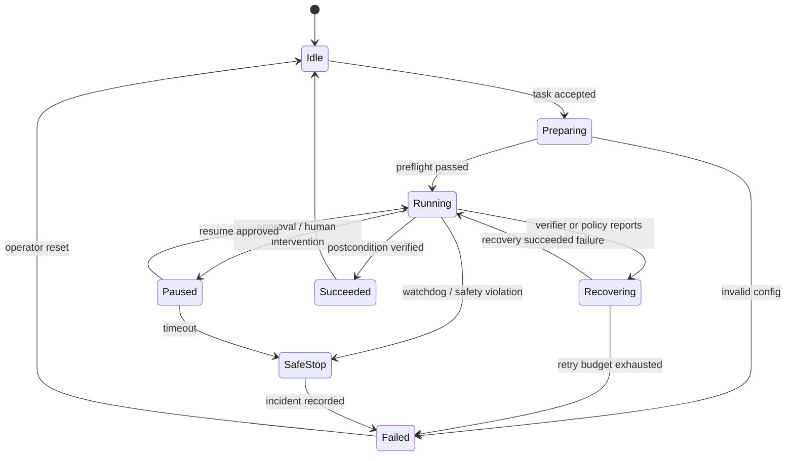

# Reference Architecture for a Robot Foundation-Model Harness

This is a model-agnostic blueprint for integrating an LLM/VLM agent, a VLA policy, or a world model with a real or simulated robot.

## 1. System Boundaries

```text
task API
  -> context + planner
  -> typed skill / policy request
  -> model adapter and inference server
  -> safety supervisor
  -> robot executor
  -> ros2_control / hardware

all components
  -> trajectory recorder
  -> replay + evaluator
  -> regression gates
```

Keep these processes separable:

1. **Task service** — accepts goals and owns user-visible task state.
2. **Planner** — selects skills, subgoals, or recovery actions.
3. **Policy server** — converts a versioned observation into an action chunk.
4. **Safety supervisor** — validates freshness, limits, collision state, and permissions.
5. **Executor** — interpolates and dispatches accepted commands.
6. **Recorder** — persists raw inputs, proposals, decisions, commands, and outcomes.
7. **Evaluator** — computes metrics from completed trajectories.

A crash or timeout in the planner or policy server must not remove the ability to hold position, stop, or return the robot to a safe controller state.

## 2. Versioned Observation and Action Contracts

Use a typed schema rather than passing ad-hoc dictionaries between the robot and model.

```yaml
observation_schema: robot-observation/v1
episode_id: "01J..."
step_id: 184
timestamp_ns: 1784985030123456789
robot_id: "franka-lab-a"
embodiment: "franka_panda_eef_delta"
instruction: "put the red cup in the sink"
images:
  - name: "base_rgb"
    frame_id: "camera_base_optical"
    timestamp_ns: 1784985030100000000
    encoding: "rgb8"
  - name: "wrist_rgb"
    frame_id: "wrist_camera_optical"
    timestamp_ns: 1784985030110000000
    encoding: "rgb8"
proprio:
  joint_position: [0.0]
  joint_velocity: [0.0]
  gripper_position: [0.0]
transforms_snapshot_id: "tf-01J..."
normalization_id: "droid-franka-v3"
```

```yaml
action_schema: robot-action-chunk/v1
request_step_id: 184
model_id: "checkpoint-name@sha256:..."
representation: "eef_delta_xyz_rot6d_gripper"
frame_id: "robot_base"
period_ms: 50
actions:
  - [0.0]
valid_for_ms: 300
confidence: null
```

The real schema should also define:

- units and axis order;
- rotation representation;
- gripper convention;
- absolute/delta semantics;
- padding and masks;
- normalization and unnormalization;
- expected camera set and preprocessing;
- model/control rate and action horizon.

Reject unknown schema versions and missing calibration. Never guess.

## 3. Task State Machine



The planner may propose transitions, but harness code owns the state machine, retry budget, and terminal conditions.

## 4. Multi-Rate Execution

### Semantic planner

- Runs on task events or at a low frequency.
- Produces typed skills or subgoals.
- Can ask for clarification or approval.
- Cannot command joints directly.

### VLA/policy server

- Receives immutable observation snapshots.
- Returns timestamped action chunks.
- Does not assume every proposal will be executed.
- Supports cancellation and health checks.

### Safety supervisor and servo

- Runs independently of model inference.
- Rejects stale, malformed, discontinuous, or out-of-bounds actions.
- Enforces workspace, joint, velocity, acceleration, force, and collision constraints.
- Owns hold, slow-down, stop, and controller handover.

## 5. Minimum Safety Gate

Apply gates in this order:

1. **Authorization** — is this task, skill, robot, and workspace allowed?
2. **Freshness** — are image/state timestamps and transforms recent enough?
3. **Schema** — do dimensions, frames, units, and normalization match?
4. **Numerical validity** — reject NaN/Inf and impossible discontinuities.
5. **Kinematic limits** — joint, Cartesian, velocity, acceleration, and jerk limits.
6. **Geometric safety** — collision, keep-out zones, self-collision, and tool geometry.
7. **Dynamic/contact safety** — force/torque, payload, stability, and controller status.
8. **Horizon and deadline** — bound how long open-loop commands may run.
9. **Human state** — respect emergency stop, enabling device, and approval gates.

The model prompt is not a safety boundary.

## 6. Recording and Traceability

For each episode record:

- task request, prompt/context version, and operator identity;
- raw sensor references and calibration version;
- planner outputs and tool calls;
- model ID, code revision, inference settings, and latency;
- proposed action chunks;
- every safety accept/reject/clip decision;
- commands actually sent to the controller;
- controller and robot feedback;
- interventions, resets, and annotations;
- task verifier outputs and terminal reason.

Use a single episode/trace ID across ROS messages, model-server traces, video, and evaluation output. Store raw operational logs separately from derived training datasets.

## 7. Evaluation Pyramid

```text
schema/unit tests
  -> recorded-observation inference tests
  -> deterministic replay
  -> simulation smoke tests
  -> seeded benchmark suite
  -> hardware-in-the-loop
  -> bounded real-robot cell
  -> perturbation and recovery tests
  -> long-duration reliability test
```

Promotion gates should be deterministic where possible. An LLM judge can help label failures, but it should not be the only verifier for physical postconditions.

## 8. Implementation Checklist

### Before model integration

- [ ] Scripted or classical controller baseline succeeds.
- [ ] Robot description, transforms, and collision geometry are correct.
- [ ] Emergency stop and controller watchdog are tested.
- [ ] Raw recording and replay work.
- [ ] Observation/action schema is documented and versioned.
- [ ] Task success has a machine-checkable definition.

### Before simulation evaluation

- [ ] Upstream checkpoint/config result is reproduced.
- [ ] Seeds, simulator, renderer, and dependencies are pinned.
- [ ] Action scaling, horizon, and control rate match the reference.
- [ ] Full rollouts and terminal reasons are recorded.

### Before real-robot rollout

- [ ] Workspace and speed are reduced for initial tests.
- [ ] Model server timeout produces a safe hold/stop.
- [ ] Stale observations and dropped cameras are tested.
- [ ] NaN, extreme, discontinuous, and wrong-frame actions are rejected.
- [ ] A human can see system state and stop motion immediately.
- [ ] Recovery and reset behavior are explicit.

### Before unattended operation

- [ ] Perturbation suite covers visual, semantic, and dynamic changes.
- [ ] Failure detector and safety supervisor are validated independently.
- [ ] Long-duration test measures drift, deadline misses, and intervention rate.
- [ ] Deployment is pinned by model, code, config, schema, and calibration hashes.
- [ ] Incident review can reconstruct every executed command.

## 9. Suggested Repository Layout

```text
robot-system/
├── configs/
│   ├── robots/
│   ├── models/
│   ├── tasks/
│   └── safety/
├── interfaces/
│   ├── observation/
│   ├── action/
│   └── task/
├── planner/
├── policy_server/
├── safety_supervisor/
├── robot_adapter/
├── recorder/
├── evaluators/
├── tests/
│   ├── replay/
│   ├── simulation/
│   └── hardware/
└── deployments/
```

Keep robot adapters thin and model adapters pure. This makes it possible to test every model against every benchmark or robot without copying the task loop.
