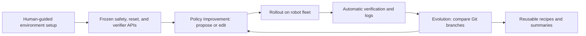

# ENPIRE — Source Note and Analysis

Verified on 2026-08-03 against the arXiv record, HTML full text, and official
project page.

## Primary sources

- **Title:** ENPIRE: Agentic Robot Policy Self-Improvement in the Real World
- **Authors:** Wenli Xiao, Jia Xie, Tonghe Zhang, Haotian Lin, Letian "Max" Fu,
  Haoru Xue, Jalen Lu, Yi Yang, Cunxi Dai, Zi Wang, Jimmy Wu, Guanzhi Wang,
  S. Shankar Sastry, Ken Goldberg, Linxi "Jim" Fan, Yuke Zhu, Guanya Shi
- **Submitted:** 2026-06-18
- **arXiv:** https://arxiv.org/abs/2606.19980
- **HTML:** https://arxiv.org/html/2606.19980v1
- **DOI:** https://doi.org/10.48550/arXiv.2606.19980
- **Project:** https://research.nvidia.com/labs/gear/enpire/
- **Subject:** Artificial Intelligence (cs.AI)

## Executive summary

ENPIRE is best understood as a **physical-autoresearch harness**, not as a new
robot policy architecture. It gives coding agents a repeatable experimental
loop over real hardware:

> reset the scene, execute a policy, verify the result, analyze the evidence,
> modify the policy or training system, and run the next experiment.

The system can improve heuristic programs, code-as-policy scripts, behavior
cloning pipelines, and offline or online reinforcement-learning policies. Its
main contribution is the infrastructure that turns scarce, failure-prone robot
trials into agent-operable and auditable experiments.

The autonomy claim has an important boundary. ENPIRE first uses a
**human-guided setup phase** to construct and validate task-specific safety,
reward, logging, and reset interfaces. These interfaces are then frozen as
immutable Gym-style APIs. Only the subsequent policy-improvement phase is
designed to run without task-specific human guidance.

## System boundary

ENPIRE has four named modules:

| Module | Responsibility | Main artifacts |
| --- | --- | --- |
| **Environment (EN)** | Enforce bounded operation, observe the task, verify success or failure, and restore a randomized initial state. | Safety constraints, reward/verifier, reset routine, observations |
| **Policy Improvement (PI)** | Read evidence, consult literature, formulate hypotheses, and edit policy or training code. | Heuristics, behavior-cloning or RL code, hyperparameters, checkpoints |
| **Rollout (R)** | Run budgeted physical trials on one or more robots and preserve the evidence. | State/action traces, videos, rewards, result metadata |
| **Evolution (E)** | Compare branches, retain useful ideas, reuse peer recipes, and abandon failures. | Git branches, commits, experiment summaries, idea trees |

This separation is the central engineering idea. The agent may edit the policy
and training infrastructure, but it does not receive write access to the
environment contract used to score that policy. That reduces direct benchmark
tampering, although it does not remove verifier errors or reward hacking.

## Stage one: make hardware agent-operable

Before policy search begins, the task is converted into a structured
environment with three properties:

1. **Hard safety constraints.** Workspace and kinematic limits terminate a
   violating rollout and trigger reset. These are operational safeguards, not
   evidence of a complete safety certification.
2. **Automatic verification.** Coding agents synthesize low-latency binary
   rewards from cameras and proprioception. For example, zip-tie verification
   combines detection and segmentation from two camera views; the paper reports
   optimizing this verifier to below 150 ms.
3. **Automatic reset.** Perception, pose tracking, grasp generation, and motion
   planning are composed into task-specific routines that return the scene to a
   known randomized starting state. Contact-rich tasks may reset directly to
   the precision-critical phase to increase useful trial throughput.

The authors describe this as a one-time, human-guided construction cost that is
amortized over later experiments. In practice, it remains a substantial part of
the system: a faulty reset changes the data distribution, and a faulty verifier
turns policy search into optimization of the wrong objective.

## Stage two: improve the policy from physical feedback

Once the environment APIs are frozen, each coding agent can:

1. inspect videos, trajectories, reward signals, and prior experiments;
2. propose an algorithmic hypothesis;
3. modify heuristic, behavior-cloning, reinforcement-learning, sampling, or
   training-infrastructure code;
4. deploy the candidate and run physical evaluation;
5. keep, revise, or discard the hypothesis based on measured results.

For fleet experiments, one agent is assigned to each robot station. Every agent
starts from the same baseline repository but works on its own Git branch. Agents
can inspect peers' results and cherry-pick, copy, or merge successful recipes.
The shared state is therefore not an unrestricted group chat: it is a versioned
experiment repository plus concise results and an evolving idea tree.

## Experimental evidence

The physical fleet contains eight nominally identical bimanual YAM stations.
Each station has two six-degree-of-freedom arms, cameras, one workstation, and
an NVIDIA RTX 5090. Policies run at 30 Hz above 100 Hz low-level joint control.
The evaluated coding-agent configurations include Codex with GPT-5.5 xhigh,
Claude Code with Opus 4.7 High, and Kimi Code with Kimi K2.6 thinking.

The showcased tasks include Push-T, pin insertion into holes with 4 mm
clearance, GPU insertion, and zip-tie manipulation or cutting. The policy
improvement search spans gradient-free heuristics, code-as-policy, behavior
cloning, offline RL, online RL, and offline-to-online RL.

### Author-reported findings

- On simulated Gym Push-T, Codex and Claude Code reached about 95% within
  roughly two hours, while Kimi Code took about twice as long. The same
  heuristic-learning approach was much less reliable on the physical task: two
  of the three agents failed, illustrating the gap between simulator search and
  physical autoresearch.
- On real pin insertion, agents explored behavior cloning, iterative data
  aggregation, several RL regimes, and associated hyperparameters. The target
  evaluation required 50 consecutive successes.
- Scaling Push-T from one to eight agent-robot pairs reduced time to a 1.0
  normalized score from roughly five hours to two hours.
- Scaling pin insertion from one to eight pairs reduced time to near-perfect
  success from more than 1.5 hours to about 40 minutes.
- A written summary of pin-insertion research was reused as context for GPU
  insertion. Raw histories were removed, so this transfer was through distilled
  training knowledge rather than direct replay of the previous session.
- In RoboCasa365, agents combined a GR00T vision-language-action policy with
  detection and motion-planning tools, including a hover-before-grasp strategy.
  The reported comparison uses matched seeds, layouts, cameras, prompts, and
  success predicates. The execution interfaces still differ: GR00T acts through
  its learned policy, while generated scripts call explicit perception and
  planning APIs.

### How to read the 99% result

The official project page reports **99% pass@8** across showcased policies. In
this protocol, one long-horizon rollout may use up to eight retries for each
subtask, and every retry is conditioned on observed earlier failures. It is not
the usual best-of-eight selection over independent full-task samples.

This is meaningful evidence of recovery, but it is not evidence of 99% pass@1.
The paper and project page should therefore be cited as reporting **99% pass@8
under failure-conditioned retries**, unless single-attempt results are reported
separately.

## Resource-scaling result

ENPIRE explicitly measures more than final task success:

- **Mean Robot Utilization (MRU):** fraction of research wall-clock time when a
  robot is actively executing an experiment;
- **GPU utilization:** fraction of wall-clock time with active GPU work;
- **Mean Token Utilization (MTU):** average token consumption per minute across
  the fleet;
- **time to success** and **tokens to success:** wall-clock and language-model
  budgets required to reach the target.

More robots reduce elapsed time, but the scaling is not free. The authors report
that per-robot utilization falls as agents spend more time reading logs, writing
code, waiting for models, and summarizing peer branches. Token consumption grows
faster than the ideal linear trend at eight agents. ENPIRE therefore demonstrates
a latency-versus-cost tradeoff, not linear research throughput.

## Relation to ASPIRE

ASPIRE and ENPIRE both use coding agents and persistent experience, but they
operate at different layers:

| Question | ASPIRE | ENPIRE |
| --- | --- | --- |
| What is improved? | An executable code-as-policy task program | A policy, training recipe, or training infrastructure |
| Main feedback | Per-primitive multimodal execution traces | Rewards, videos, trajectories, training and rollout statistics |
| Persistent knowledge | Validated repair skills used as in-context guidance | Git branches, checkpoints, datasets, experiment summaries, and reusable recipes |
| Main loop | Execute, diagnose, patch, validate | Hypothesize, train or edit, deploy, evaluate, evolve |
| Main experimental setting | Primarily simulation, plus selected real-robot transfer | Real robot fleet, plus controlled simulation studies |
| System role | Runtime program-debugging and skill-memory harness | Offline/online physical research and policy-improvement plane |
| Weight updates | Generally no; the coding model and robot primitives remain fixed | Allowed; behavior cloning and reinforcement learning may update policy weights |

A compact distinction is: **ASPIRE learns how to repair robot programs; ENPIRE
learns how to run and improve robot-policy experiments.**

## Evidence boundaries and limitations

1. **Autonomy begins after setup.** Human feedback is still used to build and
   validate task-specific safety, reward, and reset mechanisms. Hardware
   maintenance and fleet operations also remain external requirements.
2. **The verifier is part of the specification.** If it admits false positives,
   agents can improve the measured score without improving the intended task.
   Multi-view verification helps, but independent verifier regression tests are
   still required. This is a systems inference from the method, not a failure
   demonstrated by the paper.
3. **Pass@8 hides pass@1.** Recovery is useful, but retry count, intervention
   rate, reset rate, robot time, and single-attempt reliability should remain
   separate deployment metrics.
4. **Fleet scaling trades money for time.** Eight agents finish sooner while
   consuming disproportionately more tokens and using each robot less
   efficiently.
5. **The hardware evidence is concentrated.** The fleet uses one station design
   and a small family of carefully instrumented manipulation tasks. Broader
   embodiment, task, and lab transfer remains open.
6. **The agent and tool stack is strong and expensive.** Results rely on frontier
   coding models, high-end per-station GPUs, mature perception/planning tools,
   and engineered low-level controllers.
7. **Artifact availability is incomplete.** The official project page exposes
   videos and code snippets, but no public ENPIRE implementation repository was
   linked when checked on 2026-08-03. The reported results are not yet an
   independently reproduced open benchmark.

## Practical design lessons

For a production robot-learning harness, the most reusable ENPIRE patterns are:

- keep the safety, reset, and evaluation contract immutable during policy search;
- version every hypothesis, configuration, checkpoint, dataset, and verifier;
- preserve complete rollout evidence and make experiment branches auditable;
- regression-test the verifier against false positives before trusting reward;
- measure pass@1, retry-conditioned success, interventions, robot-hours,
  tokens, and wall-clock time separately;
- schedule robot trials while coding agents reason so scarce hardware is not
  idle;
- validate promoted policies on fixed untouched trials and retain a rollback
  path;
- treat automated reset as a first-class manipulation capability rather than
  incidental laboratory scripting.

The broad contribution is a change of abstraction: ENPIRE treats the entire
physical research loop—not only the learned policy—as the object that must be
made programmable, observable, and scalable.

## Literature-query record

- **Database:** arXiv API
- **Endpoint:** https://arxiv.org/api/query?id_list=2606.19980&max_results=1
- **Parsed Atom result:** one record, `arXiv:2606.19980v1`, submitted and updated
  on 2026-06-18, primary category `cs.AI`, with PDF at
  https://arxiv.org/pdf/2606.19980v1.
